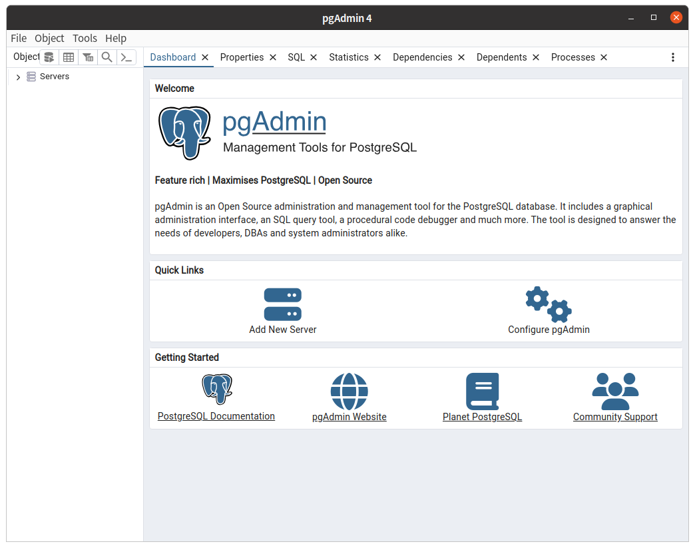

= PostgreSQL 설치

== Ubuntu에서 PostgreSQL 설치

이 연습에서는 Ubuntu 22.04에서 PostgreSQL과 GUI 도구인 pgAdmin을 설치합니다.

=== PostgreSQL 서버 설치

이 연습에서는 Ubuntu 22.04에서 PostgreSQL Server를 설치합니다. 아래 절차에 따릅니다.

1. 터미널을 실행합니다.
2. 아래 명령을 실행하여 apt를 통하여 설치되는 PostgreSQL의 버전을 확인합니다.
+
----
$ apt show postgresql
----
+
3. 아래 명령을 실행하여 Postgresql server를 설치합니다.
+
----
$ sudo apt install postgresql postgresql-contrib
----
+
4. 아래 명령을 실행하여 설치된 Postgresql을 확인합니다.
+
----
$ systemctl status postgresql
----
5. 아래 명령을 실행하여 Postgresql에 기본 관리자인 postgres 사용자로 액세스합니다.
+
----
$ sudo -i -u postgres
$ psql
----
+

=== pgAdmin 설치

이 연습에서는 PostgreSQL GUI 도구인 pgAdmin을 설치합니다. 아래 절차에 따릅니다.

1. 아래 명령을 실행하여 PostgreSQL을 위한 리포지토리를 구성합니다.
+
----
$ curl https://www.pgadmin.org/static/packages_pgadmin_org.pub | sudo apt-key add
$ sudo sh -c 'echo "deb https://ftp.postgresql.org/pub/pgadmin/pgadmin4/apt/$(lsb_release -cs) pgadmin4 main" > /etc/apt/sources.list.d/pgadmin4.list && apt update'
----
+
2. 아래 명령을 실행하여 pgAdmin 4 버전을 설치합니다.
+
----
sudo apt install pgadmin4
----
+
3. Applications 메뉴에서 pgAdmin을 검색하여 실행합니다.
4. pgAdmin이 실행되면, Add New Server를 클릭합니다.
+

+
5. Register-Server 창에서, 아래와 같이 정보를 입력하고 Save 버튼을 클릭합니다.
* General 탭의 Name: localhost
* Connection 탭의 Host name/address: localhost
* Connection 탭의 Password: <설치시 지정한 패스워드>
6. Object Explorer 탭에서 PostgreSQL 데이터베이스 연결을 확인합니다.
+
image:./images/image03.png[]

== Windows 11에서 PostgreSQL 설치

이 연습에서는 Windows 환경에서 PostgreSQL과 GUI 도구인 pgAdmin을 설치합니다. 

=== PostgreSQL 서버 설치

이 연습에서는 Windows 11 환경에서 PostgreSQL Server를 설치합니다. 아래 절차에 따릅니다.

1. Windows 터미널을 실행합니다.
2. Windows 터미널에서 아래 명령을 실행하여 Windows 패키지 관리자로 설치 가능한 PostgreSQL을 살펴봅니다.
+
----
> winget search postgresql

이름                        장치 ID                    버전          일치            원본
--------------------------------------------------------------------------------------------
PostgreSQL中文手册          9NBLGGH4NSM4               Unknown                       msstore
PostgreSQL 16               PostgreSQL.PostgreSQL      16.1                          winget
SQL Schema Compare          TiCodeX.SQLSchemaCompare   2023.4.1      Tag: postgresql winget
TeamIDE                     TeamIDE.TeamIDE            2.6.0         Tag: postgresql winget
Kangaroo                    Taozuhong.Kangaroo         3.99.2.231201 Tag: postgresql winget
TablePlus                   TablePlus.TablePlus        5.2.6         Tag: postgresql winget
PremiumSoft Navicat Premium PremiumSoft.NavicatPremium 16.1.15       Tag: postgresql winget
Laragon                     LeNgocKhoa.Laragon         6.0.0         Tag: postgresql winget
DbGate                      JanProchazka.dbgate        5.2.6         Tag: postgresql winget
DBeaver                     dbeaver.dbeaver            23.3.0        Tag: postgresql winget
pgAdmin 4                   PostgreSQL.pgAdmin         8.0                           winget
----
+
3. 검색된 PostgreSQL을 아래 명령을 실행하여 설치합니다
+
----
> winget install -e -id PostgreSQL.PostgreSQL
----

=== pgAdmin 설치

이 연습에서는 Windows 11 환경에서 PostgreSQL GUI 도구인 pgAdmin을 설치합니다. 아래 절차에 따릅니다.

1. Windows 터미널을 실행합니다.
2. Windows 터미널에서 아래 명령을 실행하여 Windows 패지기 관리자로 설치 가능한 pgAdmin을 살펴봅니다.
+
----
> winget search pgAdmin

이름      장치 ID            버전 원본
-----------------------------------------
pgAdmin 4 PostgreSQL.pgAdmin 8.0  winget
----
+
3. 검색된 PostgreSQL을 아래 명령을 실행하여 설치합니다.
+
----
> winget install -e id PostgreSQL.pgAdmin
----