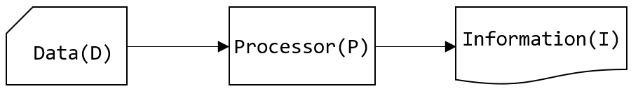

= 데이터와 정보

* 데이터(Data) +
현실 세계로부터 단순한 관찰이나 측정을 통해서 수집된 사실(fact)이나 값(Value)
* 정보(Information) +
어떤 상황에 대한 적절한 의사 결정을 할 수 있게 하는 지식(Knowldege)으로서 유효한 데[이터의 해석 또는 데이터간의 관계
* 정보(Information)는 데이터(Data)를 처리해서 얻어진 결과 +
`I = P(D)`
* 데이터에서 정보를 추출하는 방법을 데이터 처리(Data Processing), 넓은 의미로 정보 처리(Information Processing)라고 함

---

데이터(Data)는 현실 세계로부터 단순한 관찰이나 측정을 통해서 수집된 사실(facts)이나 값(value)을 말합니다. 이 값은 숫자로 표현되는 수치는 물론이고 어떤 문자들로 표현되는 수치는 물론이고 어떤 문자들로 표현되는 문자열(String)로 포함됩니다.

정보(Information)란 어떤 상황에 대한 적절한 의사 결정을 할 수 있게 하는 지식(Knowledge)으로서 데이터의 유효한 해석이나 데이터 상호간의 관계를 말합니다. 정보는 데이터를 처리해서 얻을 수 있는 결과입니다. 이를 수식으로 아래와 같이 표현할 수 있습니다.

`I = P(D)`

 
데이터 자체가 내포하고 있는 정보를 추출하는 방법은 아주 중요하며, 그런 방법이 없이 단순히 수집되어 정보가 되기 힘든 데이터는 쓰임새가 많지 않습니다. 정보 추출 방법을 자료 처리(Data Processing) 또는 정보 처리(Information Processing)라고 합니다.
정보가 유용성을 갖기 위해서는 정확성과 현재성을 가지고 있어야 합니다. 또한 필요할 때는 언제든 이용될 수 있도록 수집, 조직, 저장되어 있어야 합니다. 통상적으로 정보와 데이터가 혼용되는 이유가 바로 이러한 정보와 데이터간의 표리 관계 때문입니다.

link:./04_information_system.adoc[다음: 정보 시스템]
