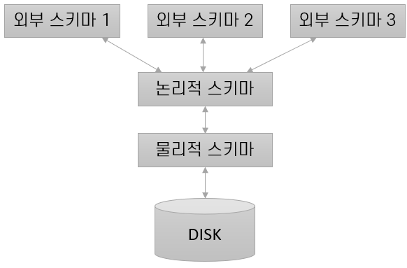

= 데이터 독립성

* DBMS의 데이터는 3단계의 추상화로 표현됨 +

+
* 각 추상화 단계 별로 응용 프로그램의 데이터 구성 및 저장 방식으로부터 격리
* 논리적 데이터 독립성(Logical Data Independency)
** 데이터의 논리적인 구조, 저장 방식/공간의 변화로부터 보호
* 물리적 데이터 독립성(Physical Data Independency)
** 디스크 파일 내부에서 데이터가 실제로 어떻게 배치되어 있는지 등의 정보를 감춤

---

데이터베이스 관리 시스템을 사용할 때 큰 장점은 DBMS가 `데이터 독립성(Data Independency)` 를 제공한다는 것입니다. 응용 프로그램은 데이터의 구성 및 저장 방식의 변화로부터 격리되어 있으며, 데이터 독립성은 세 단계의 데이터 추상화를 통해 얻을 수 있습니다.

`스키마(Scheme)` 는 데이터베이스에서 자료의 구조, 자료의 표현 방법, 자료 간의 관계와 제약조건을 형식 언어로 정의한 구조입니다. 스키마는 `개체(Entity)` , 개체의 특성을 나타내는 `속성(Attribute)` , 개체 사이에 존재하는 `관계(Relation)` , 이들이 유지해야 하는 `제약조건(Constraint)` 을 기술합니다.

DBMS의 데이터는 일반적으로 `물리적 스키마` , `논리적(개념) 스키마` , `외부 스키마`` 등의 3단계의 추상화로 표현됩니다. `개념 스키마(Conceptual Scheme)` 는 정해진 데이터 모델에 따라 저장될 데이터를 기술하며, `물리적 스키마(Physical Scheme)` 는 사용될 파일의 조직과 보조 데이터 구조 등의 상세한 저장 방법을 정의합니다. 외부 스키마는 각각의 형태를 가진 외부 사용자에게 맞춰진 데이터를 기술하는 스키마입니다.

== 논리적 스키마(개념 스키마)

`개념 스키마(Conceptual Schema)` 는 `논리적 스키마(Logical Scheme)` 라고도 부르며, 해당 데이터베이스 관리 시스템의 데이터 모델이 따라 저장될 데이터를 기술하는 스키마입니다. 관계형 데이터베이스 관리 시스템의 개념 스키마에는 데이터베이스에 저장된 모든 테이블에 대한 명세 정보가 들어 있습니다. 예를 들면, 온라인 쇼핑몰을 설계한다고 할 경우, 아래와 같이 개념 스키마를 작성할 수 있습니다.

__상품 분류(분류번호: 정수, 분류이름: 문자열) +
상품(상품번호: 정수, 모델번호: 문자열, 상품이름: 문자열, 상품가격: 실수, 설명: 문자열) +
장바구니(장바구니번호: 정수, 수량: 정수, 날짜: 날짜) +
고객(고객번호: 정수, 고객이름: 문자열, 전자메일: 문자열, 암호: 문자열) +
구매(구매번호: 정수, 주문일자: 날짜, 배송일자: 날짜) +
주문상세(상품번호: 숫자, 수량: 숫자, 가격: 실수)__

개념 스키마를 만들어내는 작업을 개념 `데이터베이스 설계(Conceptual database design)` 라고 하며 주로 E-R 모델을 사용하여 데이터베이스를 설계합니다. 개념 스키마 작업의 산출물은 설계된 스키마가 어떤 데이터베이스(SQL Server나 Oracle과 같은)에 배포될 것인지에 대한 고려가 없는 경우가 대부분입니다. 상품 번호 필드의 타입을 결정할 때 단지 ‘정수’, 상품 가격의 타입을 결정할 때 '실수' 등으로 지정할 뿐, SQL Server의 데이터 타입인 int나 Oracle의 타입인 Number등으로 결정하지 않습니다. 개념 설계 단계에서는 `E-R 모델(Entity-Relational Model)` 을 사용하여 각 `테이블(릴레이션)` 이 어떤 필드들의 관계로 구성될 지, 각 테이블은 어떤 관계로 구성될지 등을 고려하여 설계됩니다.

== 물리적 스키마

물리적 스키마는 사용할 파일 조직과 검색을 위한 인덱스 등의 보조 데이터 구조등 상세한 저장 내역을 담고 있습니다. 물리적 스키마는 개념 스키마에 명세되어 있는 테이블들이 디스크에 어떻게 실제로 저장될 지를 요약합니다. 물리적 스키마의 설계에서 중요한 것은 설계된 개념 스키마가 어떤 데이터베이스 관리 시스템에 배포될 것인지 하는 것입니다. 개념 스키마는 설계된 테이블이 어떤 자료구조, 즉 예를 들면 B- 트리에 저장될 것인지 Heap에 저장될 것인지에 대한 고려가 없다는 것입니다. 물리적 스키마에서는 이 테이블이 B- 트리 형태로 저장될 것인지 또는 Heap에 저장될 것인지를 결정하며, `필드의 타입(도메인)` 이 개념 스키마에서 정수였다면 SQL Server에 배포되므로 정수를 4 byte짜리 int로 할 것인지 8 byte짜리 bigint로 저장될 것인지를 결정합니다.

예를 들어, 아래와 같이 설계된 개념 스키마가 있다면,

__학생(학번: 정수, 이름: 문자열, 전자메일: 문자열, 나이: 정수, 학점: 실수)__

개념 스키마에서는 이 테이블이 어떤 자료구조로 어떻게 배포 될 것인지 알 수 없습니다. 물리적 스키마에서는 스키마를 아래와 같이 특정 데이터베이스에 맞는 스키마로 설계하여 어떤 형식으로 저장될 것인지, 각 필드는 어떤 타입이 될 것인지를 결정합니다.

[source, sql]
----
CREATE TABLE [학생] (
[학번]		int,
[이름]		nvarchar(12)		NOT NULL,
[전자메일]	varchar(30)		    NULL,
[나이]		int			        NOT NULL,
[학점]		decimal(2,1)		NOT NULL
)
----

SQL Server의 경우, 위 스키마는 각 필드의 타입을 결정하고 테이블이 저장된 자료구조를 heap 형태로 결정합니다.

이런 저장될 형태를 결정하고 나면 검색 속도를 향상시키기 위한 보조 자료구조, 즉 인덱스를 결정하는 것도 물리적 스키마 설계에서 해야 하는 일입니다. 만약 학생 테이블에서 학점 필드를 기준으로 데이터를 조회하는 일이 빈번하다면 학점 필드에 아래와 같은 구문을 써서 학점 필드에 인덱스를 생성할 수 있습니다. 

이런 물리적인 스키마를 설계하는 과정을 `물리적 데이터베이스 설계(Physical Database Design)` 과정이라고 하며, 물리 스키마를 설계하기 위해서 사용하는 구문을 `데이터 정의 언어(Data Definition Language – DDL)` 라고 합니다. 일반적으로 SQL 언어의 `CREATE` , `ALTER` , `DROP` 구문이 여기에 해당됩니다.

== 외부 스키마

외부 스키마는 각각의 사용자 수준에서 데이터 접근을 개별화하기 위한 권한을 부여합니다. 모든 데이터를 저장하는 테이블은 하나이기 때문에 개념 스키마와 물리적 스키마도 하나이지만, 같은 물리적 스키마를 기반으로 여러 개의 외부 스키마를 만들고 서로 다른 접근 권한을 설정하여 각 사용자 또는 업무 그룹별 업무 형태에 맞는 데이터만을 사용할 수 있도록 하는 스키마입니다. 외부 스키마는 여러 개의 `뷰(View)` 로 만들어지는 것이 일반적이며, 테이블이 사용되는 경우도 드물게 있습니다. 뷰는 개념상 테이블과 같지만, 뷰에는 데이터를 저장하지 않고 실제로 테이블에 저장되어 있는 데이터를 계산해냅니다. 

외부 스키마 설계는 사용자들의 요구사항에 따르며, 사용자는 뷰를 테이블과 동일하게 취급하여 실제로는 뷰에 저장되어 있지 않은 데이터에 대해 질의를 수행할 수 있습니다. 뷰는 특정 사용자 그룹에게 필요한 데이터에 대한 중복 저장을 막을 수 있으며, 데이터의 불일치성을 제거하는데도 도움이 됩니다.

link:./13_database_query.adoc[다음: 데이터베이스 쿼리]