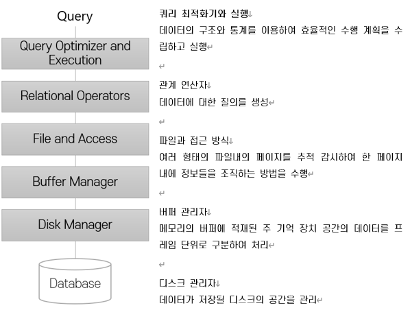

= 데이터베이스 관리 시스템 구조

관계 데이터 모델이 기반한 데이터베이스 관리 시스템의 전형적인 구조

---

그림은 관계 데이터 모델에 기반한 데이터베이스 관리 시스템의 단순화된 관리 구조를 보여줍니다. 관계 데이터 모델에 기반한 DBMS의 구조이지만 다른 구조를 사용하는 데이터베이스 관리 시스템에도 적용됩니다.

* 디스크 관리자(Disk Manager) +
최 하위 계층에는 디스크가 있으며, 운영체제 레벨에서 데이터가 저장될 디스크의 공간을 관리합니다. 그 위에 존재하는 디스크 관리자는 제공되는 루틴들을 이용하여 페이지를 할당, 반납, 판독, 기록합니다. 
* 버퍼 관리자(Buffer Manager) +
이 계층은 사용할 수 있는 두 지역공간을 프레임이라고 하는 페이지들로 나눕니다. 버퍼 관리자의 목적은 트랜잭션의 요청에 따라 이에 필요한 페이지들을 디스크에서 주 기억장치(메모리)로 가져옵니다.
+ 파일과 접근 방식(File and Access) * 
데이터베이스 관리 시스템은 파일을 페이지의 모임이나 레코드의 모임으로 간주합니다. 이 계층은 인덱스와 힙(Heap)을 포함한 다양한 형태의 파일을 지원합니다. 이 계층에서는 파일 내의 각 페이지를 추적 감시하며 한 페이지 내에 정보를 조직해 넣는 작업을 수행합니다.
* 관계 연산자(Relational Operators) +
이 계층의 연산자들은 데이터에 대한 질의를 수행하는 블록 역할을 담당합니다.
* 쿼리 최적화기와 수행(Query Optimizer and Execution) +
사용자가 쿼리를 실행하면 이 쿼리는 질의 최적화기로 보내지고 여기에서 데이터베이스에 저장된 통계 및 파일 조직 형태등의 정보를 사용하여 효율적인 `실행 계획(Execution Plan)` 을 수립합니다. 실행 계획은 대게 관계 연산자의 트리로 표현됩니다.

데이터베이스 관리 시스템은 사용자의 요청을 스케줄링하고 데이터베이스의 각종 변경 내역에 대한 로그를 유지하여 동시성과 장애 복구를 지원합니다. 위에서 논의된 구성 요소 이외에도 `동시성 제어(Concurrency Control)` 매커니즘과 `장애 복구(Failure Recovery)` 를 담당하는 구성요소가 있으며, 트랜잭션을 관리하는 `트랜잭션 관리자(Transaction Manager)` 또한 존재합니다. 트랜잭션 관리자는 트랜잭션이 적당한 잠금 규약에 따라 잠금을 요청, 해제하고 이런 트랜잭션의 수행을 스케줄링하는 작업을 담당합니다. `잠금 관리자(Locking Manager)` 는 데이터 객체에 대한 잠금 요청들을 감시해서 가능해지면 잠금을 하나씩 허가합니다. `복구 관리자(Recovery Manager)` 는 로그를 유지 관리하며, 시스템 장애 후 일관성 있는 상태로 시스템을 복구하는 역할을 담당합니다.

link:./16_advantage_of_dbms.adoc[다음: 데이터베이스 관리 시스템의 장점]