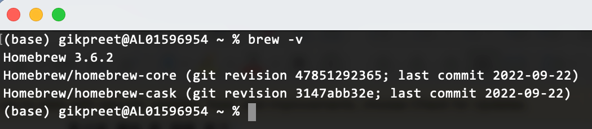
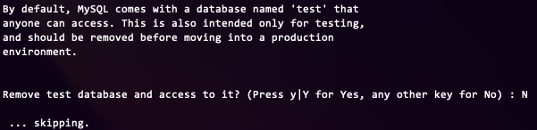
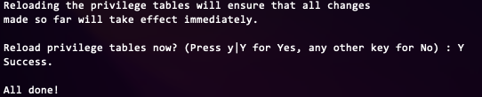
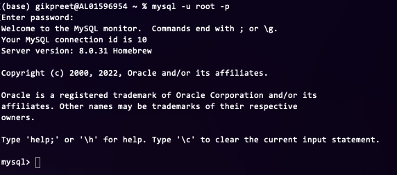
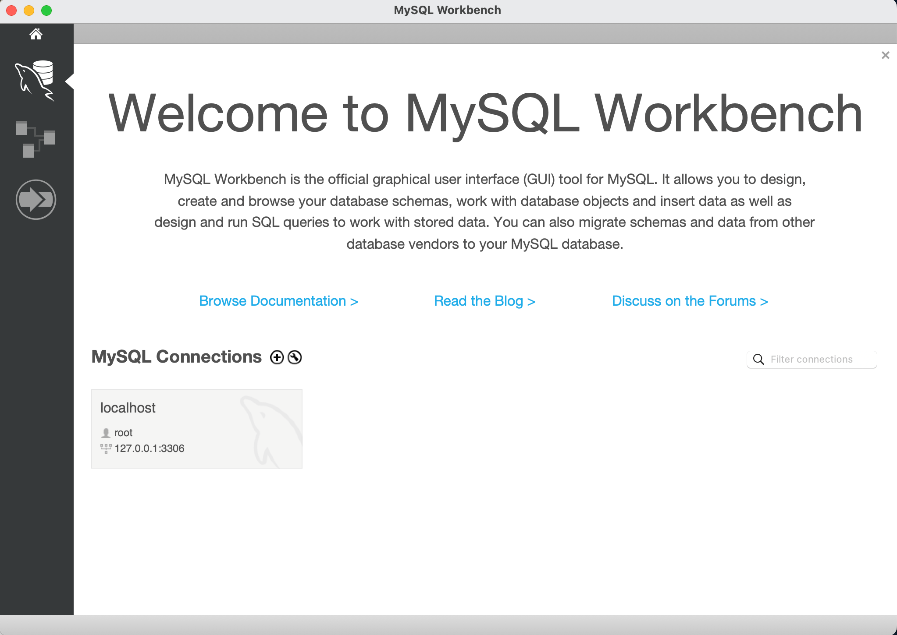
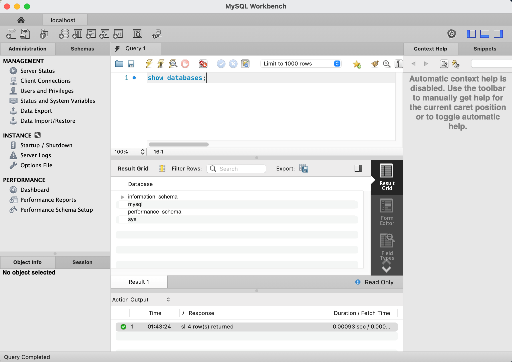

= Lab 1: MySQL 설치

== 연습 1 MySQL 설치

이 연습에서는 MacOS에 MySQL을 설치합니다. 아래 절차에 따릅니다.

=== homebrew 설치 확인
. 터미널을 실행합니다.
. 터미널에서 아래 명령을 실행하여 컴퓨터에 homebrew가 설치되어 있는지 확인합니다.
+
----
% brew –v
----
+

+
. homerew가 설치되어 있지 않으면, 아래 명령을 실행하여 homebrew를 설치합니다.
+
----
/bin/bash -c "$(curl -fsSL https://raw.githubusercontent.com/Homebrew/install/HEAD/install.sh)"
----

_참고 위 명령이 동작하지 않으면, https://brew.sh/index_ko 에 방문하여 설치 스크립트를 얻어 실행합니다._

=== MySQL 설치

. homebrew가 설치된 터미널에서 아래 명령을 실행합니다.
+
----
% brew install mysql
----
+
image:./images/image09.png[]
+
. 아래 명령을 실행하여 MySQL을 시작합니다.
+
----
% mysql.server start
----
+
. 아래 명령을 실행하여 기본 설정을 시작합니다.
+
----
% mysql_secure_installation
----
+
명령이 실행되면, MySQL 데이터베이스에 대한 기본 설정과 관련된 응답이 요구됩니다. 순서대로 설정합니다.
+
A. 비밀번호 복잡도 요구사항을 물어봅니다. N을 입력하고 엔터키를 누릅니다.
+
image:./images/image10.png[]
+
B.	root 사용자의 패스워드를 지정합니다.
+
image:./images/image11.png[]
+
C. 익명 사용자를 삭제할 것인지 여부를 물어봅니다. Y를 입력하고 엔터키를 누릅니다.
+
image:./images/image12.png[]
+
D. Root 사용자의 원격 접속을 허용하지 않을 것인지 여부를 물어봅니다. Y를 입력하고 엔터키를 누릅니다.
+
image:./images/image13.png[]
+
E. test 데이터베이스를 삭제할 것인지 물어봅니다. N을 입력하고 엔터키를 누릅니다.
+

+
F. prefilege 테이블을 다시 로드할 것인지 물어봅니다. Y를 입력하고 엔터키를 누릅니다. 설정이 완료됩니다.

+
. 다음 명령을 실행하여 mysql 서비스가 실행중인지 확인합니다.
----
% mysql.server status
----

=== MySQL Server에 접속

. 터미널에서 아래 명령을 실행하여 MySQL Server에 root 계정으로 액세스 합니다.
+
----
% mysql -u root -p 
----
+

+
. 아래 명령을 실행하여 데이터베이스 관리 시스템에 생성된 데이터베이스를 확인합니다.
+
----
mysql> show databases;
----
+ 
image:./images/image17.png[]
+
. 아래 명령을 실행하여 mysql 콘솔을 종료합니다.
+
----
mysql> exit
----

== 연습 2 MySQL Workbench 설치

이 연습에서는 MacOS에 MySQL 관리도구인 MySQL Workbench를 설치합니다. 아래 절차에 따릅니다.

. homebrew가 설치된 터미널에서 아래 명령을 실행합니다.
+
----
% brew install mysql-client
----
+
. 아래 명령을 실행하여 mysql workbench를 설치합니다.
+
----
% brew install mysqlworkbench --cask
----
. 설치가 완료되면 MySQL Workbench를 실행하고 MySQL Connections 옆의 + 아이콛을 클릭합니다.
+
image:./images/image18.png[]
+
.	아래와 같이 연결 정보를 입력하고 OK 버튼을 클릭합니다.
A.	Connection Name: `localhost`
B.	Connection Method: `Standard (TCP/IP)`
C.	Hostname: `127.0.0;1`
D.	Port: `3306`
E.	Username: `root`
+
image:./images/image19.png[]
+
. Welcome 페이지에서 생성된 Connection 패널을 클릭합니다.
+

+
. Connection to MySQL Server 창에서 패스워드를 입력하고 OK 버튼을 클릭합니다.
+
image:./images/image21.png[]
+
. 연결을 확인합니다.
+

link:./18_review.adoc[다음: 검토]