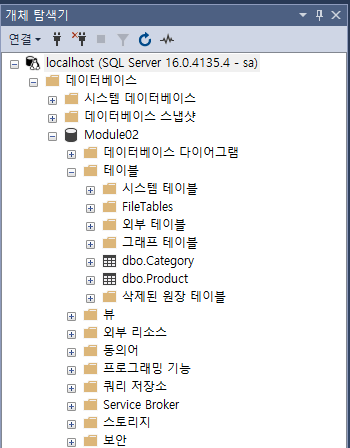
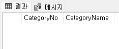
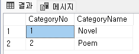
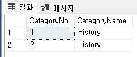
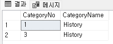

= Lab 2-1b: SQL을 사용한 를레이션 생셩 및 수정 (Microsoft SQL Server)

== 연습 1: SQL을 사용한 릴레이션 생성

이 연습에서는 SQL을 사용하여 릴레이션을 생성합니다. 이 연습에서는 아래와 같은 릴레이션 스키마를 가진 두 릴레이션을 생성합니다. 

_Category(CategoryNo: Integer, CategoryName: String) +
Product(ProductNo: Integer, ModelNumber: String, ProductName: String, Price: float, CategoryNo: Integer)_

이 연습은 SQL Server Management Studio 또는 Azure Data Studio 모두에서 실행할 수 있습니다.

=== SQL Server Management Studio에서 Category 릴레이션 생성

1. SQL Server Management Studio 또는 Azure Data Studio를 실행합니다.
2. `서버에 연결` 창에서 아래와 같이 입력하고 '연결' 버튼을 클릭합니다.
A. 서버 이름 `localhost`
B. 인증: `SQL Server 인증` 
C. 로그인: `sa`
D. 암호: <설치시 지정한 암호>
E. 암호화: `선택적`
+
image::../images/image12.png[width=500]
+
3. 위에서 `새 쿼리` 버튼을 클릭합니다.
4. 쿼리 창이 열리면, 아래 명령을 실행하여 서버의 데이터베이스 목록을 확인합니다.
+
[source, sql]
----
SELECT name, database_id
FROM Sys.databases
GO
----
+
명령의 실행 결과는 아래와 유사할 것입니다.
+
[%header, cols=2, width=30%]
|===
|name|database_id
|master|1
|tempdb|2
|model|3
|msdb|4
|===
+
5. 아래 질의를 생성하여 `Module02` 데이터베이스를 생성합니다.
+
[source, sql]
----
CREATE DATABASE Module02
----
+
명령이 완료되면, 아래의 메시지 장에 아래와 같은 메시지가 표시됩니다.
+
----
명령이 완료되었습니다.

완료 시간: 2024-08-05T23:35:45.1430636+09:00
----
+
6. 아래 명령을 실행하여 데이터베이스 연결 컨텍스트를 Module02 데이터베이스로 변경합니다.
+
[source, sql]
----
USE Module02
GO
----
+
7. 아래 쿼리를 실행하여 생성한 `Module02` 데이터베이스의 릴레이션(물리적 데이터베이스 관점에서 테이블)을 확인합니다.
+
[source, sql]
----
SELECT TABLE_NAME
FROM INFORMATION_SCHEMA.TABLES
WHERE TABLE_TYPE = 'BASE TABLE'
----
+ 
명령이 실행되면, 결과가 없는 릴레이션이 표시됩니다.
+
8. 아래 쿼리를 실행하여 `Category` 릴레이션을 생성합니다.
+
[source, sql]
----
CREATE TABLE Category (
    CategoryNo int,
    CategoryName NVARCHAR(20)
)
GO
----
+
9. 아래 쿼리를 실행하여 생성된 테이블을 확인합니다.
+
[source, sql]
----
SELECT TABLE_NAME
FROM INFORMATION_SCHEMA.TABLES
WHERE TABLE_TYPE = 'BASE TABLE'
----

=== Product 릴레이션 생성

1. 아래 쿼리를 실행하여 Product 테이블을 생성합니다.
+
[source, sql]
----
CREATE TABLE Product (
	ProductNo	int,
	ProductName	NVARCHAR(30),
    Price		MONEY,
    CategoryNo	int
)
GO
----
+
2. 아래 쿼리를 실행하여 생성된 테이블을 확인합니다.
+
[source, sql]
----
SELECT TABLE_NAME
FROM INFORMATION_SCHEMA.TABLES
WHERE TABLE_TYPE = 'BASE TABLE'
----
+
3. 개체 탐색기에서 데이터베이스 > Module 02 > 테이블 을 확장하고 생성된 테이블을 확인합니다.
+

== 연습 2 릴레이션에서 데이터 삽입/조회/수정

이 연습에서는 생성된 릴레이션에 SQL 구문을 사용하여 데이터를 삽입, 조회하고 수정합니다. 아래 절차를 따릅니다.

1. 쿼리 창에서, 아래 쿼리를 실행하여 `Category` 테이블의 데이터를 조회합니다.
+
[source, sql]
----
SELECT * FROM Category
----
+
빈 릴레이션이 출력됩니다.
+

+
2. 다음 두 쿼리를 실행하여 Category 테이블에 데이터를 입력합니다.
+
[source, sql]
----
INSERT INTO Category VALUES(1, 'Novel')
INSERT INTO Category VALUES(2, 'Poem')
----
+
실행이 완료되면 아래와 같은 메시지가 출력됩니다.
+
----
(1개 행 적용됨)

(1개 행 적용됨)

완료 시간: 2024-08-06T00:09:56.8705851+09:00
----
+
3. 다음 쿼리를 실행하여 삽입한 데이터를 확인합니다.
+
[source, sql]
----
SELECT * FROM Category
----
+
아래와 같은 결과가 표시됩니다.
+

+
4. 다음 쿼리를 실행하여 Category 릴레이션에 데이터를 삽입합니다.
+
[source, sql]
----
INSERT INTO Category VALUES (3, 'History / Relegion and Magazine')
----
+
명령은 성공적으로 수행되지 않습니다. 아래와 같은 오류 메시지가 출력됩니다.
+
----
메시지 2628, 수준 16, 상태 1, 줄 36
String or binary data would be truncated in table 'Module02.dbo.Category', column 'CategoryName'. Truncated value: 'History / Relegion a'.
The statement has been terminated.

완료 시간: 2024-08-06T00:19:08.9939871+09:00
----
+
5. 다음 쿼리를 실행하여 Category 릴레이션의 데이터를 수정합니다.
+
[source, sql]
----
UPDATE Category SET
CategoryName = 'History'
----
+
실행이 완료되면 아래와 같은 메시지가 표시됩니다.
+
----
(2개 행이 영향을 받음)

완료 시간: 2024-08-06T00:15:36.5762661+09:00
----
+
6. 아래 쿼리를 실행하여 Category 테이블의 수정된 데이터를 확인합니다.
+
[source, sql]
----
SELECT * FROM Category
----
+
아래와 같은 결과가 표시됩니다.
+

+
7. 아래 질의를 수행하여 Category 릴레이션의 데이터를 다시 수정합니다.
+
[source, sql]
----
UPDATE Category SET
CategoryName = 'Novel'
WHERE CategoryNo = 1;
----
+
8. 아래 쿼리를 실행하여 Category 테이블의 CategoryNo 필드의 데이터를 수정합니다.
+
[source, sql]
----
UPDATE Category SET
CategoryNo = 3
WHERE CategoryNo = 2
----
+
명령이 수행되면 아래와 같은 메시지가 표시됩니다.
+
----
(1개 행 적용됨)

완료 시간: 2024-08-06T00:23:48.3029282+09:00
----
+
9. 아래 쿼리를 수행하여 Category 릴레이션의 수정된 데이터를 확인합니다.
+
[source, sql]
----
SELECT * FROM Category
----
+
명령이 수행되면 아래와 같은 결과가 표시됩니다.
+

link:./14_integrity_constraint.adoc[다음: 무결성 제약조건]