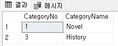

= Lab 2-1c: SQL을 사용한 를레이션 생셩 및 수정 (Oracle)

== 연습 1: SQL을 사용한 릴레이션 생성

이 연습에서는 SQL을 사용하여 릴레이션을 생성합니다. 이 연습에서는 아래와 같은 릴레이션 스키마를 가진 두 릴레이션을 생성합니다. 

_Category(CategoryNo: Integer, CategoryName: String) +
Product(ProductNo: Integer, ModelNumber: String, ProductName: String, Price: float, CategoryNo: Integer)_

이 연습은 SQL Server Management Studio 또는 Azure Data Studio 모두에서 실행할 수 있습니다.

=== SQLPlus 에서 Category 릴레이션 생성

1. 명령 프롬프트를 실행하고, 아래 명령을 실행하여 SQL Plus를 실행합니다.
+
----
docker exec -it oracle21c sqlplus
----
+
2. 사용자 이름에 system, 패스워드에 컨테이너 실행시 입력한 패스워드를 입력하고 로그인합니다.
+
----
Enter user-name: system
Enter password:
Last Successful login time: Mon Aug 05 2024 10:09:26 +00:00

Connected to:
Oracle Database 21c Express Edition Release 21.0.0.0.0 - Production
Version 21.3.0.0.0
----
3. 아래 쿼리를 실행하여 사용자를 생성합니다.
+
[source, sql]
----
CREATE USER celine IDENTIFIED BY celine
DEFAULT TABLESPACE users
TEMPORARY TABLESPACE temp
QUOTA UNLIMITED ON users;
----
+
4. 아래 명령을 실행하여 생성한 celine 사용자에게 connect privliege를 부여합니다.
+
[source, sql]
----
GRANT ALL PRIVILEGES TO celine;
----
+
5. 아래 명령을 실행하여 생성한 사용자로 로그인합니다.
+
[source, sql]
----
CONNECT celine/celnie;
----
+
6. 아래 쿼리를 실행하여 테이블을 확인합니다.
+
[source, sql]
----
SELECT * FROM tab;
----
+
명령의 실행 결과는 아래와 유사할 것입니다.
+
----
no rows selected
----
+
7. 아래 쿼리를 실행하여 `Category` 릴레이션을 생성합니다.
+
[source, sql]
----
SQL> CREATE TABLE Category (
  2  CategoryNo int,
  3  CategoryName varchar2(20)
  4  );
----
+
8. 아래 쿼리를 실행하여 생성된 테이블을 확인합니다.
+
[source, sql]
----
SELECT * FROM tab;
----

=== SQL Developer에서 Product 릴레이션 생성

1. SQL Developer를 실행하고 localhost 데이터베이스에 celine 사용자로 로그인합니다.
+

+
2. 아래 쿼리를 실행하여 Product 테이블을 생성합니다.
+
[source, sql]
----
CREATE TABLE Product (
  ProductNo	int,
	ProductName	VARCHAR2(30),
  Price		NUMBER(19,4),
  CategoryNo	int
);
----
+
3. 아래 쿼리를 실행하여 생성된 테이블을 확인합니다.
+
[source, sql]
----
SELECT * FROM tab;
----
+
명령이 실행되면, 아래와 같은 릴레이션이 표시됩니다.
+

+
4. 왼쪽의 접속 창에서 Oracle 접속 > <인스턴스 명> > 테이블(필터링 됨) 을 확장하고 생성된 테이블을 확인합니다.
+

== 연습 2 릴레이션에서 데이터 삽입/조회/수정

이 연습에서는 생성된 릴레이션에 SQL 구문을 사용하여 데이터를 삽입, 조회하고 수정합니다. 아래 절차를 따릅니다.

1. SQL Plus에서, 아래 쿼리를 실행하여 `Category` 테이블의 데이터를 조회합니다.
+
[source, sql]
----
SELECT * FROM Category;
----
+
결과는 아래와 같습니다.
+
----
no rows selected
----
+
2. 다음 두 쿼리를 실행하여 Category 테이블에 데이터를 입력합니다.
+
[source, sql]
----
INSERT INTO Category VALUES(1, 'Novel');
INSERT INTO Category VALUES(2, 'Poem');
----
+
3. 다음 쿼리를 실행하여 삽입한 데이터를 확인합니다.
+
[source, sql]
----
SELECT * FROM Category;
----
+
아래와 같은 결과가 표시됩니다.
+
----
CATEGORYNO CATEGORYNAME
---------- --------------------
         1 Novel
         2 Poem
----
+
4. 다음 쿼리를 실행하여 Category 릴레이션에 데이터를 삽입합니다.
+
[source, sql]
----
INSERT INTO Category VALUES (3, 'History / Relegion and Magazine');
----
+
명령은 성공적으로 수행되지 않습니다. 아래와 같은 오류 메시지가 출력됩니다.
+
----
INSERT INTO Category VALUES (3, 'History / Relegion and Magazine')
                                *
ERROR at line 1:
ORA-12899: value too large for column "CELINE"."CATEGORY"."CATEGORYNAME"
(actual: 31, maximum: 20)
----
+
5. 다음 쿼리를 실행하여 Category 릴레이션의 데이터를 수정합니다.
+
[source, sql]
----
UPDATE Category SET
CategoryName = 'History';
----
+
실행이 완료되면 아래와 같은 메시지가 표시됩니다.
+
----
2 rows updated.
----
+
6. 아래 쿼리를 실행하여 Category 테이블의 수정된 데이터를 확인합니다.
+
[source, sql]
----
SELECT * FROM Category
----
+
아래와 같은 결과가 표시됩니다.
+
----
CATEGORYNO CATEGORYNAME
---------- --------------------
         1 History
         2 History
----
+
7. 아래 질의를 수행하여 Category 릴레이션의 데이터를 다시 수정합니다.
+
[source, sql]
----
UPDATE Category SET
CategoryName = 'Novel'
WHERE CategoryNo = 1;
----
+
8. 아래 쿼리를 실행하여 Category 테이블의 CategoryNo 필드의 데이터를 수정합니다.
+
[source, sql]
----
UPDATE Category SET
CategoryNo = 3
WHERE CategoryNo = 2
----
+
명령이 수행되면 아래와 같은 메시지가 표시됩니다.
+
----
1 row updated.
----
+
9. 아래 쿼리를 수행하여 Category 릴레이션의 수정된 데이터를 확인합니다.
+
[source, sql]
----
SELECT * FROM Category
----
+
명령이 수행되면 아래와 같은 결과가 표시됩니다.
+
----
CATEGORYNO CATEGORYNAME
---------- --------------------
         1 Novel
         3 History
----

link:./14_integrity_constraint.adoc[다음: 무결성 제약조건]