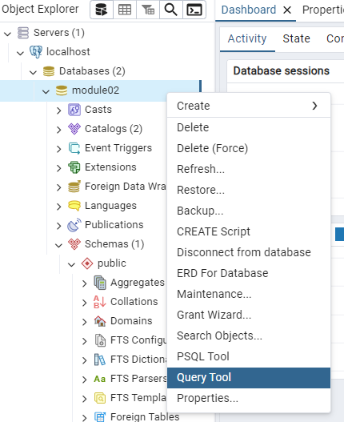

= Lab 2-1d : SQL을 사용한 릴레이션 생성 및 수정 (Postgres)

== 연습 1 SQL을 사용한 릴레이션 생성

이 연습에서는 SQL을 사용하여 릴레이션을 생성합니다. 이 연습에서는 아래와 같은 릴레이션 스키마를 가진 두 릴레이션을 생성합니다.

_Category(CategoryNo: Integer, CategoryName: String) +
Product(ProductNo: Integer, ModelNumber: String, ProductName: String, Price: float, CategoryNo: Integer)_

이 연습은 두 가지 단계로 구성됩니다.

1. psql 콘솔에서 Category 릴레이션 생성
2. pgadmin을 사용하여 Product 릴레이션 생성

=== psql Console에서 Category 릴레이션 생성

. macOS에서는 터미널, Windows에서는 명령 프롬프트를 실행합니다.
. 아래 명령을 실행하여 PostgreSQL 컨테이너에 접속합니다.
+
----
docker exec -it postgres bash
----
+
. 아래 명령을 실행하여 psql 콘솔을 실행합니다.
+
----
$ psql -U postgres
----
+
. 아래 명령을 수행하여 DBMS에 생성된 데이터베이스를 확인합니다.
+
----
postgres=# \l
----
+
명령의 실행 결과는 아래와 유사할 것입니다:
+
----
                                                      List of databases
   Name    |  Owner   | Encoding | Locale Provider |  Collate   |   Ctype    | ICU Locale | ICU Rules |   Access privileges
-----------+----------+----------+-----------------+------------+------------+------------+-----------+-----------------------
 postgres  | postgres | UTF8     | libc            | en_US.utf8 | en_US.utf8 |            |           |
 template0 | postgres | UTF8     | libc            | en_US.utf8 | en_US.utf8 |            |           | =c/postgres          +
           |          |          |                 |            |            |            |           | postgres=CTc/postgres
 template1 | postgres | UTF8     | libc            | en_US.utf8 | en_US.utf8 |            |           | =c/postgres          +
           |          |          |                 |            |            |            |           | postgres=CTc/postgres
----
+
. 아래 질의를 실행하여 DBMS에 생성된 데이터베이스를 확인합니다.
+
[source, sql]
----
postgres=# SELECT datname FROM pg_database;
----
+
명령의 실행결과는 아래와 유사할 것입니다.
+
----
  datname
-----------
 postgres
 template1
 template0
(3 rows)
----
+
. 아래 질의를 실행하여 `Module02` 데이터베이스를 생성합니다.
+
[source, sql]
----
postgres=# CREATE DATABASE Module02;
----
+
질의가 성공적으로 수행되면, 아래와 유사한 메시지가 표시됩니다.
+
----
CREATE DATABASE
----
. 아래 명령을 실행하여 콘솔의 데이터베이스 컨텍스트를 생성한 Module02 데이터베이스로 변경합니다.
+
[source, sql]
----
postgres=# \c module02
----
+
명령이 성공적으로 수행되면, 아래와 같은 메시지가 표시됩니다.
+
----
You are now connected to database "module02" as user "postgres".
----
+
. 아래 명령을 실행하여 생성한 `Module02` 데이터베이스의 릴레이션(물리적 데이터베이스 관점에서 테이블)을 확인합니다.
+
[source, sql]
----
module02=# \dt
----
+
명령이 실행되면, 아래와 같은 메시지가 표시됩니다.
+
----
Did not find any relations.
----
+
. 아래 질의를 수행하여 `Category` 릴레이션을 생성합니다.
+
[source, sql]
----
module02=# CREATE TABLE Category (
CategoryNo int,
CategoryName varchar(20)
);
----
+
질의가 성공적으로 수행되면, 아래와 같은 메시지가 표시됩니다.
+
----
CREATE TABLE
----
. 아래 명령을 실행하여 `Module02` 데이터베이스에 생성된 릴레이션(물리적 데이터베이스 관점에서 테이블)을 확인합니다.
+
[source, sql]
----
module02=# \dt
----
+
명령이 성공적으로 수행되면, 아래와 같은 메시지가 표시됩니다.
+
----
          List of relations
 Schema |   Name   | Type  |  Owner
--------+----------+-------+----------
 public | category | table | postgres
(1 row)
----

=== pgadmin에서 Product 릴레이션 생성

. pgAdmin을 실행합니다.
. `Object Explorer` 에서 Servers 노드를 확장하고 postgreSQL 컨테이너 실행시에 입력한 패스워드를 입력하여 로그인합니다.
+

+
. Object Explorer에서, Databases > module02 > Schemas > public > Tables 를 확장하고 테이블을 확인합니다.
. module02 데이터베이스를 마우스 오른쪽 클릭하고 `Query Tool` 을 클릭합니다.
+

+
. 쿼리 창에서, 아래 질의를 입력하고 `Execute script` 버튼을 클릭합니다.
+
[source, sql]
----
CREATE TABLE Product (
	ProductNo int,
	ProductName varchar(30),
	Price Money,
	Category int
);
----
+

+
. `Object Explorer` 창의 `Tables` 노드를 마우스 오른쪽 클릭하고 `Refresh` 를 클릭합니다.
+

+
. `Module02` 데이터베이스에 릴레이션을 확인합니다.
+

== 연습 2 릴레이션에서 데이터 삽입/조회/수정

이 연습에서는 생성한 릴레이션에 SQL 구문을 사용하여 데이터를 삽입, 조회하고 수정합니다. 아래 절차를 따릅니다.

. psql 콘솔에서 아래 질의를 수행하여 `Category` 테이블의 데이터를 조회합니다.
+
[source, sql]
----
module02=# SELECT * FROM Category; 
----
+
명령이 수행되면, 비어있는 릴레이션을 보여줍니다.
+
----
 categoryno | categoryname
------------+--------------
(0 rows)
----
+
. 다음 두 질의를 수행하여 `Category` 테이블에 데이터를 입력합니다.
+
[source, sql]
----
module02=# INSERT INTO Category VALUES (1, 'Novel');
module02=# INSERT INTO Category VALUES (2, 'Poem');
----
+
명령이 성공적으로 수행되면 아래와 같은 메시지가 출력됩니다.
+
----
INSERT 0 1
----
+
. 다음 질의를 수행하여 삽입한 데이터를 확인합니다.
+
[source, sql]
----
module02=# SELECT * FROM Category;
----
+
명령이 성공적으로 수행되면 아래와 같은 메시지가 출력됩니다.
+
----
 categoryno | categoryname
------------+--------------
          1 | Novel
          2 | Poem
(2 rows)
----
+
. 다음 질의를 수행하여 `Category` 릴레이션에 데이터를 삽입합니다.
+
[source, sql]
----
module02=# INSERT INTO Category VALUES (3, 'History / Religion and Magazine');
----
+
명령은 성공적으로 수행되지 않습니다. 아래와 같은 오류 메시지가 출력됩니다.
+
----
ERROR:  value too long for type character varying(20)
----
+
. 다음 질의를 수행하여 Category 릴레이션의 데이터를 수정합니다.
+
[source, sql]
----
module02=# UPDATE Category SET
module02-# CategoryName = 'History'
----
+
명령이 성공적으로 수행되면 아래와 같은 메시지를 출력합니다.
+
----
UPDATE 2
----
+
. 아래 질의를 수행하여 Category 릴레이션의 수정된 데이터를 확인합니다.
+
[source, sql]
----
module02=# SELECT * FROM Category;
----
+
명령이 수행되면 아래와 같은 결과를 반환합니다.
+
----
 categoryno | categoryname
------------+--------------
          1 | History
          2 | History
(2 rows)
----
+
. 아래 질의를 수행하여 Category 릴레이션의 데이터를 다시 수정합니다.
+
[source, sql]
----
module02=# UPDATE Category SET
module02-# CategoryName = 'Novel'
module02-# WHERE CategoryNo = 1;
----
+
명령이 성공적으로 수행되면 아래와 같은 결과를 반환합니다.
+
----
UPDATE 1
----
+
. 아래 질의를 수행하여 Category 테이블의 CategoryNo 필드의 데이터를 수정합니다.
+
[source, sql]
----
module02=# UPDATE Category SET
module02-# CategoryNo = 3
module02-# WHERE CategoryNo = 2;
----
+
명령이 성공적으로 수행되면 아래와 같은 결과를 반환합니다.
+
----
UPDATE 1
----
. 아래 질의를 수행하여 Category 릴레이션의 수정된 데이터를 확인합니다.
+
[source, sql]
----
module02=# SELECT * FROM Category;
----
+
명령이 성공적으로 수행되면 아래와 같은 결과를 반환합니다.
+
----
 categoryno | categoryname
------------+--------------
          1 | Novel
          3 | History
(2 rows)
----

link:./14_integrity_constraint.adoc[다음: 무결성 제약조건]