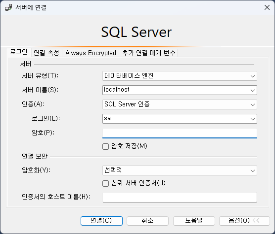

= Lab 2-2b : SQL을 사용한 무결성 제약조건 설정 (Microsoft SQL Server)

== 연습 1 SQL을 사용하여 개체 무결성을 위한 기본 키 제약조건 설정

이 연습에서는 SQL을 사용하여 연습 2-1에서 생성한 두 릴레이션에 무결성 제약조건을 설정합니다. 도메인 제약조건은 릴레이션 스키마에 이미 정의되어 적용되었으므로, 개체 무결성과 참조 무결성을 유지하기 위한 무결성 제약조건을 설정합니다. 아래 절차에 따릅니다.

=== 서버에 접근하고 현재 데이터베이스 설정

. SQL Server Management Studio 또는 Azure Data Studio를 실행합니다.
. `서버에 연결` 창에서 아래와 같이 입력하고 '연결' 버튼을 클릭합니다.
A. 서버 이름 `localhost`
B. 인증: `SQL Server 인증` 
C. 로그인: `sa`
D. 암호: <설치시 지정한 암호>
E. 암호화: `선택적`
+

+
. 위에서 `새 쿼리` 버튼을 클릭합니다.
. 아래 명령을 실행하여 현재 데이터베이스를 `Module02` 로 변경합니다.
+
[source, sql]
----
USE Module02
GO
----

=== `Category` 릴레이션에 기본 키 제약조건 설정

. 아래 명령을 실행하여 `Module02` 데이터베이스에 생성된 릴레이션(테이블)들을 확인합니다.
+
[source, sql]
----
SELECT Table_Name
FROM INFORMATION_SCHEMA.Tables 
WHERE Table_Type = 'BASE TABLE'
----
+
명령의 실행 결과는 아래와 유사할 것입니다.
+

+
. 아래 명령을 실행하여 `Category` 테이블의 스키마 정보를 확인합니다.
+
[source, sql]
----
EXEC sp_help 'Category';
----
+
명령의 실행 결과는 아래와 유사할 것입니다.
+

+
. 아래 질의를 실행하여 `Category` 테이블의 `CategoryNo` 컬럼에 기본 키 제약조건을 추가합니다.
+
[source, sql]
----
ALTER TABLE Category ALTER COLUMN CategoryNo int NOT NULL;
ALTER TABLE Category ADD CONSTRAINT pk_Category PRIMARY KEY(CategoryNo);
----
+
질의가 성공적으로 수행되면 결과는 아래와 유사할 것입니다.
+
----
명령이 완료되었습니다.

완료 시간: 2024-08-06T12:58:29.7782452+09:00
----
+
. 아래 명령을 다시 실행하여 `Category` 테이블의 스키마 정보를 다시 확인합니다.
+
[source, sql]
----
EXEC sp_help 'Category';
----
+
명령이 실행되면 결과는 아래와 같을 것입니다. `Category` 테이블의 `CategoryNo` 필드에 기본 키 제약조건이 적용되었습니다.
+

+
. 아래 질의를 실행하여 `Category` 테이블의 데이터를 확인합니다.
+
[source, sql]
----
mysql> SELECT * FROM Category;
----
+
질의가 성공적으로 수행되면 아래와 유사한 결과를 반환할 것입니다.
+

+
. 아래 질의를 실행하여 `Category` 테이블에 데이터를 삽입합니다.
+
[source, sql]
----
INSERT INTO Category (CategoryNo, CategoryName) VALUES (3, 'Science')
----
+
질의는 성공적으로 수행되지 않습니다. `Category` 테이블에 개체 무결성을 위한 기본 키 제약조건(Primary Constraint)이 적용되었고, 기본 키 제약조건에 해당하는 컬럼은 중복되는 값을 저장할 수 없습니다. 결과는 아래와 같습니다.
+
----
메시지 2627, 수준 14, 상태 1, 줄 3
PRIMARY KEY 제약 조건 'pk_Category'을(를) 위반했습니다. 개체 'dbo.Category'에 중복 키를 삽입할 수 없습니다. 중복 키 값은 (3)입니다.
문이 종료되었습니다.
----

=== Product 릴레이션에 기본 키 제약조건 설정

. 아래 명령을 실행하여 `Product` 테이블의 스키마 정보를 확인합니다.
+
[source, sql]
----
EXEC sp_help 'Product'
----
+
명령의 실행결과는 아래와 유사할 것입니다.
+

+
. 아래 질의를 실행하여 `Category` 테이블의 `CategoryNo` 컬럼에 기본 키 제약조건을 추가합니다.
+
[source, sql]
----
ALTER TABLE Product ALTER COLUMN ProductNo int NOT NULL;
ALTER TABLE Product ADD CONSTRAINT pk_Product PRIMARY KEY(ProductNo);
----
+
질의가 성공적으로 수행되면 아래와 같은 메시지가 출력됩니다.
+
----
명령이 완료되었습니다.
----
. 개체 탐색기에서 Module 2 데이터베이스의 `dbo.Product` 테이블 > `열` 을 확장하고 생성된 Primary Key를 확인합니다.
+
image::../images/image30.png[]
+
. 아래 질의를 실행하여 Product 테이블의 데이터를 확인합니다.
+
[source, sql]
----
SELECT ProductNo, ProductName, Price, CategoryNo FROM Product
----
+
빈 릴레이션이 출력됩니다.
+
. 아래 질의를 실행하여 Product 테이블에 데이터를 삽입합니다.
+
[source, sql]
----
INSERT INTO Product (ProductNo, ProductName, Price) VALUES (20101927, 'The Second World War', 37800);
----
+
질의가 수행되면 결과는 아래와 같을 것입니다.
+
----
(1개 행 적용됨)
----
+
. 아래 질의를 실행하여 Product 테이블의 데이터를 확인합니다.
+
[source, sql]
----
SELECT * FROM Product;
----
+
질의가 수행되면 결과는 아래와 같을 것입니다.
+

== 연습 2 SQL을 사용하여 참조 무결성을 위한 외래 키 제약조건 설정

여기에서는 `Product` 릴레이션의 `CategoryNo` 속성이 `Category` 릴레이션의 `CategoryNo` 속성을 참조하도록 제약조건을 설정합니다. 아래 절차에 따릅니다.

. 아래 질의를 실행하여 `Product` 테이블의 `CategoryNo` 필드에 외래 키 제약조건을 적용합니다. `Product` 테이블의 CategoryNo 필드를 참조합니다.
+
[source, sql]
----
ALTER TABLE Product ADD CONSTRAINT fk_Product_Category FOREIGN KEY(CategoryNo) REFERENCES Category(CategoryNo);
----
+
질의가 성공적으로 수행되면 결과는 아래와 같을 것입니다.
+
----
명령이 완료되었습니다.
----
+
. 아래 질의를 실행하여 `Category` 테이블의 값을 확인합니다. `Category` 테이블에는 두 개의 투플이 있으며, `CategoryNo` 필드의 데이터는 각각 1 3입니다.
+
[source, sql]
----
SELECT * FROM Category;
----
+
질의가 성공적으로 수행되면 아래와 유사한 결과를 반환할 것입니다.
+

. 아래 질의를 실행하여 `Product` 테이블의 `ProductNo` 가 20101927인 투플의 `CategoryNo` 필드의 값을 2로 변경합니다.
+
[source, sql]
----
UPDATE Product SET
CategoryNo = 2
WHERE ProductNo = 20101927;
----
+
질의는 거부됩니다. `Product` 테이블에서 `CategoryNo` 필드 값으로 업데이트하려는 2는 `Category` 테이블의 `CategoryNo` 필드에 존재하지 않습니다. 결과는 아래와 같습니다.
+
----
메시지 547, 수준 16, 상태 0, 줄 1
UPDATE 문이 FOREIGN KEY 제약 조건 "fk_Product_Category"과(와) 충돌했습니다. 데이터베이스 "Module02", 테이블 "dbo.Category", column 'CategoryNo'에서 충돌이 발생했습니다.
문이 종료되었습니다.
----
+
. 아래 질의를 실행하여 Product 테이블의 ProductNo가 20101927인 투플의 CategoryNo 필드의 값을 3으로 변경합니다.
+
[source, sql]
----
UPDATE Product SET
CategoryNo = 3
WHERE ProductNo = 20101927;
----
+
질의가 성공적으로 수행되면 결과는 아래와 같습니다.
+
----
(1개 행 적용됨)
----
+
. 아래 질의를 수행하여 Product 테이블의 데이터를 확인합니다.
+
[source, sql]
----
mysql> SELECT * FROM Product;
----
+
질의가 수행되면 결과는 아래와 같을 것입니다.
+

+
. 아래 질의를 수행하여 `Product` 테이블에 데이터를 삽입합니다.
+
[source, sql]
----
INSERT INTO Product (ProductNo, ProductName, Price, CategoryNo) VALUES (97422537, 'Hobbit', 28800, 1);
INSERT INTO Product (ProductNo, ProductName, Price, CategoryNo) VALUES (97422515, 'Lord of the Rings 1', 28800, 1);
----
+
. 아래 질의를 수행하여 `Product` 테이블의 데이터를 확인합니다.
+
[source, sql]
----
mysql> SELECT * FROM Product;
----
+
질의가 수행되면 결과는 아래와 같을 것입니다.
+

=== 참조하는 릴레이션에 없는 값에 대한 삽입이 시도되는 경우

. 아래 질의를 실행하여 Product 테이블에 데이터 삽입을 시도합니다.
+
[source, sql]
----
INSERT INTO Product (ProductNo, ProductName, Price, CategoryNo) VALUES (2312211, 'Cosmos', 28800, 2);
----
+
질의는 성공적으로 수행되지 않습니다. `Product` 테이블에 참조 무결성을 위한 외래 키 제약조건(Foreign Key Constraint)이 적용되었고, `Product` 테이블의 `CategoryNo` 필드는 `Category` 테이블의 `CategoryNo` 필드를 참조합니다. `Category` 테이블에는 `CategoryNo` 필드의 값이 2인 투플은 존재하지 않습니다 결과는 아래와 같습니다.
+
----
메시지 547, 수준 16, 상태 0, 줄 1
INSERT 문이 FOREIGN KEY 제약 조건 "fk_Product_Category"과(와) 충돌했습니다. 데이터베이스 "Module02", 테이블 "dbo.Category", column 'CategoryNo'에서 충돌이 발생했습니다.
문이 종료되었습니다.
----
. 아래 질의를 실행하여 `Category` 테이블에 데이터를 삽입합니다.
+
[source, sql]
----
INSERT INTO Category VALUES (2, 'Science');
----
+
질의가 성공적으로 수행되면 결과는 아래와 같을 것입니다.
+
----
(1개 행 적용됨)
----
. 아래 질의를 실행하여 `Category` 테이블의 데이터를 확인합니다.
+
[source, sql]
----
SELECT * FROM Category;
----
+
질의가 실행되면 결과는 아래와 유사할 것입니다.
+
image::../images/image35.png[]
+
. 아래 질의를 다시 실행하여 `Product` 테이블에 데이터를 삽입합니다.
+
[source, sql]
----
INSERT INTO Product (ProductNo, ProductName, Price, CategoryNo) VALUES (2312211, 'Cosmos', 28800, 2);
----
+
질의가 성공적으로 수행되면 결과는 아래와 같을 것입니다.
+
----
(1개 행 적용됨)
----

=== 참조 릴레이션의 데이터가 삭제되는 경우

현재 `Category` 릴레이션과 `Product` 릴레이션의 데이터는 아래와 같습니다.

image:../images/image11.png[]
 
. 아래 질의를 실행하여 `Category` 테이블에서 `CategoryNo` 가 2인 투플 삭제를 시도합니다.
+
[source, sql]
----
DELETE FROM Category WHERE CategoryNo = 2;
----
+
질의는 성공적으로 수행되지 않습니다. `Product` 테이블에 참조 무결성을 위한 외래 키 제약조건(Foreign Key Constraint)가 적용되었고, `Product` 테이블의 `CategoryNo` 필드는 `Category` 테이블의 `CategoryNo` 필드를 참조합니다. `Product` 테이블에는 `CategoryNo` 가 2인 투플이 존재하고, `Category`` 테이블의 `CategoryNo` 가 2인 투플이 삭제되면 `Product` 테이블의 `CategoryNo` 가 2인 투플의 무결성은 지켜지지 않습니다.  결과는 아래와 같습니다.
+
----
메시지 547, 수준 16, 상태 0, 줄 1
DELETE 문이 REFERENCE 제약 조건 "fk_Product_Category"과(와) 충돌했습니다. 데이터베이스 "Module02", 테이블 "dbo.Product", column 'CategoryNo'에서 충돌이 발생했습니다.
문이 종료되었습니다.
----
. 아래 질의를 수행하여 `Product` 테이블의 제약조건을 확인합니다.
+
[source, sql]
----
SELECT OBJECT_NAME(OBJECT_ID),
	SCHEMA_NAME(schema_id),
	OBJECT_NAME(parent_object_id)
	,type_desc
FROM sys.objects 
WHERE OBJECT_NAME(parent_object_id) = 'Product' AND
type_desc IN ('FOREIGN_KEY_CONSTRAINT','PRIMARY_KEY_CONSTRAINT')
----
+
명령이 성공적으로 실행되면 결과는 아래와 유사할 것입니다.
+

+
. `개체 탐색기` 에서 Product 테이블을 확장하고 키 를 확장한 다음 fk_Product_Category 외래 키를 마우스 오른족 클릭하고 `수정` 을 클릭합니다.
+

+
. 외래 키 관계 대화상자에서, `INSERT 및 UPDATE 사양` 을 확장하고 `삭제 규칙` 과 `업데이트 규칙` 을 `계단식 배열` 로 수정 한 후 닫기 버튼을 클릭합니다.
+

+
. dbo.Product 디자인 창에서 저장 버튼을 클릭합니다.
. 아래 질의를 실행하여 Category 테이블에서 CategoryNo가 2인 투플을 삭제합니다.
+
[source, sql]
----
DELETE FROM Category WHERE CategoryNo = 2;
----
+
쿼리가 성공적으로 수행되면 결과는 아래와 같습니다.
+
----
(1개 행 적용됨)
----
+
. 아래 질의를 실행하여 Category 테이블의 데이터를 확인합니다.
+
[source, sql]
----
SELECT * FROM Category;
----
+
쿼리가 수행되면 결과는 아래와 같을 것입니다.
+

+
. 아래 질의를 수행하여 Product 테이블의 데이터를 확인합니다.
+
[source, sql]
----
SELECT * FROM Product;
----
+
외래 키 제약조건이 `ON DELETE CASCADE` 로 적용되면 참조 테이블의 투플이 삭제될 때 이를 참조하는 테이블의 모든 투플이 삭제됩니다. 결과는 아래와 유사할 것입니다.
+

+
. 아래 질의를 수행하여 `Product` 테이블의 `fk_Product_Category` 제약 조건을 삭제합니다.
+
[source, sql]
----
ALTER TABLE Product DROP CONSTRAINT fk_Product_Category;
----
+
질의가 성공적으로 수행되면 결과는 아래와 유사할 것입니다.
+
----
명령이 완료되었습니다.
----
. 아래 질의를 수행하여 `Product` 테이블에 외래 키 제약 조건을 다시 적용합니다. 제약조건에 `ON DELETE SET NULL` 을 추가하여 참조 릴레이션의 투플이 삭제되면 외래 키가 존재하는 테이블의 해당 투플의 데이터가 `NULL` 로 지정되도록 적용합니다.
+
[source, sql]
----
ALTER TABLE Product ADD CONSTRAINT fk_Product_Category FOREIGN KEY(CategoryNo) REFERENCES Category(CategoryNo) ON DELETE SET NULL;
----
+
질의가 성공적으로 수행되면 결과는 아래와 유사할 것입니다.
+
----
명령이 완료되었습니다.
----
+
. 아래 질의를 수행하여 `Category` 테이블에서 `CategoryNo` 값이 3인 투플을 삭제합니다.
+
[source, sql]
----
DELETE FROM Category WHERE CategoryNo = 3;
----
+
질의가 성공적으로 수행되면 결과는 아래와 같을 것입니다.
+
----
(1개 행 적용됨)
----
. 아래 질의를 수행하여 Product 테이블의 데이터를 확인합니다.
+
[source, sql]
----
SELECT * FROM Product;
----
+
외래 키 제약조건이 `ON DELETE SET NULL` 로 적용되면 참조 테이블의 투플이 삭제될 때 이를 참조하는 테이블의 모든 투플의 해당 값이 `NULL` 로 지정됩니다. 결과는 아래와 유사할 것입니다.
+

+
. 아래 질의를 수행하여 Product 테이블의 fk_Product_Category 제약 조건을 삭제합니다.
+
[source, sql]
----
ALTER TABLE Product DROP CONSTRAINT fk_Product_Category;
----
+
질의가 성공적으로 수행되면 결과는 아래와 유사할 것입니다.
+
----
령이 완료되었습니다.
----
+
. 아래 질의를 수행하여 Product 테이블에 외래 키 제약 조건을 다시 적용합니다. 제약조건에 ON DELETE NO ACTION을 추가하여 삭제를 시도하는 릴레이션의 투플의 해당 필드를 참조하는 다른 릴레이션의 데이터가 존재할 경우 질의 실행이 거부되도록 적용합니다.
+
[source, sql]
----
ALTER TABLE Product ADD CONSTRAINT fk_Product_Category FOREIGN KEY(CategoryNo) REFERENCES Category(CategoryNo) ON DELETE NO ACTION;
----
+
질의가 성공적으로 수행되면 결과는 아래와 같습니다.
+
----
명령이 완료되었습니다.
----
+
. 아래 질의를 수행하여 Category 테이블에서 CategoryNo 필드의 값이 1인 투플의 삭제를 시도합니다.
+
[source, sql]
----
DELETE FROM Category WHERE CategoryNo = 1;
----
+
외래 키 제약조건이 `ON DELETE NO ACTION` 으로 적용되면 삭제를 시도하는 릴레이션의 투플의 해당 필드를 참조하는 다른 릴레이션의 데이터가 존재할 경우 질의 실행이 거부됩니다. 결과는 아래와 유사할 것입니다.
+
----
메시지 547, 수준 16, 상태 0, 줄 1
DELETE 문이 REFERENCE 제약 조건 "fk_Product_Category"과(와) 충돌했습니다. 데이터베이스 "Module02", 테이블 "dbo.Product", column 'CategoryNo'에서 충돌이 발생했습니다.
문이 종료되었습니다.
----

=== 참조 릴레이션의 데이터가 갱신되는 경우

. 아래 질의를 수행하여 Product 테이블의 fk_Product_Category 제약 조건을 삭제합니다.
+
[source, sql]
----
ALTER TABLE Product DROP CONSTRAINT fk_Product_Category;
----
+
질의가 성공적으로 수행되면 결과는 아래와 유사할 것입니다.
+
----
명령이 완료되었습니다.
----
+
. 아래 질의를 수행하여 `Product` 테이블에 외래 키 제약 조건을 다시 적용합니다. 제약조건에 `ON UPDATE CASCADE` 을 추가하여 투플의 해당 필드 값이 갱신될 경우 해당 값을 참조하는 모든 릴레이션의 필드 값이 같이 갱신되도록 지정합니다.
+
[source, sql]
----
ALTER TABLE Product ADD CONSTRAINT fk_Product_Category FOREIGN KEY(CategoryNo) REFERENCES Category(CategoryNo) ON UPDATE CASCADE;
----
+
질의가 성공적으로 수행되는 결과는 아래와 유사할 것입니다.
+
----
명령이 완료되었습니다.
----
+
. 아래 질의를 수행하여 `Category` 테이블의 `CategoryNo` 가 1인 투플의 `CategoryNo` 필드 값을 2로 갱신합니다.
+
[source, sql]
----
UPDATE Category SET CategoryNo = 2 WHERE CategoryNo = 1;
----
+
질의가 성공적으로 수행되면 결과는 아래와 유사할 것입니다.
+
----
(1개 행 적용됨)
----
. 아래 질의를 수행하여 `Product` 테이블의 데이터를 확인합니다.
+
[source, sql]
----
SELECT * FROM Product;
----
+
질의가 성공적으로 수행되면 결과는 아래와 유사할 것입니다.
+

+
. 아래 질의를 수행하여 `Product` 테이블의 `fk_Product_Category` 제약 조건을 삭제합니다.
+
[source, sql]
----
ALTER TABLE Product DROP CONSTRAINT fk_Product_Category;
----
+
질의가 성공적으로 수행되면 결과는 아래와 유사할 것입니다.
+
----
명령이 완료되었습니다.
----
+
. 아래 질의를 수행하여 `Product` 테이블에 외래 키 제약 조건을 다시 적용합니다. 제약조건에 `ON UPDATE NO ACTION` 을 추가하여 갱신을 시도하는 릴레이션의 투플의 해당 필드를 참조하는 다른 릴레이션의 데이터가 존재할 경우 질의 실행이 거부되도록 적용합니다.
+
[source, sql]
----
ALTER TABLE Product ADD CONSTRAINT fk_Product_Category FOREIGN KEY(CategoryNo) REFERENCES Category(CategoryNo) ON UPDATE NO ACTION;
----
+
질의가 성공적으로 수행되는 결과는 아래와 유사할 것입니다.
+
----
명령이 완료되었습니다.
----
+
. 아래 질의를 수행하여 `Category` 테이블의 `CategoryNo` 가 2인 투플의 `CategoryNo` 필드 값을 1로 갱신합니다.
+
[source, sql]
----
UPDATE Category SET CategoryNo = 1 WHERE CategoryNo = 2;
----
+
외래 키 제약조건이 `ON DELETE NO ACTION` 으로 적용되면 갱신을 시도하는 릴레이션의 투플의 해당 필드를 참조하는 다른 릴레이션의 데이터가 존재할 경우 질의 실행이 거부됩니다. 결과는 아래와 유사할 것입니다.
+
----
메시지 547, 수준 16, 상태 0, 줄 1
UPDATE 문이 REFERENCE 제약 조건 "fk_Product_Category"과(와) 충돌했습니다. 데이터베이스 "Module02", 테이블 "dbo.Product", column 'CategoryNo'에서 충돌이 발생했습니다.
문이 종료되었습니다.
----
+
. 아래 질의를 수행하여 `Product` 테이블의 `fk_Product_Category` 제약 조건을 삭제합니다.
+
[source, sql]
----
ALTER TABLE Product DROP CONSTRAINT fk_Product_Category;
----
+
질의가 성공적으로 수행되면 결과는 아래와 유사할 것입니다.
+
----
명령이 완료되었습니다.
----
+
. 아래 질의를 수행하여 `Product` 테이블에 외래 키 제약 조건을 다시 적용합니다. 제약조건에 `ON UPDATE SET NULL`  추가하여 참조 릴레이션의 투플의 해당 필드 값이 갱신되면 외래 키가 존재하는 테이블의 해당 투플의 데이터가 `NULL` 로 지정되도록 적용합니다.
+
[source, sql]
----
ALTER TABLE Product ADD CONSTRAINT fk_Product_Category FOREIGN KEY(CategoryNo) REFERENCES Category(CategoryNo) ON UPDATE SET NULL;
----
+
질의가 성공적으로 수행되면 결과는 아래와 같습니다.
+
----
명령이 완료되었습니다.
----
+
. 아래 질의를 수행하여 `Category` 테이블의 `CategoryNo` 가 2인 투플의 `CategoryNo` 필드 값을 1로 갱신합니다.
+
[source, sql]
----
UPDATE Category SET CategoryNo = 1 WHERE CategoryNo = 2;
----
+
. 아래 질의를 수행하여 Product 테이블의 데이터를 확인합니다.
+
[source, sql]
----
SELECT * FROM Product;
----
+
외래 키 제약조건이 `ON DELETE SET NULL` 로 적용되면 갱신을 시도하는 릴레이션의 투플의 해당 필드를 참조하는 다른 릴레이션의 데이터가 `NULL` 로 갱신됩니다. 결과는 아래와 유사할 것입니다.
+

link:./24_review.adoc[다음: 검토]