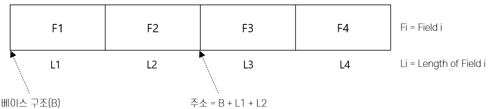

= 고정 길이 레코드

* 각 필드의 길이가 고정적이고 필드의 수도 고정된 레코드 형식
* 필드를 레코드에 연속적으로 저장

---

고정 길이 레코드(Fixed-length Record)는 각 필드의 길이가 고정적이며 필드의 수가 고정되어 있습니다. 레코드의 주소가 주어지면 시스템 카탈로그에 있는 선행 필드들의 길이 정보를 이용하여 원하는 필드의 주소(위치)를 계산해 낼 수 있어 레코드들은 연속적으로 저장할 수 있습니다

link:./18_variant_length_record.adoc[다음: 가변 길이 레코드]