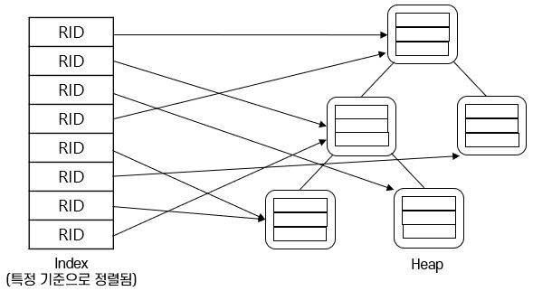

= 인덱스 개요

* 대부분의 자료 구조에서는 저장된 데이터의 rid를 직접 알 수 없음
* 정렬되지 않은 자료 구조에서 동등 검색을 수행할 경우, 전체 자료 구조를 스캔해야 함
* 인덱스(Index) +
선택(Selection) 조건에 맞는 rid를 구할 수 있도록 만든 보조 자료 구조

---

어떤 필드의 값에 대해 같은 데이터를 검색하는 경우가 많습니다. 이때 검색하고자 하는 레코드의 rid만 구할 수 있으면 정렬되지 않은 힙과 같은 형식의 파일에서 해당 레코드를 쉽게 검색할 수 있습니다. 그렇지만 힙 파일에는 레코드의 rid를 구할 수 있는 기능이 없습니다. 이런 경우 **인덱스(Index)**를 사용할 수 있습니다. 인덱스는 **선택(Selection)** 조건에 맞는 레코드의 rid를 구할 수 있도록 만든 보조 자료구조입니다.

도서관에서 원하는 책을 어떻게 찾는지 생각해봅시다. 저자 이름이나 책 제목순으로 정렬된 인덱스 카드를 뒤져서 분류 번호를 알아낼 것입니다. 책은 분류 번호에 따라 정렬 있기 때문에 분류 번호만 알면 원하는 책이 있는 서가로 찾아갈 수 있습니다. 이런 경우 저자 이름에 대한 인덱스는 소용이 없습니다. 하나의 인덱스는 어느 특정한 종류의 탐색에 대해 속도를 높여줄 수 있는 보조 자료구조입니다. 

파일에서 원하는 데이터 부분을 효율적으로 검색할 때에도 같은 방법을 적용할 수 있습니다. 구현의 관점에서 인덱스란 데이터 레코드의 요청에 대해 방향을 가리켜주는 레코드로 구성된, 또 다른 파일입니다. 인덱스마다 **탐색 키(Search Key)**가 정해져 있습니다. 탐색 키는 인덱스 구축의 기준으로 삼는, 레코드 파일에 속한 하나 이상의 필드로 이루어진 집합입니다. 전체 필드 집합의 모든 부분집합은 탐색 키가 될 수 있습니다. 인덱스가 구축된 레코드 파일을 **인덱스된 파일(Indexed File)**이라고 부르기도 합니다.

link:./26_isam.adoc[다음: ISAM 파일]