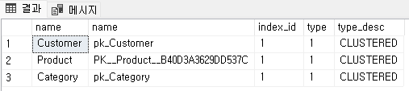
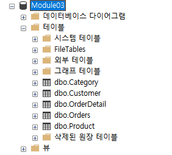

= 테이블 생성 (Microsoft SQL Server)

== 연습 1 SQL Server Management Studio에서 테이블 생성

이 연습에서는 아래와 같은 스키마를 가진 릴레이션을 생성합니다.

_Category(CategoryNo: 정수, CategoryName 문자열) +
Product(ProductNo: 정수,: ProductName:문자열, UnitPrice: 정수, Description: 문자열, CategoryNo: 정수) +
Customer(CustomerNo: 정수, CustomerName: 문자열, email: 문자열, Password: 문자열) +
Orders(OrderNo: 정수, OrderDate: 날짜, CustomerNo: 정수) +
OrderDetail(ProductNo: 숫자, OrderNo:정수 Quantity: 숫자)_

=== SQL Server Management Studio에 접속하고 데이터베이스 생성

1. SQL Server Management 또는 Azure Data Studio를 실행합니다.
2. `서버에 연결` 창에서 아래와 같이 입력하고 '연결' 버튼을 클릭합니다.
A. 서버 이름 `localhost`
B. 인증: `SQL Server 인증` 
C. 로그인: `sa`
D. 암호: <설치시 지정한 암호>
E. 암호화: `선택적`
3. 위쪽에서 `새 쿼리` 버튼을 클릭합니다.
4. 새 쿼리 창에서 아래 명령을 실행하여 Module03 데이터베이스를 생성하고, 연결 컨텍스트를 생성한 Module03 데이터베이스로 변경합니다.
+
[source, sql]
----
CREATE DATABASE Module03
GO
USE Module03
GO
----
5. 아래 쿼리를 실행하여 생성한 Module03 데이터베이스의 테이블을 확인합니다.
+
[source, sql]
----
SELECT * FROM INFORMATION_SCHEMA.Tables WHERE TABLE_TYPE = 'base table'
----

=== Category 테이블 생성

이 연습에서는 Module03 데이터베이스에 Category 테이블을 생성합니다. 아래 절차에 따릅니다.

1. 새 쿼리 창에서 아래 쿼리를 실행합니다.
+
[source, sql]
----
CREATE TABLE Category (
    CategoryNo int,
    CategoryName varchar(20) NOT NULL

    CONSTRAINT pk_Category PRIMARY KEY(CategoryNo)
)
----
+
2. 아래 쿼리를 실행하여 생성된 테이블 정보를 확인합니다.
+
[source, sql]
----
SELECT COLUMN_NAME, IS_NULLABLE, DATA_TYPE FROM INFORMATION_SCHEMA.COLUMNS
WHERE TABLE_NAME = 'Category'
----
+
결과는 아래와 유사할 것입니다.
+

=== Product 테이블 생성

이 연습에서는 Module03 데이터베이스에 Product 테이블을 생성합니다. 아래 절차에 따릅니다.

1. 새 쿼리 창에서 아래 쿼리를 실행합니다.
+
[source, sql]
----
CREATE TABLE Product (
    ProductNo int PRIMARY KEY,
    ProductName varchar(100) NOT NULL,
    UnitPrice money DEFAULT 0 NOT NULL,
    Description nvarchar(max),
    CategoryNo int

    CONSTRAINT fk_Product_CategoryID FOREIGN KEY(CategoryNo) REFERENCES Category(CategoryNo)
)
----
+
2. 아래 쿼리를 실행하여 생성된 테이블 정보를 확인합니다.
+
[source, sql]
----
SELECT COLUMN_NAME, IS_NULLABLE, DATA_TYPE FROM INFORMATION_SCHEMA.COLUMNS
WHERE TABLE_NAME = 'Product'
----
+
결과는 아래와 유사할 것입니다.
+
image::../images/image14.png[]

=== Customer 테이블 생성

이 연습에서는 Module03 데이터베이스에 Product 테이블을 생성합니다. 아래 절차에 따릅니다.

1. 새 쿼리 창에서 아래 쿼리를 실행합니다.
+
[source, sql]
----
CREATE TABLE Customer (
	CustomerNo int,
	CustomerName nvarchar(10),
	Email varchar(40),
	Password varchar(16),
)
----
+
2. 아래 쿼리를 실행하여 생성한 테이블의 인덱스 타입을 확인합니다.
+
[source, sql]
----
SELECT t.name, i.index_id, i.type, i.type_desc
FROM sys.tables t INNER JOIN sys.indexes i
    ON t.object_id = i.object_id
----
+
결과는 아래와 유사할 것입니다.
+

+
index_id 컬럼이 의미하는 것은 아래와 같습니다.
+
[%header, width=60%, cols="15,85"]
|===
|값|설명
|0|Heap
|1|Clustered Index
|> 1|Non Clustered Index
|===
+
Microsoft SQL Server에서 type이 의미하는 것은 아래와 같습니다.
+
[%header, width=60%, cols="15,85"]
|===
|값|설명
|0|heap
|1|Clustered rowstore(B+트리)
|2|Non Clustered rowstore(B+트리)
|3|XML
|4|space
|5|Clustered columnstore Index
|6|Non Clustered columnstore Index
|7|Non Clustered hash index
|===

=== Orders 테이블 생성

여기에서는 Orders 테이블을 생성합니다. 아래 절차에 따릅니다.

1. 쿼리 창에서 아래 쿼리를 실행합니다.
+
[source, sql]
----
CREATE TABLE Orders (
    OrderNo int,
    OrderDate Date,
    CustomerNo int,

    CONSTRAINT pk_Order PRIMARY KEY(OrderNo),
    CONSTRAINT fk_Order_Customer FOREIGN KEY(CustomerNo) REFERENCES Customer(CustomerNo)
)
----
+
쿼리는 실패합니다. 위에서 생성한 Customer 테이블은 PRIMARY KEY가 없이 생성된 Heap 이고, 유일성을 보장하는 기본 키(Primary Key) 또는 후보 키(Candidate Key)가 없기 때문입니다. 메시지는 아래와 같습니다.
+
----
메시지 1776, 수준 16, 상태 0, 줄 15
참조되는 테이블 'Customer'에 외래 키 'fk_Order_Customer'의 참조 열 목록과 일치하는 기본 키 또는 후보 키가 없습니다.
메시지 1750, 수준 16, 상태 1, 줄 15
제약 조건 또는 인덱스를 만들 수 없습니다. 이전 오류를 참조하십시오.
----
+
2. 아래 쿼리를 실행하여 Customer 테이블의 CustomerNo 컬럼에 PRIMARY KEY 제약조건을 설정합니다.
+
[source, sql]
----
ALTER TABLE Customer ALTER COLUMN CustomerNo int NOT NULL
GO
ALTER TABLE Customer ADD CONSTRAINT pk_Customer PRIMARY KEY(CustomerNo)
GO
----
+
3. 아래 쿼리를 실행하여 Module03 데이터베이스에 생성된 테이블의 타입을 확인합니다.
+
[source, sql]
----
SELECT t.name, i.name, i.index_id, i.type, i.type_desc
FROM sys.tables t INNER JOIN sys.indexes i
    ON t.object_id = i.object_id
----
+ 
결과는 아래와 유사할 것입니다.
+

+
4. 아래 쿼리를 실행하여 Orders 테이블을 생성합니다.
+
[source, sql]
----
CREATE TABLE Orders (
    OrderNo int,
    OrderDate Date,
    CustomerNo int,

    CONSTRAINT pk_Order PRIMARY KEY(OrderNo),
    CONSTRAINT fk_Order_Customer FOREIGN KEY(CustomerNo) REFERENCES Customer(CustomerNo)
)
----

=== OrderDetail 테이블 생성

이 연습에서는 OrderDetail 테이블을 생성합니다. 아래 절차에 따릅니다.

1. 쿼리 창에서 아래 쿼리를 실행하여 OrderDetail 테이블을 생성합니다.
+
[source, sql]
----
CREATE TABLE OrderDetail (
    ProductNo int,
    OrderNo	int,
    Quantity int,

    CONSTRAINT pk_OrderDetail PRIMARY KEY(ProductNo, OrderNo),
    CONSTRAINT fk_OrderDetail_Order FOREIGN KEY(OrderNo) REFERENCES Orders(OrderNo),
    CONSTRAINT fk_OrderDetail_Product FOREIGN KEY(ProductNo) REFERENCES Product(ProductNo)
)
----

=== 생성된 개체 확인

1. 개체 탐색기에서 Module03 데이터베이스를 마우스 오른쪽 클릭하고 `새로 고침` 을 클릭합니다.
2. Module03 > 테이블 노드를 확장하고, 생성된 테이블을 확인합니다.
+

+
3. 각 테이블을 확장하여 생성된 테이블의 정보를 확인합니다.

link:./31_review.adoc[다음: 검토]