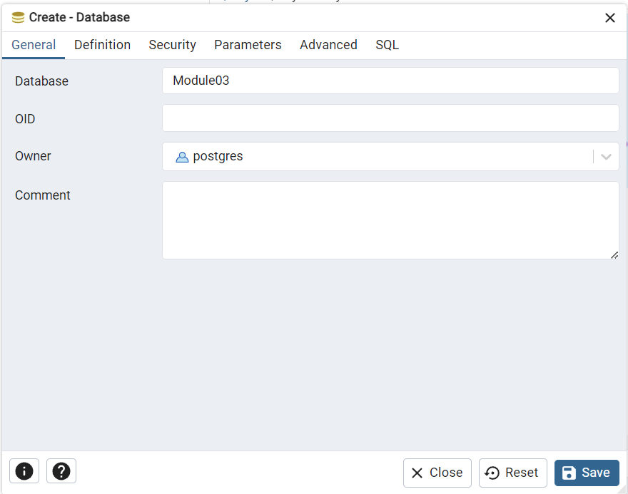

= = Lab 3d : 테이블 생성 (Postgres)

== 연습 1 pgAdmin 에서 테이블 생성

이 연습에서는 아래와 같은 스키마를 가진 릴레이션을 생성합니다.

_Category(CategoryNo: 정수, CategoryName 문자열) +
Product(ProductNo: 정수,: ProductName:문자열, UnitPrice: 정수, Description: 문자열, CategoryNo: 정수) +
Customer(CustomerNo: 정수, CustomerName: 문자열, email: 문자열, Password: 문자열) +
Orders(OrderNo: 정수, OrderDate: 날짜, CustomerNo: 정수) +
OrderDetail(ProductNo: 숫자, OrderNo:정수 Quantity: 숫자)_

=== pgAdmin을 통해 Postgres 데이터베이스에 접속하고 데이터베이스 생성

1. pgAdmin을 실행합니다.
2. Object Explorer에서 Database를 마우스 오른쪽 클릭하고 Create -> Database를 클릭합니다.
+

+
3. Create - Database 창에서 Database에 Module03을 입력하고 Save 버튼을 클릭합니다.
+

+
4. Object Explorer에서 Module03 데이터베이스를 마우스 오른쪽 클릭하고 Query Tool을 클릭합니다.
+
image:../images/image21.png[width=400]

=== Category 테이블 생성

1. 쿼리 도구에서 아래 쿼리를 실행하여 Category 테이블을 생성합니다.
+
[source, sql]
----
CREATE TABLE Category (
    CategoryNo int,
    CategoryName varchar(20) NOT NULL,

    CONSTRAINT pk_Category PRIMARY KEY(CategoryNo)
);
----
+
2. 아래 쿼리를 실행하여 생성된 테이블 정보를 확인합니다.
+
[source, sql]
----
SELECT column_name, data_type, character_maximum_length, is_nullable, column_default 
FROM information_schema.columns 
WHERE table_name = 'category';
----
+

=== Product 테이블 생성

1. 다음 쿼리를 실생하여 Product 테이블을 생성합니다.
+
[source, sql]
----
CREATE TABLE Product (
    ProductNo int,
    ProductName varchar(100) NOT NULL,
    UnitPrice money,
    Description varchar(4000),
    CategoryNo int,

    CONSTRAINT pk_product PRIMARY KEY(ProductNo),
    CONSTRAINT fk_product_category FOREIGN KEY(CategoryNo) REFERENCES Category(CategoryNo)
);
----
+
2. 다음 쿼리를 실행하여 생성된 Product 테이블을 확인합니다.
+
[source, sql]
----
SELECT column_name, data_type, character_maximum_length, is_nullable, column_default 
FROM information_schema.columns 
WHERE table_name = 'product';
----
+
image:../images/image23.png[]

=== Customer 테이블 생성

1. 다음 쿼리를 실행하여 Customer 테이블을 생성합니다.
+
[source, sql]
----
CREATE TABLE Customer (
	CustomerNo int,
	CustomerName varchar(10),
	Email varchar(40),
	Password varchar(16)
);
----
+
2. 다음 쿼리를 실행하여 Customer 테이블에 PRIMARY KEY 인덱스를 생성합니다.
+
[source, sql]
----
ALTER TABLE Customer ADD CONSTRAINT pk_customer PRIMARY KEY(CustomerNo);
----

=== Orders 테이블 생성

1. 다음 쿼리를 수행하여 Orders 테이블을 생성합니다.
+
[source, sql]
----
CREATE TABLE Orders (
    OrderNo int,
    OrderDate Date,
    CustomerNo int,

    CONSTRAINT pk_Order PRIMARY KEY(OrderNo),
    CONSTRAINT fk_Order_Customer FOREIGN KEY(CustomerNo) REFERENCES Customer(CustomerNo)
);
----

=== OrderDetail 테이블 생성

1. 다음 쿼리를 수행하여 OrderDetail 테이블을 생성합니다.
+
[source, sql]
----
CREATE TABLE OrderDetail (
    ProductNo int,
    OrderNo	int,
    Quantity int,

    CONSTRAINT pk_OrderDetail PRIMARY KEY(ProductNo, OrderNo),
    CONSTRAINT fk_OrderDetail_Order FOREIGN KEY(OrderNo) REFERENCES Orders(OrderNo),
    CONSTRAINT fk_OrderDetail_Product FOREIGN KEY(ProductNo) REFERENCES Product(ProductNo)
);
----