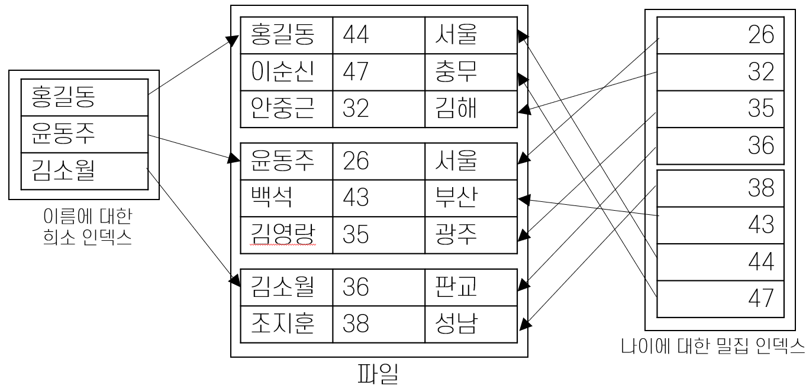

= 밀집 인덱스와 희소 인덱스

* 밀집 인덱스(Dense Index)
** 파일에 있는 모든 탐색 키 값에 대해 데이터 엔트리를 구성
* 희소 인덱스(Sparse Index)
** 데이터 파일의 페이지별로 하나의 데이터 엔트리를 구성

---

인덱스 된 파일의 레코드에 나타나는 탐색 키 값 모두에 하나씩의 엔트리를 구성해 놓는 인덱스를 **밀집 인덱스(Dense Index)**라고 하고, 데이터 파일의 페이지 별로 하나의 엔트리를 구성하는 인덱스를 **희소 인덱스(Sparse Index)**라고 합니다.

희소 인덱스가 넌 클러스터드 인덱스인 경우는 없습니다. 따라서, 희소 인덱스는 하나 밖에 만들 수 없습니다. 희소 인덱스는 보통 밀집 인덱스보다 크기가 작습니다. 하지만 유용한 최적화 기법에는 밀집 인덱스를 사용하는 경우가 많습니다.

한 데이터 파일의 한 필드에 밀집 인덱스가 존재하면, 이때 데이터 파일이 **도치(Inverted)**되었다고 합니다. **완전 역 파일(Fully inverted file)**은 기본 키에 속하지 않은 모든 필드마다 밀집 보조 인덱스를 하나씩 만들어 놓은 파일을 말합니다.

link:./13_primary_index.adoc[다음: 기본 인덱스와 보조 인덱스]