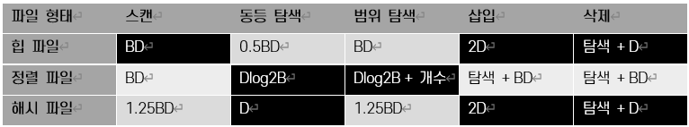

==파일 조직 선택

---

* 힙 파일은 저장 성능이 우수하고 스캔, 삽입, 삭제 연산이 빠르지만 탐색은 느립니다.
* 정렬 파일은 저장 성능이 우수하고, 삽입과 삭제 연산이 느리지만 탐색은 대단히 빠릅니다.
* 해시 파일은 저장 성능이 떨어지지만, 삽입과 삭제가 빠르며 동등 탐색에서 대단히 우수합니다. 하지만 범위 탐색은 지원하지 못하며 스캔 성능이 떨어집니다.

link:./09_index.adoc[다음: 인덱스]