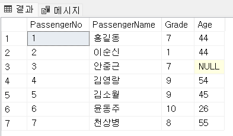

= Lab 6-1: 테이블 생성 (Microsoft SQL Server)

이 연습에서는 아래 릴레이션 스키마를 가지는 릴레이션 인스턴스(테이블)을 생성합니다.

_Passenger(PassengerNo: Integer, PassengerName: String, Grade: Integer, Age: Integer) +
Aircraft(AircraftNo: Integer, KindOfAircraft: String, Airline: String) +
Flight(FlightNo: Integer, AircraftNo: Integer, Departure: Int, Arrival:String, FlightDate: Date, AircraftNo: Integer) +
Reservation(PassengerNo: Integer, FlightNo: Integer, ReservedDate: Date, FlightNo: Integer, PassengerNo: Integer)_

== 연습 1: Module06 데이터베이스 생성

이 연습에서는 `Passenger` 테이블을 생성합니다. 아래 절차에 따릅니다.

1. SQL Server Management Studio 또는 Azure Data Studio를 실행합니다.
2. localhost 서버에 연결합니다.
+

+
3. `새 쿼리` 버튼을 클릭하여 쿼리 창을 실행합니다.
4. 아래 질의를 수행하여 Module06 데이터베이스를 생성합니다.
+
[source, sql]
----
CREATE DATABASE Module06
GO
----
+
5. 아래 명령을 수행하여 연결 컨텍스트를 Module06 데이터베이스로 변경합니다.
+
[source, sql]
----
USE Module06
GO
----

== 연습 2: Passenger 테이블 생성

이 연습에서는 `Passenger` 테이블을 생성합니다. `Passenger` 테이블은 `Reservation` 테이블과 관계를 가지며, 개체 무결성을 위한 `PRIMARY KEY 제약 조건` 과 `CHECK` 제약 조건 을 가집니다. `Passenger` 테이블의 스키마는 아래와 같습니다.

_Passenger(PassengerNo: Integer, PassengerName: String, Grade: Integer, Age: Integer)_

승객 이름을 나타내는 PassengerName 컬럼은 가변 길이 문자열로, 2 바이트 문자 10자로 제한하며, 승객 등급을 표현하는 Grade 는 1에서 10까지의 정수형 숫자로 제한합니다.

1. SQL Server Management Studio의 왼쪽 위에서, 데이터베이스 연결 컨텍스트가 Module06 데이터베이스 임을 확인합니다.
+

+
2. 아래 질의를 수행하여 Passenger 테이블을 생성합니다.
. 테이블의 이름은 Passenger 입니다.
. PassengerNo 컬럼의 타입은 int 이며, 기본 키로 지정됩니다. 기본 키의 이름은 pk_Passenger 입니다.
. PassengerName` 컬럼은 nvarchar(10) 으로 지정하며, NULL 을 허용하지 않습니다.
. Grade 컬럼의 타입은 int 이며, CHECK 제약 조건으로 1부터 10사이의 값으로 지정되며, 기본 값 1로 지정됩니다.
. Age 컬럼의 타입은 int 이며, `NULL` 을 허용합니다.
+
[source, sql]
----
CREATE TABLE Passenger (
    PassengerNo	int,
    PassengerName nvarchar(10)    NOT NULL,
    Grade 	int CHECK (Grade >= 1 AND Grade <= 10) default 1,
    Age     int     NULL
    
    CONSTRAINT pk_Passenger PRIMARY KEY(PassengerNo)
);
----
+
3. 개체 탐색기에서 데이터베이스 -> Module06 데이터베이스를 확장하여 생성된 `Passenger` 테이블의 정보를 확인합니다.
+

+
4. 아래 질의를 수행하여 `Passenger` 테이블에 데이터를 삽입합니다.
+
[source, sql]
----
INSERT INTO Passenger VALUES(1, '홍길동', 7, 44);
----
+
5. 아래 쿼리를 수행하여 `Passenger` 테이블의 데이터를 확인합니다.
+
[source, sql]
----
SELECT * FROM Passenger;
----
+

+
6. 아래 질의를 수행하여 `Passenger` 테이블에 데이터를 삽입합니다. 이 쿼리에서는 `Grade` 컬럼에 데이터를 삽입하지 않습니다.
+
[source,sql]
----
INSERT INTO Passenger (PassengerNo, PassengerName, Age) VALUES (2, '이순신', 44);
----
+
7. 아래 질의를 수행하여 `Passenger` 테이블의 데이터를 확인합니다.
+
[source, sql]
----
SELECT * FROM Passenger;
----
+
결과는 아래와 같습니다. `Grade` 컬럼에 기본 값인 1이 삽입된 것을 확인합니다.
+

+
8. 아래 질의를 수행하여 `Passenger` 테이블에 데이터를 삽입합니다. `PassengerName` 컬럼에 값을 삽입하지 않습니다.
+
[source, sql]
----
INSERT INTO Passenger (PassengerNo, Grade, Age) VALUES (3, 7, 40);
----
+
----
메시지 515, 수준 16, 상태 2, 줄 1
테이블 'Module06.dbo.Passenger', 열 'PassengerName'에 NULL 값을 삽입할 수 없습니다. 열에는 NULL을 사용할 수 없습니다. INSERT이(가) 실패했습니다.
문이 종료되었습니다.
----
+
9. 아래 질의를 수행하여 `Passenger` 테이블에 데이터를 삽입합니다. 이 쿼리는 `Age` 컬럼에 값을 삽입하지 않습니다.
+
[source, sql]
----
INSERT INTO Passenger (PassengerNo, PassengerName, Grade) VALUES(3, '안중근', 7);
----
+
10. 아래 질의를 수행하여 `Passenger` 테이블의 데이터를 확인합니다.
+
[source, sql]
----
SELECT * FROM Passenger
----
+

+
11. 아래 질의를 수행하여 `Passenger` 테이블에 데이터를 삽입합니다.
+
[source, sql]
----
INSERT INTO Passenger VALUES(4, '김영랑', 9, 54);
----
+
12. 아래 질의를 수행하여 `Passenger` 테이블의 데이터를 확인합니다.
+
[source, sql]
----
SELECT * FROM Passenger;
----
+

+
13. 아래 질의를 수행하여 `Passenger` 테이블에 데이터를 삽입합니다. `PassengerNo` 컬럼에 중복된 값을 삽입합니다.
+
[source, sql]
----
INSERT INTO Passenger VALUES (4, '김소월',9, 45);
----
+
질의의 수행은 실패합니다. 기본 키 컬럼에 중복된 값이 삽입되는 것은 개체 무결성을 위반합니다. 오류 메시지는 아래와 같습니다.
+
----
메시지 2627, 수준 14, 상태 1, 줄 1
PRIMARY KEY 제약 조건 'pk_Passenger'을(를) 위반했습니다. 개체 'dbo.Passenger'에 중복 키를 삽입할 수 없습니다. 중복 키 값은 (4)입니다.
문이 종료되었습니다.
----
+
14. 아래의 세 질의를 수행하여 `Passenger` 테이블에 데이터를 삽입합니다.
+
[source, sql]
----
INSERT INTO Passenger VALUES (5, '김소월',9, 45);
INSERT INTO Passenger VALUES (6, '윤동주', 10, 26);
INSERT INTO Passenger VALUES (7, '천상병', 8, 55);
----
+
15. 아래 질의를 수행하여 `Passenger` 테이블의 데이터를 확인합니다.
+
[source, sql]
----
SELECT * FROM Passenger;
----
+

== 연습 3: Aircraft 테이블 생성

이 연습에서는 `Aircraft` 테이블을 생성합니다. `Aircraft` 테이블은 `Flight` 테이블에서 참조하며, 개체 무결성을 위한 `PRIMARY KEY 제약 조건` 을 가집니다. `Aircraft` 테이블의 스키마는 아래와 같습니다.

_Aircraft(AircraftNo: Integer, KindOfAircraft: String, Airline: String)_

비행기 종류를 나타내는 `KindOfAircraft` 컬럼은 가변 길이 문자열로, 문자 20자로 제한하며, 소유 항공사를 나타내는 `Airline` 컬럼은 2 바이트 문자열 10자로 제한합니다. 아래 절차에 따릅니다.

1. 아래 명령을 수행하여 현재 연결 컨텍스트를 확인합니다.
+
[source, sql]
----
SELECT db_name()
----
+

+
2. 아래 질의를 수행하여 `Aircraft` 테이블을 생성합니다.
a. 테이블의 이름은 `Aircraft` 입니다.
b. `KindOfAIrcraft` 컬럼은 varchar(20) 으로 지정합니다.
c. `Airline` 컬럼의 타입은 nvarchar(10) 으로 지정합니다.
+
[source, sql]
----
CREATE TABLE Aircraft (
    AircraftNo int,
    KindOfAircraft varchar(20),
    Airline nvarchar(10)
);
----
+
3. 아래 질의를 수행하여 `Module06` 데이터베이스의 테이블을 확인합니다.
+
[source, sql]
----
SELECT * FROM information_schema.TABLES WHERE table_type = 'BASE TABLE'
----
+

+
4. 아래 질의를 수행하여 `Aircraft` 테이블의 상세 정보를 확인합니다.
+
[source, sql]
----
SELECT column_name, data_type, CHARACTER_MAXIMUM_LENGTH FROM information_schema.COLUMNS WHERE table_name = 'Aircraft'
----
+

+
5. 아래 질의를 수행하여 `AircraftNo` 컬럼에 기본 키를 지정합니다. 기본 키의 이름은 `pk_Aircraft` 입니다
+
[source, sql]
----
ALTER TABLE Aircraft ALTER COLUMN AircraftNo int NOT NULL;
ALTER TABLE Aircraft ADD CONSTRAINT pk_Aircraft PRIMARY KEY(AircraftNo);
----
+
6. 아래 질의를 수행하여 `Aircraft` 테이블의 제약조건을 확인합니다.
+
[source, sql]
----
SELECT constraint_name, constraint_type FROM INFORMATION_SCHEMA.TABLE_CONSTRAINTS WHERE table_name = 'Aircraft'
----
+

+
7. 아래 질의를 수행하여 `KindOfAircraft` 컬럼이 널 값을 허용하지 않도록 지정합니다.
+
[source, sql]
----
ALTER TABLE Aircraft ALTER COLUMN KindOfAircraft varchar(20) NOT NULL;
----
+
8. 아래 질의를 수행하여 `Aircraft` 테이블의 상세 정보를 확인합니다.
+
[source, sql]
----
SELECT column_name, data_type, CHARACTER_MAXIMUM_LENGTH, is_nullable FROM information_schema.COLUMNS WHERE table_name = 'Aircraft'
----
+

+
9. 아래 질의를 수행하여 `Aircraft` 테이블에 데이터를 삽입합니다.
+
[source, sql]
----
INSERT INTO Aircraft VALUES (101, 'Boeing 747', '대한항공');
----
+
10. 아래 질의를 수행하여 `Aircraft` 테이블의 데이터를 확인합니다.
+
[source, sql]
----
SELECT * FROM Aircraft;
----
+

+
11. 아래 네 질의를 수행하여 `Aircraft` 테이블에 데이터를 삽입합니다.
+
[source, sql]
----
INSERT INTO Aircraft VALUES (102, 'Boeing 727', '대한항공');
INSERT INTO Aircraft VALUES (103, 'Airbus A380', '아시아나 항공');
INSERT INTO Aircraft VALUES (104, 'Airbus A300', '대한항공');
INSERT INTO Aircraft VALUES (105, 'Boeing 737-800', '제주항공');
----
+
11.아래 질의를 수행하여 `Aircraft` 테이블의 데이터를 확인합니다.
+
[source, sql]
----
SELECT * FROM Aircraft;
----
+

== 연습 4: Flight 테이블 생성

이 연습에서는 `Flight` 테이블을 생성합니다. `Flight` 테이블은 `Aircraft` 테이블을 참조하며, 개체 무결성을 위한 `PRIMARY KEY 제약 조건` 과 `Aircraft` 테이블 참조를 위한 `FOREIGN KEY 제약 조건` 을 가집니다. `Flight` 테이블의 스키마는 아래와 같습니다.

_Flight(FlightNo: Integer, AircraftNo: Integer, Departure: Int, Arrival: String, FlightDate: Date)_

출발지를 나타내는 `Departures` 컬럼과 도착지를 나타내는 `Arrival` 컬럼은 가변 길이 문자열 10자로 제한하며, 운임을 나타내는 `Price` 컬럼은 `money` , 출발 시간을 나타내는 `FlightDate` 컬럼은 날짜와 시간을 모두 표현할 수 있는 `datetime` 타입으로 지정합니다. 아래 절차에 따릅니다.

1. SQL Server Management Studio에서, 아래 쿼리를 수랭하여 연결된 데이터베이스 컨텍스트를 확인합니다.
+
[source, sql]
----
SELECT db_name()
----
+

+
2. 아래 질의를 수행하여 `Flight` 테이블을 생성합니다.
a. `FlightNo` 와 `AircraftNo` 컬럼은 `int` 로 지정합니다.
b. `Deparetures` 컬럼과 `Arrival` 컬럼은 `nvarchar(10)` 로 지정하며, `NULL` 값을 허용하지 않습니다.
c. `Price` 컬럼은 `money` 로 지정하며, 기본값을 0으로 지정합니다.
d. `FlightDate` 컬럼은 `Datetime` 으로 지정하며, `NULL` 값을 허용하지 않습니다.
e. `FlightNo` 컬럼은 `Flight` 테이블의 기본 키로, 기본 키 이름은 `pk_Flight` 로 지정합니다.
f. `AircraftNo` 컬럼은 `Aircraft` 테이블의 `AircraftNo` 컬럼을 참조하는 외래키로, 외래 키 이름은 `fk_flight_aircraft` 로 지정합니다.
+
[source, sql]
----
CREATE TABLE Flight (
    FlightNo int,
    AircraftNo int,
    Deparetures nvarchar(10) NOT NULL,
    Arrival nvarchar(10) NOT NULL,
    Price money DEFAULT 0,
    FlightDate datetime NOT NULL,
    
    CONSTRAINT pk_Flight PRIMARY KEY(FlightNo),
    CONSTRAINT fk_Flight_Aircraft FOREIGN KEY(AircraftNo) REFERENCES Aircraft(AircraftNo)
);
----
+
3. 아래 질의를 수행하여 `Module06` 데이터베이스의 테이블을 확인합니다.
+
[source, sql]
----
SELECT * FROM information_schema.TABLES WHERE table_type = 'BASE TABLE'
----
+

+
4. 아래 질의를 수행하여 `Flight` 테이블의 상세 정보를 확인합니다.
+
[source, sql]
----
SELECT column_name, data_type, CHARACTER_MAXIMUM_LENGTH, is_nullable FROM information_schema.COLUMNS WHERE table_name = 'Flight'
----
+

+
5. 아래 질의를 수행하여 `Flight` 테이블에 데이터를 삽입합니다.
+
[source, sql]
----
INSERT INTO Flight VALUES(1, 101, '인천', '샌프란시스코', 1230000, '2022-10-23 10:20');
----
+
6. 아래 질의를 수행하여 `Flight` 테이블의 데이터를 확인합니다.
+
[source, sql]
----
SELECT * FROM Flight;
----
+

+
7. 아래 질의를 수행하여 `Flight` 테이블에 데이터를 삽입합니다.
+
[source, sql]
----
INSERT INTO Flight VALUES(2, 106, '샌프란시스코', '인천', 1320000, '2022-10-26 13:00');
----
+
질의의 수행은 실패합니다. `Aircraft` 테이블의 `AircraftNo` 컬럼은 항공기 번호가 106인 데이터가 존재하지 않으므로, 참조 무결성을 위반합니다. 오류 메시지는 아래와 같습니다.
+
----
메시지 547, 수준 16, 상태 0, 줄 1
INSERT 문이 FOREIGN KEY 제약 조건 "fk_Flight_Aircraft"과(와) 충돌했습니다. 데이터베이스 "Module06", 테이블 "dbo.Aircraft", column 'AircraftNo'에서 충돌이 발생했습니다.
문이 종료되었습니다.
----
8. 아래 질의를 수행하여 `Flight` 테이블에 데이터를 삽입합니다.
+
[source, sql]
----
INSERT INTO Flight VALUES(2, 101, '샌프란시스코', '인천', 1320000, '2022-10-26 13:00');
INSERT INTO Flight VALUES(3, 105, '김포', '제주', 72000, '2022-11-23 09:00');
INSERT INTO Flight VALUES(4, 105, '김포', '김해', 68000, '2022-11-12 17:30');
INSERT INTO Flight VALUES(5, 103, '인천', '프랑크푸르트', 1480000, '2022-12-01 18:00');
INSERT INTO Flight VALUES(6, 103, '프랑크푸르트', '인천', 1560000, '2022-12-10 10:00');
INSERT INTO Flight VALUES(7, 104, '김해', '김포', 70000, '2022-11-13 11:00');
INSERT INTO Flight VALUES(8, 101, '인천', '샌프란시스코', 1230000, '2022-11-15 10:00');
----
+
9. 아래 질의를 수행하여 `Flight` 테이블의 데이터를 확인합니다.
+
[source, sql]
----
SELECT * FROM Flight;
----
+

== 연습 5: Reservation 테이블 생성

이 연습에서는 `Reservation` 테이블을 생성합니다. `Reservation` 테이블은 `Passenger` 테이블과 `Flight` 테이블을 참조하며, 개체 무결성을 위한 `PRIMARY KEY 제약 조건` 과 `Passenger`, `Flight` 두 테이블 참조를 위한 `FOREIGN KEY 제약 조건` 을 가집니다.

`Reservation` 테이블의 스키마는 아래와 같습니다.

_Reservation(PassengerNo: Integer, FlightNo: Integer, ReservedDate: Date)_

`PassengerNo` 컬럼과 `FlightNo` 두 컬럼이 기본 키를 구성하며, `ReservedDate` 컬럼은 날짜만을 모두 표현할 수 있는 `datetime` 타입으로 지정합니다. 아래 절차에 따릅니다.

1. SQL Server Management Studio에서, 아래 쿼리를 수랭하여 연결된 데이터베이스 컨텍스트를 확인합니다.
+
[source, sql]
----
SELECT database();
----
+

+
2. 아래 질의를 수행하여 `Flight` 테이블을 생성합니다.
a. `ReservedDate` 컬럼은 날짜와 시간을 모두 표현할 수 있는 `datetime` 타입으로 지정하며, `NULL` 값을 허용하지 않습니다.
+
[source, sql]
----
CREATE TABLE Reservation (
    PassengerNo int,
    FlightNo int,
    ReservedDate datetime NOT NULL
);
----
+
3. 아래 질의를 수행하여 `Module06` 데이터베이스의 테이블을 확인합니다.
+
[source, sql]
----
SELECT * FROM information_schema.TABLES WHERE table_type = 'BASE TABLE'
----
+

+
4. 아래 질의를 수행하여 Reservation 테이블에 기본 키를 지정합니다.
+
[source, sql]
----
ALTER TABLE Reservation ALTER COLUMN PassengerNo int NOT NULL
GO
ALTER TABLE Reservation ALTER COLUMN FlightNo int NOT NULL
GO
ALTER TABLE Reservation ADD CONSTRAINT pk_Reservation PRIMARY KEY(PassengerNo, FlightNo)
GO
----
+
5. 아래 질의를 수행하여 Reservation 테이블의 상세 정보를 확인합니다.
+
[source, sql]
----
SELECT column_name, data_type, CHARACTER_MAXIMUM_LENGTH, is_nullable FROM information_schema.COLUMNS WHERE table_name = 'Flight'
----
+

+
6. 아래 질의를 수행하여 PassengerNo 컬럼을 Passenger 테이블의 PassengerNo 컬럼을 참조하는 외래키로 지정합니다. 외래 키의 이름은 fk_Reservation_Passenger 로 지정합니다.
+
[source, sql]
----
ALTER TABLE Reservation ADD CONSTRAINT fk_reservation_passenger FOREIGN KEY(PassengerNo) REFERENCES Passenger(PassengerNo);
----
+
7. 아래 질의를 수행하여 FlightNo 컬럼을 Flight 테이블의 FlightNo 컬럼을 참조하는 외래키로 지정합니다. 외래 키의 이름은 fk_Reservation_Flight 로 지정합니다.
+
[source, sql]
----
ALTER TABLE Reservation ADD CONSTRAINT fk_reservation_flight FOREIGN KEY(FlightNo) REFERENCES Flight(FlightNo);
----
+
8. 아래 질의를 수행하여 Reservation 컬럼에 생성한 제약 조건을 확인합니다.
+
[source, sql]
----
SELECT constraint_name, constraint_type FROM INFORMATION_SCHEMA.TABLE_CONSTRAINTS WHERE table_name = 'Reservation'
----
+

+
9. 아래 질의를 수행하여 Reservation 테이블에 데이터를 삽입합니다.
+
[source, sql]
----
INSERT INTO Reservation VALUES (1, 4, '2022-10-22');
INSERT INTO Reservation VALUES (3, 1, '2022-10-20');
INSERT INTO Reservation VALUES (4, 7, '2022-10-11');
INSERT INTO Reservation VALUES (6, 7, '2022-10-21');
INSERT INTO Reservation VALUES (2, 1, '2022-10-11');
INSERT INTO Reservation VALUES (2, 2, '2022-10-11');
INSERT INTO Reservation VALUES (7, 3, '2022-09-11');
INSERT INTO Reservation VALUES (1, 3, '2022-11-09');
----
+
10. 아래 질의를 실행하여 Reservation 테이블의 데이터를 확인합니다.
+
[source, sql]
----
SELECT * FROM Reservation;
----
+

+
11. 연습이 종료되었습니다.