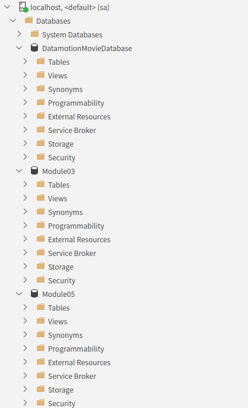

= Lab 07-1 : 사용자 생성 및 권한 제어

이 연습에서는 Microsoft SQL Server 데이터베이스에서 사용자 개체를 생성하고 권한을 부여합니다. 아래 절차에 따릅니다.

== 사용자 생성

1. SQL Server Management Studio 또는 Azure Data Studio를 실행하고 sa로 로그인합니다.
2. 아래 질의를 수행하여 시스템의 기존 사용자를 확인합니다.
+
[source, sql]
----
SELECT name, principal_id, * FROM sys.server_principals
WHERE type_desc IN ('SQL_LOGIN', 'WINDOWS_GROUP', 'WINDOWS_LOGIN')
----
+
3. 아래 명령을 수행하여 Michael이라는 로그인을 생성합니다.
+
[source, sql]
----
CREATE LOGIN Michael WITH PASSWORD = 'P@ssw0rd';
----
+
4. 아래 질의를 사용하여 생성된 사용자를 확인합니다.
+
[source, sql]
----
SELECT name, principal_id, * FROM sys.server_principals
WHERE type_desc IN ('SQL_LOGIN', 'WINDOWS_GROUP', 'WINDOWS_LOGIN')
----

== 새 사용자로 로그인

1. 새 SQL Management Studio 또는 Azure Data Studio를 실행하고 Michael로 로그인합니다.
2. sa로 로그인 한 첫 번째 도구에서, Server Explorer에서 각 데이터베이스를 확장하여 연결을 확인합니다.
+

+
3. Michael로 로그인한 두 번째 도구에서, Server Explorer에서 각 데이터베이스를 확장하여 권한을 확인합니다.
+
image:./images/image02.png[]
+

