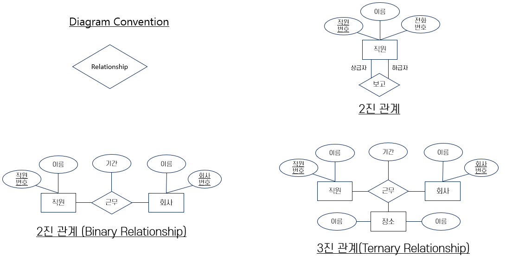
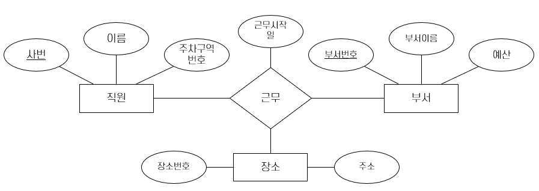

= 관계, 관계 집합

* 관계 (Relationship)
** 여러 개체들 사이의 연관성
* 관계 집합(Relationship set)
** 같은 유형의 관계들의 집합. n ≥ 2 개의 개체집합(중복 허용) 사이의 수학적 관계

:stem: asciimath

> 만약 E1, E2… En이 개체 집합들일 때 관계집합 R은

stem:[{(e1, e2,… en)| e1 ∈ E1 ... en ∈ En}]

> 의 부분집합이다. 여기에서 (e1, e2,… en)은 관계

* 개체 집합 사이의 연관을 관계 집합에의 참가(participation)라고 함
* 관계에서 개체가 행하는 기능을 개체의 역할(Role)이라고 함
* 관계는 설명형 속성(descriptive attribute)이라는 속성을 가짐

---

**관계(Relationship)**는 둘 이상의 개체간의 관련성을 말합니다. 한 직원이 한 부서에서 근무한다는 개체간의 관계가 있을 수 있습니다. 개체와 마찬가지로 관계들도 비슷한 항목끼리 하나의 집합으로 묶을 수 있는데 이를 관계집합(Relationship Set)이라고 합니다. 관계 집합은 n-투플의 집합으로 생각할 수 있습니다.

stem:[{(e1, e2,… en)| e1 ∈ E1 ... en ∈ En}]

개체 집합 E~i~의 한 개체를 e~i~라고 할 때 n-투플 하나는 e~1~에서 e~n~까지 n개의 개체가 관련된 관계 하나를 나타냅니다. 아래 다이어그램은 한 명의 직원이 하나의 부서에 근무한다는 관계를 묶은 개체집합 근무를 나타냅니다. 

image:./images/image05.png[]
 
관계 자체에도 내용을 기술하는 **설명형 속성(Descriptive Attribute)**들이 들어갈 수 있습니다. 이 속성들은 관계 자체의 정보를 기록하는 것이며 이에 관련되는 개체 정보를 기록하지는 않습니다. 만약 홍길동 사원이 인사 부서에서 2022년 12월 3일부터 근무하고 있다는 사실을 기록하고자 할 때, 근무 시작일에 대한 정보는 직원 개체 또는 부서 개체 어디에도 기록될 수 없습니다. 이 정보는 직원과 부서 간의 관계에서 비롯되는 것이므로, 근무 개체집합에 추가된 근무 시작일 속성에 표현됩니다. 
한 부서가 여러 지역에 지부를 가지고 있는 경우, 각 직원들이 어디에서 근무하고 있는지를 기록하고 싶을 경우, 이 관계는 직원과 부서, 장소와 관계됩니다. 이를 **3진 관계(Ternary Relationship) **관계라고 하며, ER 다이어그램으로는 아래와 같이 표시할 수 있습니다.

관계집합에 참여하는 개체집합은 동일한 개체집합일 수 있습니다. 한 개체 집합의 두 개체(투플)을 한 관계가 연결시켜 주기도 합니다. 만약 한 직원이 다른 직원에게 보고하는 관계가 있다고 하면, 직원 개체집합과 직원 개체집합 사이에 관계가 필요하게 됩니다. 이 관계는 **역할(Role)**을 표현하는 관계가 되고, 이들은 **역할 지시자(Role Indicator)**를 사용하여 관계에서 상급자와 하급자를 표시하게 됩니다. 한 개체집합이 여러 역할을 수행할 때에는 해당 개체 집합의 속성 이름에 역할 지시자를 붙여서 관계집합 내의 각 속성에 유일한 이름을 주게 됩니다.

image:./images/image07.png[]
 
== 관계 모델로 변환

개체집합처럼 관계집합도 관계 모델의 한 릴레이션으로 매핑됩니다. 관계 하나를 표현하려면 이에 참여하는 각 개체를 식별하고 관계의 설명형 속성에 값을 줄 수 있어야 합니다. 이 릴레이션에는 다음과 같은 속성이 존재하게 됩니다.

* 참여하는 각 개체 집합의 기본 키 속성(외래 키 필드의 자격)
* 관계집합 자체의 설명형 속성

설명형 속성 이외의 속성 집합은 이 릴레이션의 수퍼키를 형성합니다. 제약조건이 없다면 이 속성 집합이 후보 키가 됩니다.

근무 개체집합의 인스턴스는 아래와 같이 표현될 수 있습니다. 사번과 부서번호가 근무 관계집합의 기본 키가 됩니다.

[%header, cols=3, width=60%]
|===
|사번	|부서번호	|근무시작일
|1	|12	|2022-01-23
|2	|21	|2022-10-22
|===

근무 릴레이션을 생성하는 DDL 구문은 다음과 같습니다.

[source, sql]
----
CREATE TABLE 근무 (
	사번 int,
	부서번호 int,
	근무시작일 date,
	
	CONSTRAINT pk_근무 PRIMARY KEY(사번, 부서번호),
	CONSTRAINT fk_근무_직원 FOREIGN KEY(사번) REFERENCES 직원(사번),
	CONSTRAINT fk_근무_부서 FOREIGN KEY(부서번호) REFERENCS 부서(부서번호)
)
----

역할지시자를 사용하는 보고 릴레이션을 생성하는 DDL 구문은 아래와 같습니다.

[source, sql]
----
CREATE TABLE 보고 (
	상급자_사번	int,
	하급자_사번	int,
	CONSTRAINT pk_보고 PRIMARY KEY(상급자_사번, 하급자_사번),
	CONSTRAINT fk_보고_상급자 FOREIGN KEY(상급자_사번) REFERENCES 직원(사번),
	CONSTRAINT fk_보고_하급자 FOREIGN KEY(하급자_사번) REFERENCES 직원(사번)
)
----

link:./07_er_model_function.adoc[다음: ER 모델 기능]