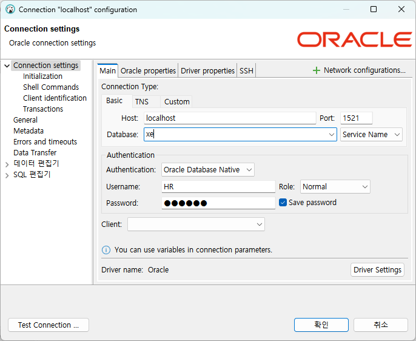
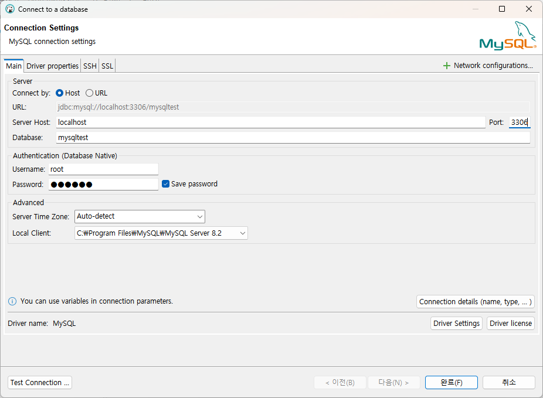

= Lab 8-1 실습 환경 구성

이 연습에서는 다양한 데이터베이스 환경에서 SQL 구문을 실습하기 위한 환경을 구축합니다. 아래 절차에 따릅니다.

== Database 도구 설치

이 연습에서는 Universal 데이터베이스 도구인 DBeaver를 설치합니다. 

=== Windows 운영체제에서

1. 터미널을 실행합니다.
2. 아래 명령을 실행하여 DBeaver를 설치합니다.
+
----
> winget install -e --id dbeaver.dbeaver
----

=== macOS 운영체제에서

1. 터미널을 실행합니다.
2. 아래 명령을 실행하여 DBeaver를 설치합니다.
+
----
% brew install -cask dbaever-community
----

=== Ubuntu 운영체제에서

1. 터미널을 실행합니다.
2. 아래 명령을 실행하여 DBeaver 저장소를 추가합니다.
+
----
$ curl -fsSL https://dbeaver.io/debs/dbeaver.gpg.key | sudo gpg --dearmor -o /etc/apt/trusted.gpg.d/dbeaver.gpg
$ echo "deb https://dbeaver.io/debs/dbeaver-ce /" | sudo tee /etc/apt/sources.list.d/dbeaver.list
----
+
3. 아래 명령을 실행하여 apt 목록을 업데이트합니다.
+
----
$ sudo apt update
----
+
4. 아래 명령을 실행하여 DBeaver Community 버전을 설치합니다.
+
----
$ sudo apt install dbeaver-ce
----

== Oracle 실습 환경 구축

1. 터미널(또는 명령 프롬프트)를 실행합니다.
2. 아래 명령을 실행하여 oracle-xe 컨테이너 이미지를 검색합니다.
+
----
$ docker search jaspeen/oracle-xe-11g
----
+
3. 검색된 이미지를 확인하고, 아래 명령을 실행하여 oracle xe docker 이미지를 다운로드 합니다.
+
----
$ docker pull jaspeen/oracle-xe-11g
----
+
4. 아래 명령을 실행하여 다운로드된 docker 이미지를 확인합니다.
+
----
$ docker images
----
+
5. 아래 명령을 실행하여 oracle-xe-11g 컨테이터를 실행합니다.
+
----
$ docker run --name oracle11g -d -p 1521:1521 jaspeen/oracle-xe-11g
----
+
6. 아래 명령을 실행하여 실행중인 컨테이너를 확인합니다.
+
----
$ docker ps
----
+
7. 아래 명령을 실행하여 실행중인 컨테이너에 액세스합니다.
+
----
$ docker exec -it oracle11g sqlplus
----
+
8. Oracle sqlplus에서, 아래 명령을 실행하여 HR 사용자의 잠금을 해제하고 패스워드를 변경합니다.
+
----
SQL> ALTER USER HR IDENTIFIED BY P@ssw0rd ACCOUNT UNLOCK;
---- 
+
9. 아래 명령을 실행하여 현재 사용자를 HR 사용자로 전환합니다.
+
----
SQL> CONNECT HR/P@ssw0rd;
----
+
10. 아래 명령을 실행하여 현재 접속한 사용자를 확인합니다.
+
----
SQL> show user;
----
+
11. 아래 명령을 실행하여 테이블을 확인합니다.
+
----
SQL> SELECT * FROM tab;
----
12. DBeaver를 실행합니다.
13. 왼쪽 위의 **새 데이터베이스 연결**을 클릭합니다.
+
image:./images/image01.png[]
+
14. **select your database** 창에서 **Oracle**을 선택하고 **다음** 버튼을 클릭합니다.
+
image:./images/image02.png[]
+
15. 아래와 같이 연결 정보를 입력하고 **완료** 버튼을 클릭합니다.
+

+
    a. host: **localhost**
    b. port: 1521
    c. Database: **xe**
    d. Authentication: **Oracle Database Native**
    e. Username: HR
    f. Password: P@ssw0rd

16. 메뉴바에서 **SQL 편집기 열기** 버튼을 클릭하여 새 SQL 편집기를 엽니다.
+
image:./images/image04.png[]
+
17. SQL 편집기에서 아래 쿼리를 입력하고 **SQL 문 실행** 버튼을 클릭합니다.
+
[source, sql]
----
SELECT * FROM tab;
----
+
18. 결과를 확인합니다.
+
image:./images/image05.png[]

== MS-SQL 실습 환경 구축

1. 터미널(또는 명령 프롬프트)를 실행합니다.
2. 아래 명령을 실행하여 Microsoft SQL Server 2022 for Linux 이미지를 검색합니다.
+
----
$ docker pull mcr.microsoft.com/mssql/server:2022-latest
----
3. 아래 명령을 실행하여 다운로드 한 docker 이미지를 확인합니다.
+
----
$ docker images
----
+
4. 아래 명령을 실행하여 Microsoft SQL Server 2022 이미지를 실행합니다.
+
----
$ docker run -e "ACCEPT_EULA=Y" -e "MSSQL_SA_PASSWORD=P@ssw0rd" -p 1433:1433 --name mssql2022 -d mcr.microsoft.com/mssql/server:2022-latest
----
5. 아래 명령을 실행하여 실행중인 docker 이미지를 확인합니다.
+
----
$ docker ps
----
+
6. DBeaver를 실행하고 왼쪽 위의 **새 데이터베이스 연결**을 클릭합니다.
7. **select your database** 창에서 **SQL Server**를 선택하고 다음 버튼을 클릭합니다.
8. 아래와 같이 연결 정보를 입력하고 완료 버튼을 클릭합니다.
+
image:./images/image06.png[]
+
    a. Connect by: **Host**
    b. Host: **localhost**
    c. Database/Schema: **master**
    d. Authentication: **SQL Server Authentication**
    e. Username: **sa**
    f. Password: **P@ssa0rd**
+
9. 메뉴바에서 SQL 편집기 열기 버튼을 클릭하여 새 SQL 편집기를 엽니다.
10. 아래 질의를 입력하고 **SQL 쿼리 문 실행** 버튼을 클릭합니다.
+
[source, sql]
----
CREATE DATABASE MSSQLTest
GO
USE MSSQLTest
GO
----

== PostgreSQL 실습 환경 구성

1. 터미널(또는 명령 프롬프트)를 실행합니다.
2. 아래 명령을 실행하여 PostgreSQL 이미지를 다운로드 합니다.
+
----
$ docker pull postgres
----
3. 아래 명령을 실행하여 다운로드 한 docker 이미지를 확인합니다.
+
----
$ docker images
----
+
4. 아래 명령을 실행하여 PostgreSQL 컨테이너를 실행합니다.
+
----
$ docker run -e "POSTGRES_PASSWORD=P@ssw0rd" -p 5432:5432 --name postgres -d postgres:latest
----
5. 아래 명령을 실행하여 실행중인 docker 컨테이너를 확인합니다.
+
----
$ docker ps
----
+
6. 아래 명령을 실행하여 실행중인 컨테이너에 접속합니다.
+
----
$ docker exec -it postgres bash
----
+
7. 아래 명령을 실행하여 postgres DBMS에 액세스 합니다.
+
----
# psql -U postgres
----
+
8. 아래 질의를 실행하여 test 데이터베이스를 생성합니다.
+
----
postgres=# create database pgtest;
----
+
9. 아래 명령을 실행하여 데이터베이스 연결을 test 데이터베이스로 변경합니다.
+
----
\c pgtest
----
+
10. 아래 명령을 실행하여 현재 데이터베이스를 확인합니다.
+
----
test=# select current_database();
----
+
11. DBeaver를 실행하고 왼쪽 위의 **새 데이터베이스 연결** 버튼을 클릭합니다.
12. **Select your database**창에서, PostgreSQL을 선택하고 **다음** 버튼을 클릭합니다.
13. **DB 연결 설정** 창에서 아래와 같이 정보를 입력하고 **완료** 버튼을 클릭합니다.
+
image:./images/image07.png[]
+
    a. Connect by: **Host**
    b. Host: **localhost**
    c. Port: **5432**
    d. Database: **pgtest**
    e. Authentication: **Database Native**
    f. Password: **P@ssw0rd**
+
14. 메뉴바에서 SQL 편집기 열기 버튼을 클릭하여 새 SQL 편집기를 엽니다.
15. 아래 질의를 실행하여 테이블을 확인합니다.
+
[source, sql]
----
select * from pg_tables where schemaname = 'public';
----

== MySQL 실습 환경 설정

1. 터미널(또는 명령 프롬프트)를 실행합니다.
2. 아래 명령을 실행하여 MySQL 이미지를 다운로드 합니다.
+
----
$ docker pull mysql
----
+
3. 아래 명령을 실행하여 다운로드한 docker 이미지를 확인합니다.
+
----
$ docker images
----
+
4. 아래 명령을 실행하여 MySQL 컨테이너를 실행합니다.
+
----
$ docker run --name mysql82 -e "MYSQL_ROOT_PASSWORD=P@ssw0rd" -p 3306:3306 -d mysql:latest
----

5. 아래 명령을 실행하여 컨테이너에 액세스 합니다.
+
----
$ docker exec -it mysql82 mysql -u root -p
----
6. 연결된 MySQL에서, 아래 명령을 실행하여 test 데이터베이스를 생성합니다.
+
----
mysql> create database mysqltest;
----
+
7. DBeaver를 실행하고 왼쪽 위의 **새 데이터베이스 연결** 버튼을 클릭합니다.
8. **select your database** 창에서, MySQL을 선택하고 **다음** 버튼을 클릭합니다.
9. **DB 연결 설정** 창에서 아래와 같이 정보를 입력하고 **완료** 버튼을 클릭합니다.
+

+
    a. Connect by: **Host**
    b. Server Host: **localhost**
    c. Database: **mysqltest**
    d. Password: **P@ssw0rd**
+
10. 메뉴바에서 **SQL 편집기 열기** 버튼을 클릭하여 새 SQL 편집기를 엽니다.
11. 아래 질의를 실행하여 테이블을 확인합니다.
+
----
show tables;
----

link:./04_introduction_psm.adoc[다음: Persistant Stored Module 소개]