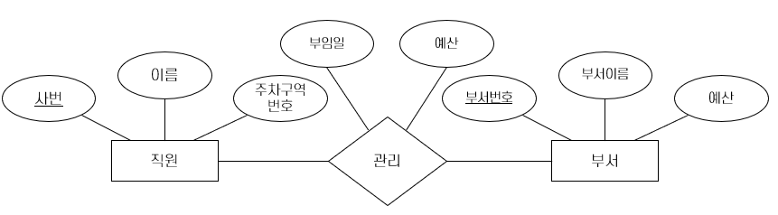

= 개체 or 관계

* 개체로 모델링하는 경우
** 관계가 관계로 생성되는 한 개체에 국한되는 속성을 가짐
** A 개체집합의 개체가 정확히 B 개체집합의 한 개체에만 해당
* 관계로 모델링 하는 경우
** 관계집합에서 중복이 발생하는 경우
** 두 개체 사이에 일어나는 동작을 기술하는 경우

---

아래와 같은 관리 관계집합을 생각해봅시다. 각 부서의 부서장은 예산을 가지고 있습니다. 

한 부서에는 한 명의 관리자가 있지만, 한 관리자는 여러 부서를 관리할 수 있는 경우, 관리 관계집합에 부임일자와 예산을 저장합니다. 요구사항이 여기까지 라면 설계는 자연스럽습니다. 

예산액에 부서별로 할당되는 것이 아니라, 관리자에게 할당되는 경우라고 생각하면, 관리 관계집합에는 예산이 같은 값으로 저장됩니다. 이런 중복성은 일반적으로 매우 중요하며, 중복된 데이터는 여러 문제를 일으킬 수 있습니다. 

이런 경우, 직원을 부서 그룹의 관리자로 입명하고 그에 대해 예산을 책정하여 해결할 수 있습니다. 임명 내용을 관리자임명이라는 개체 집합으로 모델링하고 관리자, 부서를 3진관계로 연관시킵니다. 임명에 대한 세부 내용(부임일, 예산 등)은 임명에 속한 각 부서에 대해 반복되지 않습니다.

image:./images/image13.png[]

link:./17_binary_or_triage.adoc[다음: 이진관계 or 삼진관계]