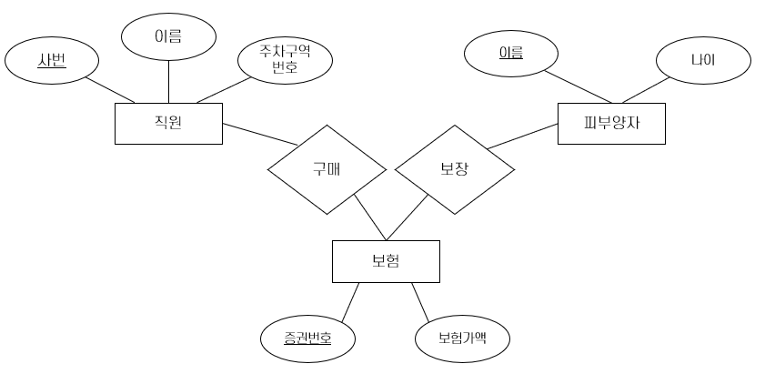

= 이진 관계 or 삼진 관계

* 이진 관계
** 약 개체가 포함되는 경우
** 관계의 변화가 개체에 영향을 미치는 경우
* 삼진 관계
** 관계의 변화가 개체에 영향을 미치는 경우
** 식별 관계의 체인이 존재하지 않는 경우

---

아래 ER 다이어그램은 한 직원이 보험에 가입할 수 있고 각 보험에는 여러 직원이 가입할 수 있으며 피부양자 한 명은 여러 보험에 들어있을 수 있는 상황을 모델링 한 것입니다.

image:./images/image14.png[]
 
다음과 같은 요구사항이 추가된다고 가정해 봅시다.

* 보험 하나를 둘 이상의 직원이 함께 소유할 수 없다.
* 각 보험증권은 어떤 직원인가가 반드시 소유해야 한다.
* 피부양자는 약 개체 집합이며, 각 피부양자 개체는 그에 대한 피부양자 이름과 그 피부양자를 보장하는 보험증권 개체의 증권번호를 조합해야 유일하게 식별할 수 있다.

첫 번째 조건으로 인해 보장 관계에서 보험에 대해 키 제약조건을 설정해야 할 것 같으나, 그렇게 되면 한 증권이 한 명의 피부양자에게만 보장되게 됩니다. 두 번째 조건은 보험 개체집합에 대해 전체 참여 조건을 설정하게 됩니다. 세 번째 조건은 이진 관계를 만들어야 하는 조건입니다. 

세 번째 조건을 무시한다 해도 가장 좋은 모델링 방식은 아래와 같이 두 개의 이진 관계를 사용하는 것입니다.

ER 다이어그램을 관계 모델로 변환하면 아래와 같이 됩니다.

[source, sql]
----
CREATE TABLE 보험 (
	증권번호		int,
	보험가액		decimal,
	사번		int	NOT NULL,.

	CONSTRAINT pk_보험 PRIMARY KEY(증권번호),
	CONSTRAINT fk_보험_직원 FOREIGN KEY(사번) REFERENCEWS 직원(사번) ON DELETE CASCADE
)

CREATE TABLE 피부양자 (
	이름		varchar(10),
	나이		int,
	증권번호		int,

	CONSTRAINT pk_피부양자 PRIMARY KEY(이름, 증권번호),
	CONSTRAINT pk_피부양자_보험 FOREIGN KEY(증권번호) REFERENCES 보험(증권번호)
	ON DELETE CASCADE
)
----

한 직원을 삭제하면 그 직원이 소유한 모든 보험들이 따라서 삭제되며, 그 보험의 보장을 받는 모든 피 부양자들도 삭제됩니다. 또한 피부양자 테이블에서 증권번호는 기본 키의 일부이므로 암시적으로 NOT NULL 제약조건이 지정되어 각 피부양자들은 자신을 보장하는 증권이 하나씩 있게 됩니다. 

link:./18_review.adoc[다음: 검토]