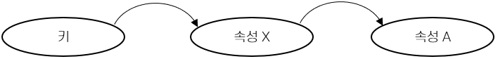

= 제 3정규형(Third Normal Form)

* 이행적 종속성(Transitive dependency) 개념에 기반
** 릴레이션 스키마 R에서, 후보 키가 아니고 어떤 키의 부분집합도 아닌 속성 집합 Z가 있을 때,
** X → Z와 Z → Y가 만족될 때, 함수 종속 X → Y를 이행적 함수 종속이라고 부름
* Codd의 정의
** 릴레이션 스키마 R이 2NF이고
** R의 어떤 비주요 속성도 기본 키에 이행적으로 종속하지 않으면 R은 3NF에 속함
* 구분
** R: 릴레이션 스키마, X: R에 속하는 릴레이션 인스턴스의 부분집합, A: R의 속성일 때
** 다음 중 하나에 속하면 제 3 정규형에 속함
*** A ∈ X, 즉 평범한 함수 종속
*** X가 슈퍼키
*** A가 R의 어떤 키의 일부

---

R을 어떤 릴레이션 스키마라고 하고 X를 R에 속하는 속성들의 한 부분집합이라고 하며 A를 R의 한 속성이라고 할 때, R이 만족하는 모든 함수 종속 X → A가 다음 중 하나에 속하면 R은 제 3 정규형에 속합니다.

* A ∈ X, 즉 평범한 FD이거나, 또는
* X가 슈퍼키거나, 또는
* A가 R의 어떤 키의 일부

제 3차 정규형은 BCNF와 비슷합니다. 세 번째 항목이 다른데, 세 번째 조건을 이해하려면 릴레이션의 키라는 것들이 다른 모든 속성들을 유일하게 결정짓는 속성들의 최소 집합임을 상기해 보면 됩니다. A가 어떤 키의 일부여야 한다는 것은 키가 여러 개 있을 경우 그 중 어떤 키라도 상관없다는 뜻입니다. A가 슈퍼키의 일부인 것으로는 불충분합니다. A가 슈퍼키의 일부인 조건을 만족한다면 어떤 속성이라도 이 조건을 만족할 수 있기 때문입니다. 한 릴레이션의 스키마에서 모든 키들을 찾아내는 문제는 NP-Complete라고 알려져 있고, 또 어떤 릴레이션의 스키마가 3NF에 속하는가를 알아내는 문제도 마찬가지입니다.

어떤 종속성 X → A가 3NF를 위배하는 경우는 다음 두 가지입니다.

* X는 어떤 키 K의 진부분집합입니다. 이러한 종속성을 부분 종속성(Partial Dependency)이라고 부릅니다. 이 경우에는 (X, A) 쌍 여러 개를 중복해서 저장하게 됩니다. 아래와 같이 항공편 번호, 승객 번호, 예약 일자, 신용카드 번호를 저장하는 릴레이션 스키마가 있을 때, 
+
----
Reservation(FlightNo, PassengerNo, Date, CreditCardNo)
                F            P          D         C
----
+
릴레이션 Reservation에 키는 FPD 밖에 없고 함수 종속 P → C가 존재합니다. 여기에서는 한 고객에 대한 신용카드 번호가 고객의 예약 수 만큼 존재하게 됩니다.
* X는 어떤 키의 진부분집합도 아닙니다. 이러한 종속성은 K → X → A라고 하는 연쇄적인 종속을 의미하기 때문에 **이행적 함수 종속(Transitive Dependency)**라고 부릅니다. 문제는 어떤 K 값에 어떤 X 값을 연관시킬 때에는 그 X값이 어떤 A값을 연관시켜 주어야 한다는 것입니다. 아래와 같은 릴레이션이 있을 때,
+
----
Parttime_emp(EmpID, Name, Parkingslot, Grade, WagePerHr, Workingtime)
                E     M       P          G        W           T
----
여기서 유일한 키는 E이고, 함수 종속 W → T가 존재하기 되므로 E → W → T라는 연쇄가 나타나게 됩니다. 따라서 직원 E가 등급 G를 가진다는 것을 기록하려면 해당 등급에 해당하는 시간당 임금을 같이 삽입해야 합니다. 이로 인해 삽입 이상, 삭제 이상, 갱신 이상이 발생합니다.

부분적 함수 종속은 다음과 같이 표시할 수 있습니다.

image:./images/image02.png[]

이행적 함수 종속은 다음과 같이 표시할 수 있습니다.

 +
A가 키에 속하지 않는 경우

image:./images/image04.png[A가 키에 속하는 경우] +
A가 키에 속하는 경우

제 3차 정규형을 사용하는 이유는 기술적인 측면이 많습니다. 키 속성과 관련한 어떤 형태의 종속성들을 특별히 취급함으로써 바람직한 어떤 성질을 준수하는 분해 작업만으로도 모든 릴레이션 스키마를 3NF 릴레이션들로 분해할 수 있게 됩니다. 이런 요건은 BCNF에는 없습니다. 3NF의 정의는 BCNF의 요건을 완화시켜서 보장이 가능하도록 합니다.

BCNF와는 달리 3NF에서는 중복성이 일부 발생할 수 있습니다. 만일 비평범 종속성 X → A가 존재하고 X가 슈퍼키가 아니라면 A가 키의 일부라서 이 릴레이션이 3NF에 속한다 하더라도 부분 종속성 및 이행 종속성에 따른 문제가 발생할 수 있습니다. 

아래 릴레이션 스키마에서,

----
Reservation(FlightNo, PassengerNo, Date, CreditCardNo)
                F          P         D         C
----

함수 종속 P → C 가 존재하여 한 승객이 예약에 대한 지불을 위해 하나의 신용카드만 사용해야 한다는 조건이 있다고 할 때, P는 키가 아니고 C도 키가 아닙니다. (여기에서 키는 FPD 입니다) 따라서 이 릴레이션은 3NF가 아닙니다. 하지만 신용카드가 소유주를 유일하게 식별한다면 함수 종속 C → P를 얻게되고, CDP도 키가 됩니다. 따라서 종속성 C → P는 3NF를 위배하지 않게 되므로 Reservation 릴레이션은 3NF에 속하게 되지만, F 값이 같은 투플들은 (P, C) 쌍들을 중복해서 저장하게 됩니다.

link:./13_bcnf.adoc[다음: BCNF 정규형]