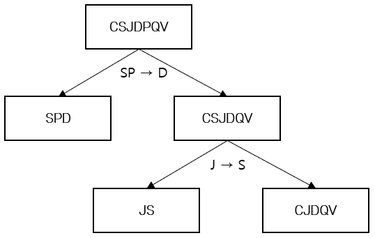

= BCNF로 분해

* R이 BCNF에 속하지 않을 때,
** X ⊂ R이고 A는 R에 속하는 단일 속성이며 X → A 가 BCNF를 위배하는 FD라고 하면, R을 R – A와 XA로 분해
** R – A나 XA가 BCNF에 속하지 않으면 순환해서 반복

---

릴레이션 스키마 R을 몇 개의 BCNF 릴레이션 스키마들로 분해하는 알고리즘은 아래와 같습니다.

1. R이 BCNF에 속하지 않는다고 할 때, X ⊂ R이고 A는 R에 속하는 단일 속성이며 X → A가 BCNF를 위배하는 FD라고 하면, R을 R – A와 XA로 분해한다.
2. R – A나 XA가 BCNF가 속하려 하지 않으면, 이 알고리즘을 순환하여 계속 적용한다.

R – A는 R에서 A에 속하지 않은 속성들의 집합을 표시한 것이고 XA는 X에 속하는 속성과 A에 속하는 속성들의 합집합을 표시한 것입니다. X → A가 BCNF를 위반하기 때문에 이 종속성은 평범한 종속성이 아입니다. 또 A는 단일 속성입니다. 그러므로 A는 X에 속하지 않고 X ∩ A는 공집합입니다. 따라서 단계 1의 분해는 무손실 조인 분해입니다.

R – A와 XA에 관한 종속성의 집합은 F를 그들의 속성에 대해 프로젝션한 것과 같습니다. 이렇게 새로 얻은 릴레이션 중에 하나다 BCNF에 속하지 않으면 단계 2에서 계속해서 분해합니다. 릴레이션을 분해하게 되면 속성의 수가 계속 줄게 되므로 이 과정은 반복을 통해 종료되게 되고 결국 BCNF에 속하는 몇 개의 릴레이션 스키마들을 얻게 됩니다. 또한 이 알고리즘을 통해 얻은 릴레이션의 인스턴트들을 조인하면 원래 릴레이션에 해당하는 인스턴스를 그대로 얻게 됩니다. 

아래와 같은 릴레이션이 있을 때,

----
Contract(ContractNo, SupplierID, SubjectID, DepartmentID, PartNo, Quantity, ValuePrice)
              C            S         J           D           P        Q          V
----

Contract 릴레이션의 함수 종속은 C → CSJDPQV, JP → C, SD → P가 있습니다. 이 경우 SD는 키가 아니므로 FD SD → P는 BCNF를 위반합니다. 함수 종속 SD → P를 분해의 기준으로 삼으면 두 개의 스키마 SDP과 CSJDQV를 얻습니다. SDP는 BCNF에 속합니다. 그런데 각 과제마다 공급자가 하나 뿐이라는 제약 조건이 있다고 가정합시다. 이 함수 종속은 J → S 가 됩니다. 이렇게 되면 스키마 CSJDQV는 BDNF에 속하지 못합니다. 이 스키마를 J → S를 기준으로 분해하여 JS와 CJDQV로 또 분해합니다. C → JDQV는 CJDQV 상에서 만족합니다. 만족하는 다른 FD이라고는 이 FD에 첨가 법칙을 적용하여 얻는 것들 뿐이며 이러한 모든 FD의 왼편에는 키가 들어있습니다. 그러므로 스키마 SDP, JS, CJDQV는 모두 BCNF에 속하도 이 스키마의 모임은 CDJDQV의 무손실 조인 분해를 나타냅니다.

이런 분해 과정상의 단계들을 아래와 같이 트리 형태로 나타낼 수 있습니다.

link:./19_review.adoc[다음: 검토]