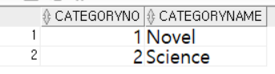
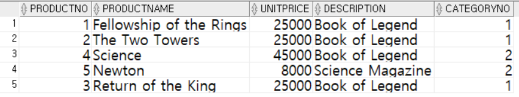
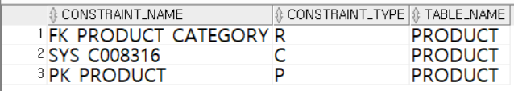
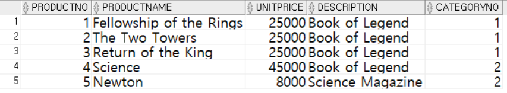
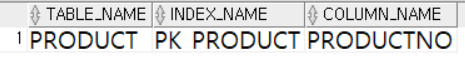
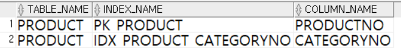
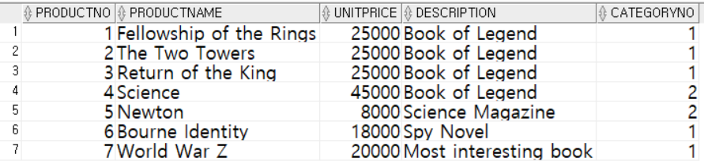
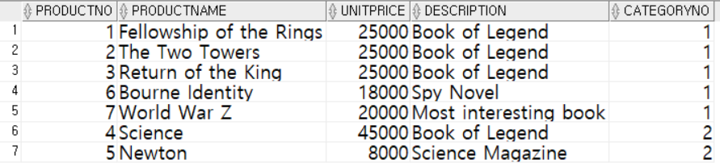

= Lab 4b: 인덱스 생성(Oracle)

== 연습 1 인덱스 확인

이 연습에서는 Module03에서 생성한 테이블에 인덱스를 생성하고 데이터를 삽입한 후 동작을 확인합니다. 아래 절차에 따릅니다.

1. SQL Developer를 실행하고 데이터베이스에 celine 사용자로 접속합니다.
2. 쿼리 창에서 아래 쿼리를 수행하여 `Product` 테이블의 컬럼을 확인합니다.
+
[source, sql]
----
desc Product;
----
+
----
 Name                                      Null?    Type
 ----------------------------------------- -------- ----------------------------
 PRODUCTNO                                 NOT NULL NUMBER
 PRODUCTNAME                               NOT NULL VARCHAR2(100)
 UNITPRICE                                          NUMBER(19,4)
 DESCRIPTION                                        VARCHAR2(4000)
 CATEGORYNO                                         NUMBER
----
+
3. 아래 쿼리를 수행하여 `Product` 테이블에 데이터를 삽입합니다.
+
[source, sql]
----
INSERT INTO Product VALUES (1, 'Fellowship of the Rings', 25000, 'Book of Legend', 1);
----
+
쿼리는 실패합니다. 오류 메시지는 아래와 같습니다.
+
----
ERROR at line 1:
ORA-02291: integrity constraint (CELINE.FK_PRODUCT_CATEGORY) violated - parent
key not found
----
+
4. 아래 쿼리를 수행하여 Category 테이블에 데이터를 삽입합니다.
+
[source, sql]
----
INSERT INTO Category (CategoryNo, CategoryName)
SELECT 1, 'Novel' FROM DUAL
UNION ALL
SELECT 2, 'Science' FROM DUAL;
----
+
5. 아래 쿼리를 수행하여 Category 테이블의 데이터를 조회합니다.
+
[source, sql]
----
SELECT * FROM Category;
----
+

+
6. 다음 쿼리를 실행하여 Product 테이블에 데이터를 삽입합니다.
+
[source, sql]
----
INSERT INTO Product VALUES (1, 'Fellowship of the Rings', 25000, 'Book of Legend', 1);
----
+
7. 다음 쿼리를 실행하여 Product 테이블에 데이터를 삽입합니다.
+
[source, sql]
----
INSERT INTO Product VALUES (1, 'The Two Towers', 25000, 'Book of Legend', 1);
----
+
PRIMARY KEY로 지정된 ProductNo 컬럼에 중복값의 삽입이 시도되었으로 쿼리는 실패합니다.
+
----
ERROR at line 1:
ORA-00001: unique constraint (CELINE.PK_PRODUCT) violated
----
+
8. 다음 쿼리를 실행하여 Product 테이블에 데이터를 삽입합니다.
+
[source, sql]
----
INSERT INTO Product VALUES (2, 'The Two Towers', 25000, 'Book of Legend', 1);
----
+
9. 다음 쿼리를 실행하여 Product 테이블에 데이터를 삽입합니다. 데이터는 삽입 순서대로 정렬됩니다.
+
[source, sql]
----
INSERT INTO Product VALUES (4, 'Science', 45000, 'Book of Legend', 2)
INSERT INTO Product VALUES (5, 'Newton', 8000, 'Science Magazine', 2)
INSERT INTO Product VALUES (3, 'Return of the King', 25000, 'Book of Legend', 1)
----
+
10. 다음 쿼리를 수행하여 Product 테이블의 데이터를 확인합니다.
+
[source, sql]
----
SELECT * FROM Product;
----
+

== 연습 2 Index Organized Table 생성

이 연습에서는 Oracle 데이터베이스에서 Product 테이블을 삭제하고 IOT(Index Organized Table)로 다시 생성합니다.

1. 아래 쿼리를 수행하여 Product 테이블의 제약조건을 확인합니다.
+
[source, sql]
----
SELECT constraint_name, constraint_type, table_name FROM USER_CONSTRAINTS WHERE TABLE_NAME = 'PRODUCT';
----
+

+
2. 아래 쿼리를 수행하여 OrderDetail 테이블의 외래 키 제약조건을 삭제합니다.
+
[source, sql]
----
ALTER TABLE OrderDetail DROP CONSTRAINT fk_orderdetail_product;
----
+
3. 쿼리를 실행하여 Product 테이블을 삭제합니다.
+
[source, sql]
----
DROP TABLE Product;
----
+
4. 아래 쿼리를 수행하여 Product 테이블을 IoT 형태로 다시 생성합니다.
+
[source, sql]
----
CREATE TABLE Product (
    ProductNo NUMBER,
    ProductName varchar2(100) NOT NULL,
    UnitPrice NUMBER(19, 4),
    Description varchar2(4000),
    CategoryNo NUMBER,

    CONSTRAINT pk_product PRIMARY KEY(ProductNo),
    CONSTRAINT fk_product_category FOREIGN KEY(CategoryNo) REFERENCES Category(CategoryNo)
)
ORGANIZATION INDEX
OVERFLOW TABLESPACE users;
----
+
5. 아래 쿼리를 수행하여 Product 테이블에 데이터를 삽입합니다.
+
[source, sql]
----
INSERT INTO Product VALUES (1, 'Fellowship of the Rings', 25000, 'Book of Legend', 1);
INSERT INTO Product VALUES (2, 'The Two Towers', 25000, 'Book of Legend', 1);
INSERT INTO Product VALUES (4, 'Science', 45000, 'Book of Legend', 2);
INSERT INTO Product VALUES (5, 'Newton', 8000, 'Science Magazine', 2);
INSERT INTO Product VALUES (3, 'Return of the King', 25000, 'Book of Legend', 1);
----
+
6. 아래 쿼리를 수행하여 Product 테이블의 데이터를 확인합니다.
+
[source, sql]
----
SELECT * FROM Product;
----
+
결과는 아래와 같습니다. 데이터 삽입 순서와 관계없이 Product 테이블의 기본 키(Primary Key)인 ProductNo 필드를 기준으로 정렬됩니다.
+

+
7. 아래 쿼리를 수행하여 OrderDetail 테이블에 외래 키 제약조건을 생성합니다.
+
[source, sql]
----
ALTER TABLE OrderDetail ADD CONSTRAINT fk_OrderDetail_Product FOREIGN KEY(ProductNo) REFERENCES Product(ProductNo);
----

== 연습 3 인덱스 생성 및 확인

이 연습에서는 Module03 데이터베이스의 Product 테이블의 CategoryNo 컬럼에 대해 인덱스를 생성하고 확인합니다. 아래 절차에 따릅니다.

1. 다음 쿼리를 실행하여 Product 테이블의 인덱스를 확인합니다.
+
[source, sql]
----
SELECT table_name, index_name, column_name 
FROM all_ind_columns
WHERE table_name = 'PRODUCT';
----
+

+
2. 다음 쿼리를 실행하여 Product 테이블의 CategoryNo 컬럼에 인덱스를 생성합니다.
+
[source, sql]
----
CREATE INDEX idx_Product_CategoryNo ON Product(CategoryNo);
----
+
3. 다음 쿼리를 실행하여 Product 테이블의 인덱스를 확인합니다.
+
[source, sql]
----
SELECT table_name, index_name, column_name 
FROM all_ind_columns
WHERE table_name = 'PRODUCT';
----
+

+
4. 아래 두 질의를 순서대로 실행하여 Product 테이블에 데이터를 삽입합니다.
+
[source, sql]
----
INSERT INTO Product VALUES (7, 'World War Z', 20000, 'Most interesting book', 1);
INSERT INTO Product VALUES (6, 'Bourne Identity', 18000, 'Spy Novel', 1);
----
+
5. 아래 쿼리를 실생하여 Product 테이블의 데이터를 확인합니다.
+
[source, sql]
----
SELECT * FROM Product
----
+
결과는 아래와 같습니다. Product 테이블의 기본 키 인덱스인 ProductNo 를 기준으로 정렬됩니다.
+

+
6. 아래 질의를 수행하여 Product 테이블의 데이터를 확인합니다.
+
[source, sql]
----
SELECT * FROM Product WHERE CategoryNo > 0;
----
+
위 쿼리는 Product 테이블의 CategoryNo 컬럼을 기준으로 생성된 idx_product_category 인덱스를 사용하여 수행되도록 작성되었습니다. 따라서, 결과는 Product 테이블의 CategoryNo 컬럼을 기준으로 정렬된 결과를 보여줍니다.
+
