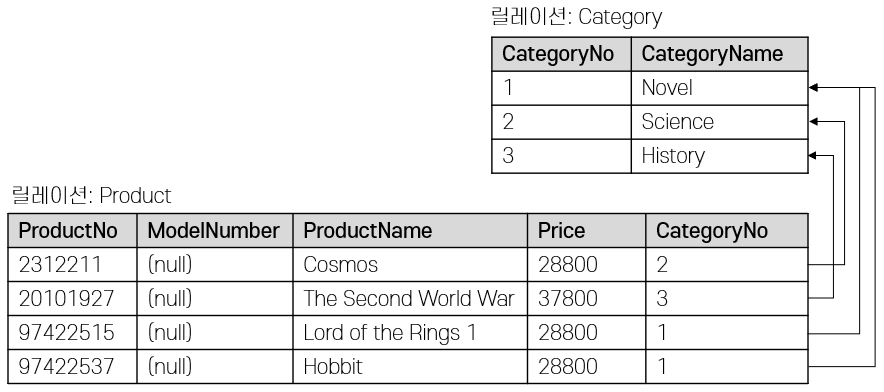

= Lab 2-2c: SQL을 사용한 무결성 제약조건 설정(Oracle)

== 연습 1 SQL을 사용하여 개체 무결성을 위한 기본 키 제약조건 설정

이 연습에서는 SQL을 사용하여 연습 2-1에서 생성한 릴레이션에 무결성 제약조건을 설정합니다. 도메인 제약조건은 릴레이션 스키마에 이미 정의되어 적용되었으므로, 개체 무결성과 참조 무결성을 유지하기 위한 무결성 제약조건을 설정합니다. 아래 절차에 따릅니다.

=== Oracle에 접속하고 현재 데이터베이스 설정

1. 명령 프롬프트를 실행합니다.
2. 아래 명령을 실행하여 Oracle에 SQL Plus로 접속합니다.
+
----
docker exec -it oracle21c sqlplus
----
+
3. `celine` 사용자로 로그인합니다.
+
----
SQL*Plus: Release 21.0.0.0.0 - Production on Tue Aug 6 14:04:14 2024
Version 21.3.0.0.0

Copyright (c) 1982, 2021, Oracle.  All rights reserved.

Enter user-name: celine
Enter password:
Last Successful login time: Tue Aug 06 2024 13:54:40 +00:00

Connected to:
Oracle Database 21c Express Edition Release 21.0.0.0.0 - Production
Version 21.3.0.0.0
----

=== Category 릴레이션에 기본 키 제약조건 설정

1. 아래 명령을 실행하여 테이블을 확인합니다.
+
[source, sql]
----
SELECT TNAME FROM tab;
----
+
결과는 아래와 같을 것입니다.
+
----
TNAME
--------------------------------------------------------------------------------
CATEGORY
PRODUCT
----
+
2. 아래 쿼리를 실행하여 `Category` 테이블의 정보를 확인합니다.
+
[source, sql]
----
desc Category;
----
+
결과는 아래와 같을 것입니다.
+
----
 Name                                      Null?    Type
 ----------------------------------------- -------- ----------------------------
 CATEGORYNO                                         NUMBER(38)
 CATEGORYNAME                                       VARCHAR2(20)
----
+
3. 아래 쿼리를 실행하여 `Category` 테이블의 제약조건을 확인합니다.
+
[source, sql]
----
SELECT OWNER, CONSTRAINT_NAME, TABLE_NAME FROM ALL_CONSTRAINTS WHERE TABLE_NAME = 'CATEGORY';
----
+
결과는 아래와 같을 것입니다.
+
----
no rows selected
----
+
4. 아래 쿼리를 실행하여 `Category` 테이블의 `CategoryNo` 컬럼에 PRIMARY KEY 제약조건을 설정합니다.
+
[source, sql]
----
ALTER TABLE Category ADD CONSTRAINT pk_Category PRIMARY KEY(CategoryNo);
----
+
5. 아래 쿼리를 실행하여 `Category` 테이블의 제약조건을 확인합니다.
+
[source, sql]
----
SELECT OWNER, CONSTRAINT_NAME, TABLE_NAME FROM ALL_CONSTRAINTS WHERE TABLE_NAME = 'CATEGORY';
----
+
결과는 아래와 같을 것입니다.
+
----
OWNER
--------------------------------------------------------------------------------
CONSTRAINT_NAME
--------------------------------------------------------------------------------
TABLE_NAME
--------------------------------------------------------------------------------
CELINE
PK_CATEGORY
CATEGORY
----
+
6. 아래 질의를 수행하여 `Category` 테이블의 데이터를 확인합니다.
+
[source, sql]
----
SELECT * FROM Category;
----
+
결과는 아래와 같을 것입니다.
+
----
CATEGORYNO CATEGORYNAME
---------- --------------------
         1 Novel
         3 History
----
+
7. 아래 쿼리를 수행하여 `Category` 테이블에 데이터를 삽입합니다.
+
[source, sql]
----
INSERT INTO Category VALUES (3, 'Science');
----
+
질의는 성공적으로 수행되지 않습니다. `Category` 테이블에 개체 무결성을 위한 기본 키 제약조건(Primary Constraint)이 적용되었고, 기본 키 제약조건에 해당하는 컬럼은 중복되는 값을 저장할 수 없습니다. 결과는 아래와 같습니다.
+
----
INSERT INTO Category VALUES(3, 'Science')
*
ERROR at line 1:
ORA-00001: unique constraint (CELINE.PK_CATEGORY) violated
----

=== Product 릴레이션에 기본 키 제약조건 설정

1. 아래 쿼리를 실행하여 `Product` 테이블의 스키마 정보를 확인합니다.
+
----
desc Product;
----
+
결과는 아래와 같을 것입니다.
+
----
 Name                                      Null?    Type
 ----------------------------------------- -------- ----------------------------
 PRODUCTNO                                          NUMBER(38)
 PRODUCTNAME                                        VARCHAR2(30)
 PRICE                                              NUMBER(19,4)
 CATEGORYNO                                         NUMBER(38)
----
+
2. 아래 쿼리를 실행하여 `Product` 테이블의 데이터를 확인합니다.
+
[source, sql]
----
SELECT * FROM Product;
----
+
결과는 아래와 같을 것입니다.
+
----
no rows selected
----
+
3. 아래 질의를 실행하여 `Product` 테이블의 `ProductNo` 컬럼에 기본 키 제약조건을 추가합니다.
+
[source, sql]
----
ALTER TABLE Product ADD CONSTRAINT pk_Product PRIMARY KEY(ProductNo);
----
+
결과는 아래와 같습니다.
+
----
Table altered.
----
+
4. 아래 쿼리를 실행하여 `Product` 테이블의 제약조건을 확인합니다.
+
[source, sql]
----
SELECT OWNER, CONSTRAINT_NAME, TABLE_NAME FROM ALL_CONSTRAINTS WHERE TABLE_NAME = 'PRODUCT';
----
+
결과는 아래와 같습니다.
+
----
OWNER
--------------------------------------------------------------------------------
CONSTRAINT_NAME
--------------------------------------------------------------------------------
TABLE_NAME
--------------------------------------------------------------------------------
CELINE
PK_PRODUCT
PRODUCT
----
+
5. 아래 쿼리를 실행하여 `Product` 테이블에 데이터를 삽입합니다.
+
[source, sql]
----
INSERT INTO Product (ProductNo, ProductName, Price) VALUES (20101927, 'The Second World War', 37800);
----
+
결과는 아래와 같을 것입니다.
+
----
1 row created.
----
+
6. 아래 질의를 실행하여 `Product` 테이블의 데이터를 확인합니다.
+
[source, sql]
----
SELECT * FROM Product;
----
+
결과는 아래와 같을 것입니다.
+
----
 PRODUCTNO PRODUCTNAME                         PRICE CATEGORYNO
---------- ------------------------------ ---------- ----------
  20101927 The Second World War                37800
----

=== SQL을 사용하여 참조 무결성을 위한 외래 키 제약조건 설정

여기에서는 `Product` 릴레이션의 `CategoryNo` 속성이 `Category` 릴레이션의 `CategoryNo` 속성을 참조하도록 제약조건을 설정합니다. 아래 절차에 따릅니다.

1. 아래 질의를 실행하여 `Product` 테이블의 `CategoryNo` 필드에 외래 키 제약조건을 설정합니다. 이 제약조건은 `Category` 테이블의 `CategoryNo` 필드를 참조합니다.
+
[source, sql]
----
ALTER TABLE Product ADD CONSTRAINT fk_Product_Category FOREIGN KEY(CategoryNo) REFERENCES Category(CategoryNo);
----
+
결과는 아래와 같을 것입니다.
+
----
Table altered.
----
+
2. 아래 쿼리를 실행하여 `Product` 테이블의 제약조건을 확인합니다.
+
[source, sql]
----
SELECT OWNER, CONSTRAINT_NAME, TABLE_NAME FROM ALL_CONSTRAINTS WHERE TABLE_NAME = 'PRODUCT';
----
+
결과는 아래와 같을 것입니다.
+
----
OWNER
--------------------------------------------------------------------------------
CONSTRAINT_NAME
--------------------------------------------------------------------------------
TABLE_NAME
--------------------------------------------------------------------------------
CELINE
FK_PRODUCT_CATEGORY
PRODUCT

CELINE
PK_PRODUCT
PRODUCT

OWNER
--------------------------------------------------------------------------------
CONSTRAINT_NAME
--------------------------------------------------------------------------------
TABLE_NAME
--------------------------------------------------------------------------------
----
+
3. 아래 쿼리를 수행하여 `Category` 테이블의 데이터를 확인합니다.
+
[source, sql]
----
SELECT * FROM Category;
----
+
결과는 아래와 같을 것입니다.
+
----
CATEGORYNO CATEGORYNAME
---------- --------------------
         1 Novel
         3 History
----
+
4. 아래 쿼리를 수행하여 `Product` 테이블의 `ProductNo` 가 20101927인 투플의 `Category` 필드의 값을 2로 변경합니다.
+
[source, sql]
----
UPDATE Product SET
CategoryNo = 2
WHERE ProductNo = 20101927;
----
+
쿼리는 거부됩니다. `Product` 테이블에서 `CategoryNo` 필드값으로 업데이트하려는 2는 `Category` 테이블의 `CategoryNo` 필드에 존재하지 않습니다. 결과는 아래와 같습니다.
+
----
UPDATE Product SET
*
ERROR at line 1:
ORA-02291: integrity constraint (CELINE.FK_PRODUCT_CATEGORY) violated - parent
key not found
----
+
5. 아래 질의를 실행하여 `Product` 테이블의 `ProductNo` 가 20101927인 투플의 `CategoryNo` 필드의 값을 3으로 변경합니다.
+
[source, sql]
----
UPDATE Product SET
CategoryNo = 3
WHERE ProductNo = 20101927;
----
+
질의가 성공적으로 수행되면 결과는 아래와 같습니다.
+
----
1 row updated.
----
6. 아래 질의를 수생하여 `Product` 테이블의 데이터를 확인합니다.
+
[source, sql]
----
SELECT * FROM Product;
----
+
결과는 아래와 같습니다.
+
----
 PRODUCTNO PRODUCTNAME                         PRICE CATEGORYNO
---------- ------------------------------ ---------- ----------
  20101927 The Second World War                37800          3
----
+
7. 아래 질의를 수행하여 Product 테이블에 데이터를 삽입합니다.
+
[source, sql]
----
INSERT INTO Product (ProductNo, ProductName, Price, CategoryNo) VALUES (97422537, 'Hobbit', 28800, 1);
INSERT INTO Product (ProductNo, ProductName, Price, CategoryNo) VALUES (97422515, 'Lord of the Rings 1', 28800, 1);
----
+
8. 아래 쿼리를 수행하여 Product 테이블의 데이터를 확인합니다.
+
[source, sql]
----
SELECT * FROM Product;
----
+
결과는 아래와 같습니다.
+
----
 PRODUCTNO PRODUCTNAME                         PRICE CATEGORYNO
---------- ------------------------------ ---------- ----------
  20101927 The Second World War                37800          3
  97422537 Hobbit                              28800          1
  97422515 Lord of the Rings 1                 28800          1
----

=== 참조하는 릴레이션에 없는 값에 대한 삽입이 시도되는 경우

1. 아래 질의를 실행하여 `Product` 테이블에 데이터 삽입을 시도합니다.
+
[source, sql]
----
INSERT INTO Product (ProductNo, ProductName, Price, CategoryNo) VALUES (2312211, 'Cosmos', 28800, 2);
----
+
질의는 성공적으로 수행되지 않습니다. `Product` 테이블에 참조 무결성을 위한 외래 키 제약조건(Foreign Key Constraint)이 적용되었고, `Product` 테이블의 `CategoryNo` 필드는 `Category` 테이블의 `CategoryNo` 필드를 참조합니다. `Category` 테이블에는 `CategoryNo` 필드의 값이 2인 투플은 존재하지 않습니다 결과는 아래와 같습니다.
+
----
INSERT INTO Product (ProductNo, ProductName, Price, CategoryNo) VALUES (2312211, 'Cosmos', 28800, 2)
*
ERROR at line 1:
ORA-02291: integrity constraint (CELINE.FK_PRODUCT_CATEGORY) violated - parent
key not found
----
+
2. 아래 쿼리를 실행하여 `Category` 테이블에 데이터를 삽입합니다.
+
[source, sql]
----
INSERT INTO Category VALUES(2, 'Science');
----
+
3. 아래 쿼리를 실행하여 `Category` 테이블의 데이터를 확인합니다.
+
[source, sql]
----
SELECT * FROM Category;
----
+
결과는 아래와 같습니다.
+
----
CATEGORYNO CATEGORYNAME
---------- --------------------
         1 Novel
         3 History
         2 Science
----
+
4. 아래 질의를 다시 실행하여 `Product` 테이블에 데이터를 삽입합니다.
+
[source, sql]
----
INSERT INTO Product (ProductNo, ProductName, Price, CategoryNo) VALUES (2312211, 'Cosmos', 28800, 2);
----
+ 
질의는 성공적으로 실행됩니다.
+
----
1 row created.
----

=== 참조 릴레이션의 데이터가 삭제되는 경우

현재 `Category` 릴레이션과 `Product` 릴레이션의 데이터는 아래와 같습니다.

1. 아래 쿼리를 실행하여 `Category` 테이블에서 `CategoryNo` 가 2인 투플의 삭제를 시도합니다.
+
[source, sql]
----
DELETE FROM Category WHERE CategoryNo = 2;
----
+
질의는 성공적으로 수행되지 않습니다. `Product` 테이블에 참조 무결성을 위한 외래 키 제약조건(Foreign Key Constraint)가 적용되었고, `Product` 테이블의 `CategoryNo` 필드는 `Category` 테이블의 `CategoryNo` 필드를 참조합니다. `Product` 테이블에는 `CategoryNo` 가 2인 투플이 존재하고, `Category` 테이블의 `CategoryNo` 가 2인 투플이 삭제되면 `Product` 테이블의 `CategoryNo` 가 2인 투플의 무결성은 지켜지지 않습니다. 결과는 아래와 같습니다.
+
----
DELETE FROM Category WHERE CategoryNo = 2
*
ERROR at line 1:
ORA-02292: integrity constraint (CELINE.FK_PRODUCT_CATEGORY) violated - child
record found
----
+
2. 아래 쿼리를 실행하여 `Product` 테이블의 제약조건을 확인합니다.
+
[source, sql]
----
SELECT OWNER, CONSTRAINT_NAME, TABLE_NAME FROM ALL_CONSTRAINTS WHERE TABLE_NAME = 'PRODUCT';
----
+
----
OWNER
--------------------------------------------------------------------------------
CONSTRAINT_NAME
--------------------------------------------------------------------------------
TABLE_NAME
--------------------------------------------------------------------------------
CELINE
FK_PRODUCT_CATEGORY
PRODUCT

CELINE
PK_PRODUCT
PRODUCT

OWNER
--------------------------------------------------------------------------------
CONSTRAINT_NAME
--------------------------------------------------------------------------------
TABLE_NAME
--------------------------------------------------------------------------------
----
+
3. 아래 쿼리를 실행하여 `Product` 테이블의 `fk_product_category` 제약조건을 삭제합니다.
+
[source, sql]
----
ALTER TABLE Product DROP CONSTRAINT fk_Product_Category;
----
+
4. 아래 질의를 수행하여 `Product` 테이블에 외래 키 제약 조건을 다시 적용합니다. 제약조건에 ON DELETE CASCADE 를 추가하여 참조 릴레이션의 투플이 삭제되면 외래 키가 존재하는 테이블의 해당 투플을 모두 삭제되도록 적용합니다.
+
[source, sql]
----
ALTER TABLE Product ADD CONSTRAINT fk_Product_Category FOREIGN KEY(CategoryNo) REFERENCES Category(CategoryNo) ON DELETE CASCADE;
----
+
5. 아래 질의를 실행하여 `Category` 테이블에서 `CategoryNo` 가 2인 투플을 삭제합니다.
+
[source, sql]
----
DELETE FROM Category WHERE CategoryNo = 2;
----
+
6. 아래 질의를 실행하여 `Category` 테이블의 데이터를 확인합니다.
+
[source, sql]
----
SELECT * FROM Category;
----
+
7. 아래 질의를 수행하여 `Product` 테이블의 데이터를 확인합니다.
+
외래 키 제약조건이 `ON DELETE CASCADE` 로 적용되면 참조 테이블의 투플이 삭제될 때 이를 참조하는 모든 테이블의 모든 투플이 삭제됩니다. 경과는 아래와 유사할 것입니다.
+
[source, sql]
----
SELECT * FROM Product;
----
+
결과는 아래와 같을 것입니다.
+
----
 PRODUCTNO PRODUCTNAME                         PRICE CATEGORYNO
---------- ------------------------------ ---------- ----------
  20101927 The Second World War                37800          3
  97422537 Hobbit                              28800          1
  97422515 Lord of the Rings 1                 28800          1
----
+
8. 아래 질의를 수행하여 `Product` 테이블의 `fk_product_category` 제약조건을 삭제합니다.
+
[source, sql]
----
ALTER TABLE Product DROP CONSTRAINT fk_Product_Category;
----
+
9. 아래 질의를 수행하여 `Product` 테이블에 외래 키 제약 조건을 다시 적용합니다. 제약조건에 ON DELETE SET NULL 을 추가하여 참조 릴레이션의 투플이 삭제되면 외래 키가 존재하는 테이블의 해당 투플의 데이터가 NULL 로 지정되도록 적용합니다.
+
[source, sql]
----
ALTER TABLE Product ADD CONSTRAINT fk_Product_Category FOREIGN KEY(CategoryNo) REFERENCES Category(CategoryNo) ON DELETE SET NULL;
----
+
10. 아래 질의를 수행하여 `Category` 테이블에서 `CategoryNo` 값이 3인 투플을 삭제합니다.
+
[source, sql]
----
DELETE FROM Category WHERE CategoryNo = 3;
----
+
11. 아래 질의를 수행하여 `Product` 테이블의 데이터를 확인합니다.
+
[source, sql]
----
SELECT * FROM Product;
----
+
외래 키 제약조건이 `ON DELETE SET NULL` 로 적용되면 참조 테이블의 투플이 삭제될 때 이를 참조하는 테이블의 모든 투플의 해당 값이 `NULL` 로 지정됩니다. 결과는 아래와 유사할 것입니다.
+
----
 PRODUCTNO PRODUCTNAME                         PRICE CATEGORYNO
---------- ------------------------------ ---------- ----------
  20101927 The Second World War                37800
  97422537 Hobbit                              28800          1
  97422515 Lord of the Rings 1                 28800          1
----
+
12. 아래 질의를 수행하여 `Product` 테이블의 `fk_Product_Category` 제약 조건을 삭제합니다.
+
[source, sql]
----
ALTER TABLE Product DROP CONSTRAINT fk_Product_Category;
----
+
13. 아래 질의를 수행하여 `Product` 테이블에 외래 키 제약 조건을 다시 적용합니다. 제약조건에 `ON DELETE NO ACTION` 을 추가하여 삭제를 시도하는 릴레이션의 투플의 해당 필드를 참조하는 다른 릴레이션의 데이터가 존재할 경우 질의 실행이 거부되도록 적용합니다.
+
[source, sql]
----
ALTER TABLE Product ADD CONSTRAINT fk_Product_Category FOREIGN KEY(CategoryNo) REFERENCES Category(CategoryNo);
----
+
14. 아래 질의를 수행하여 `Category` 테이블에서 `CategoryNo` 필드의 값이 1인 투플의 삭제를 시도합니다.
+
[source, sql]
----
DELETE FROM Category WHERE CategoryNo = 1;
----
+
Oracle의 외래키 집행의 기본 값은 child record 레코드가 존재할 시 parent record의 삭제를 불허하는 것입니다. 외래 키가 CASCADE, SET NULL등의 조건으로 만들어지지 않았으니, parent record의 삭제는 허가되지 않습니다.
+
----
DELETE FROM Category WHERE CategoryNo = 1
*
ERROR at line 1:
ORA-02292: integrity constraint (CELINE.FK_PRODUCT_CATEGORY) violated - child
record found
----

=== 참조 릴레이션의 데이터가 갱신되는 경우

ORACLE 데이터베이스는 ON UPDATE CASCADE를 지원하지 않습니다. ORACLE 데이터베이스에서는 참조 릴레이션의 데이터가 갱신되는 경우에 대한 대처가 필요한 경우 Trigger를 사용해야 합니다.

---

link:./04-lab2-2b.adoc[Lab 2-2b : SQL을 사용한 무결성 제약조건 설정 (Microsoft SQL Server)] +
link:./04-lab2-2d.adoc[Lab 2-2d : SQL을 사용한 무결성 제약조건 설정 (Postgres)]
