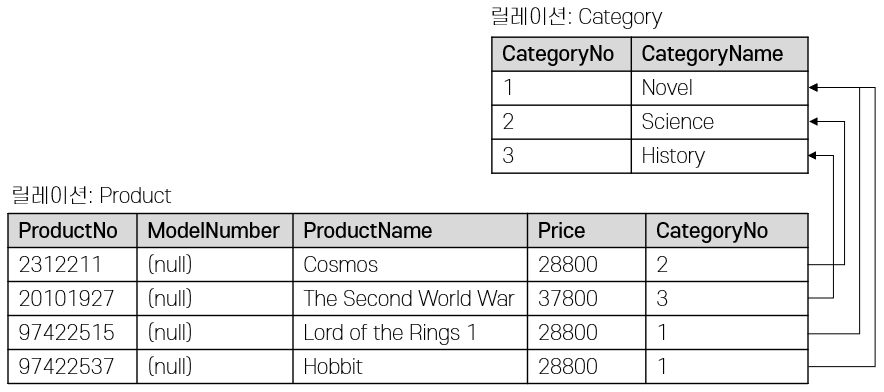

= Lab 2-2c: SQL을 사용한 무결성 제약조건 설정(Postgres)

== 연습 1 SQL을 사용하여 개체 무결성을 위한 기본 키 제약조건 설정

이 연습에서는 SQL을 사용하여 연습 2-1에서 생성한 릴레이션에 무결성 제약조건을 설정합니다. 도메인 제약조건은 릴레이션 스키마에 이미 정의되어 적용되었으므로, 개체 무결성과 참조 무결성을 유지하기 위한 무결성 제약조건을 설정합니다. 아래 절차에 따릅니다.

=== Postgres에 접속하고 현재 데이터베이스 설정

1. macOS와 Linux에서는 터미널, Windows에서는 명령 프롬프트를 실행합니다.
2. 아래 명령을 실행하여 Postgres 콘솔에 접근합니다.
+
----
psql -U postgres
----
+
3. 아래 명령을 수행하여 DBMS에 생성된 데이터베이스를 확인합니다.
+
----
SELECT datname FROM pg_database;
----
+
질의의 수행 결과는 아래와 유사할 것입니다.
+
----
  datname
-----------
 postgres
 module02
 template1
 template0
(4 rows)
----
+
4. 아래 질의를 수행하여 현재 데이터베이스를 확인합니다.
+
[source, sql]
----
SELECT current_database();
----
+
질의의 수행 결과는 아래와 유사할 것입니다.
+
----
 current_database
------------------
 postgres
(1 row)
----
+
5. 아래 명령을 수행하여 현재 데이터베이스를 `module02` 로 변경합니다.
+
----
\c module02
----
+
명령의 실행 결과는 아래와 유사할 것입니다.
+
----
You are now connected to database "module02" as user "postgres".
----
+
6. 아래 질의를 수행하여 현재 데이터베이스를 확인합니다.
+
[source, sql]
----
SELECT current_database();
----
+
질의의 수행 결과는 아래와 같을 것입니다.
+
----
 current_database
------------------
 module02
(1 row)
----

=== Category 릴레이션에 기본 키 제약조건 설정

1. 아래 명령을 실행하여 `module02` 데이터베이스에 생성된 릴레이션(테이블)들을 확인합니다.
+
----
\dt
----
+
명령의 실행 결과는 아래와 유사할 것입니다.
+
----
          List of relations
 Schema |   Name   | Type  |  Owner
--------+----------+-------+----------
 public | category | table | postgres
 public | product  | table | postgres
(2 rows)
----
+
2. 아래 질의를 수행하여 `Category` 테이블의 스키마 정보를 확인합니다.
+
[source, sql]
----
SELECT column_name, data_type FROM information_schema.columns WHERE table_name='category';
----
+
----
 column_name  |     data_type
--------------+-------------------
 categoryno   | integer
 categoryname | character varying
(2 rows)
----
+
3. 아래 질의를 수행하여 `Category` 테이블의 `CategoryNo` 컬럼에 기본 키 제약조건을 추가합니다.
+
[source, sql]
----
ALTER TABLE Category ADD CONSTRAINT pk_category PRIMARY KEY(CatregoryNo);
----
+
----
ALTER TABLE
----
+
4. 아래 질의를 수랭하여 `Category` 테이블에 생성된 제약 조건을 확인합니다.
+
[source, sql]
----
SELECT constraint_name, column_name, constraint_type FROM information_schema.constraint_column_usage AS c NATURAL JOIN INFORMATION_SCHEMA.TABLE_CONSTRAINTS AS T WHERE T.table_name = 'category';
----
+
----
 constraint_name | column_name | constraint_type
-----------------+-------------+-----------------
 pk_category     | categoryno  | PRIMARY KEY
(1 row)
----
5. 아래 질의를 실행하여 `Category` 테이블의 데이터를 확인합니다.
+
[source, sql]
----
SELECT * FROM Category;
----
+
----
 categoryno | categoryname
------------+--------------
          1 | Novel
          3 | History
(2 rows)
----
+
6. 아래 질의를 실행하여 `Category` 테이블에 데이터를 삽입합니다.
+
[source, sql]
----
INSERT INTO Category (CategoryNo, CategoryName) VALUES (3, 'Science');
----
+
질의는 성공적으로 수행되지 않습니다. `Category` 테이블에 개체 무결성을 위한 기본 키 제약조건(Primary Constraint)이 적용되었고, 기본 키 제약조건에 해당하는 컬럼은 종복되는 값을 저장할 수 없습니다. 결과는 아래와 같습니다.
+
----
ERROR:  duplicate key value violates unique constraint "pk_category"
DETAIL:  Key (categoryno)=(3) already exists.
----

=== Product 테이블에 기본 키 제약조건 설정

1. 아래 명령을 실행하여 `Product` 테이블의 스키마 정보를 확인합니다.
+
[source, sql]
----
SELECT column_name, data_type FROM information_schema.columns WHERE table_name='product';
----
+
----
 column_name |     data_type
-------------+-------------------
 productno   | integer
 price       | money
 category    | integer
 productname | character varying
(4 rows)
----
+
2. 아래 질의를 수행하여 `product` 테이블의 `productno` 컬럼에 기본 키 제약조건을 추가합니다.
+
[source, sql]
----
ALTER TABLE Product ADD CONSTRAINT pk_Product PRIMARY KEY(ProductNo);
----
+
----
ALTER TABLE
----
+
3. 아래 질의를 수행하여 `Product` 테이블에 생성된 제약 조건을 확인합니다.
+
[source, sql]
----
SELECT constraint_name, column_name, constraint_type FROM information_schema.constraint_column_usage AS c NATURAL JOIN INFORMATION_SCHEMA.TABLE_CONSTRAINTS AS T WHERE T.table_name = 'product';
----
+
질의의 수행 결과는 아래와 유사할 것입니다. `product` 테이블의 `productNo` 필드에 기본 키 제약 조건이 적용되었습니다.
+
----
 constraint_name | column_name | constraint_type
-----------------+-------------+-----------------
 pk_product      | productno   | PRIMARY KEY
(1 row)
----
+
4. 아래 질의를 수행하여 `Product` 테이블의 데이터를 확인합니다.
+
[source, sql]
----
SELECT productNo, productname, price, categoryno FROM Product;
----
+
----
 productno | productname | price | categoryno
-----------+-------------+-------+------------
(0 rows)
----
+
5. 아래 질의를 수행하여 `Product` 테이블에 데이터를 삽입합니다.
+
[source, sql]
----
INSERT INTO Product (ProductNo, ProductName, Price) VALUES (20101927, 'The Second World War', 37800);
----
+
----
Query OK, 1 row affected (0.02 sec)
----
+
6. 아래 질의를 수행하여 `Product` 테이블의 데이터를 확인합니다.
+
[source, sql]
----
SELECT * FROM Product;
----
+
----
 productno |     productname      |   price    | categoryno
-----------+----------------------+------------+------------
  20101927 | The Second World War | $37,800.00 |
(1 row)
----

== 연습 2 SQL을 사용하여 참조 무결성을 위한 외래 키 제약조건 설정

여기에서는 `Product` 릴레이션의 `CategoryNo` 속성이 `Category` 릴레이션의 `CategoryNo` 속성을 참조하도록 제약조건을 설정합니다. 아래 절차에 따릅니다.

1. 아래 질의를 실행하여 `Product` 테이블의 `CategoryNo` 속성이 `Category` 릴레이션의 `CategoryNo` 속성을 참조하도록 제약조건을 설정합니다. 이 제약조건은 `Category` 테이블의 `CategoryNo` 필드를 참조합니다.
+
[source, sql]
----
ALTER TABLE Category ADD CONSTRAINT pk_Category PRIMARY KEY(CategoryNo);
----
+
질의가 성공적으로 수행되면 결과는 아래와 유사할 것입니다.
+
----
ALTER TABLE
----
+
2. 아래 질의를 수행하여 `Categroy` 테이블의 값을 확인합니다. `Category` 테이블에는 두 개의 투플이 있으며, `CategoryNo` 필드의 데이터는 각각 1, 3입니다.
+
[source, sql]
----
SELECT * FROM Category;
----
+
----
 categoryno | categoryname
------------+--------------
          1 | Novel
          3 | History
(2 rows)
----
+
3. 아래 질의를 수행하여 `Product` 테이블의 `ProductNo가` 20101927인 투플의 `CategoryNo` 필드의 값을 2로 변경합니다.
+
[source, sql]
----
UPDATE Product SET
CategoryNo = 2
WHERE ProductNo = 20101927;
----
+
질의는 거부됩니다. `Product` 테이블에서 `CategoryNo` 필드 값으로 업데이트하려는 2는 `Category` 테이블의 `CategoryNo` 필드에 존재하지 않습니다. 결과는 아래와 같습니다.
+
----
ERROR:  insert or update on table "product" violates foreign key constraint "fk_product_category"
DETAIL:  Key (categoryno)=(2) is not present in table "category".
----
+
4. 아래 질의를 실행하여 `Product` 테이블의 `ProductNo가` 20101927인 투플의 `CategoryNo` 필드의 값을 3으로 변경합니다.
+
[source, sql]
----
UPDATE Product SET
CategoryNo = 3
WHERE ProductNo = 20101927;
----
+
----
UPDATE 1
----
+
5, 아래 질의를 수행하여 `Product` 테이블의 데이터를 확인합니다.
+
[source, sql]
----
SELECT * FROM Product;
----
+
----
 productno |     productname      |   price    | categoryno
-----------+----------------------+------------+------------
  20101927 | The Second World War | $37,800.00 |          3
(1 row)
----
+
5. 아래 질의를 수행하여 `Product` 테이블에 데이터를 삽입합니다.
+
[source, sql]
----
INSERT INTO Product (ProductNo, ProductName, Price, CategoryNo) VALUES (97422537, 'Hobbit', 28800, 1);
INSERT INTO Product (ProductNo, ProductName, Price, CategoryNo) VALUES (97422515, 'Lord of the Rings 1', 28800, 1);
----
+
6. 아래 질의를 수행하여 `Product` 테이블의 데이터를 확인합니다.
+
[source, sql]
----
SELECT * FROM Product;
----
+
----
 productno |     productname      |   price    | categoryno
-----------+----------------------+------------+------------
  20101927 | The Second World War | $37,800.00 |          3
  97422537 | Hobbit               | $28,800.00 |          1
  97422515 | Lord of the Rings 1  | $28,800.00 |          1
(3 rows)
----

=== 참조하는 릴레이션에 없는 값에 대한 삽입이 시도되는 경우

1. 아래 질의를 실행하여 `Product` 테이블에 데이터 삽입을 시도합니다.
+
[source, sql]
----
INSERT INTO Product (ProductNo, ProductName, Price, CategoryNo) VALUES (2312211, 'Cosmos', 28800, 2);
----
+
질의는 성공적으로 수행되지 않습니다. `Product` 테이블에 참조 무결성을 위한 외래 키 제약조건(Foreign Key Constraint)이 적용되었고, `Product` 테이블의 `CategoryNo` 필드는 `Category` 테이블의 `CategoryNo` 필드를 참조합니다. `Category` 테이블에는 `CategoryNo` 필드의 값이 2인 투플은 존재하지 않습니다 결과는 아래와 같습니다.
+
----
ERROR:  insert or update on table "product" violates foreign key constraint "fk_product_category"
DETAIL:  Key (categoryno)=(2) is not present in table "category".
----
+
2. 아래 질의를 실행하여 `Category` 테이블에 데이터를 삽입합니다.
+
[source, sql]
----
INSERT INTO Category VALUES (2, 'Science');
----
+
3. 아래 질의를 실행하여 `Category` 테이블의 데이터를 확인합니다.
+
[source, sql]
----
SELECT * FROM Category;
----
+
----
 categoryno | categoryname
------------+--------------
          1 | Novel
          3 | History
          2 | Science
(3 rows)
----
+
4. 아래 질의를 다시 실행하여 `Product` 테이블에 데이터를 삽입합니다.
+
[source, sql]
----
INSERT INTO Product (ProductNo, ProductName, Price, CategoryNo) VALUES (2312211, 'Cosmos', 28800, 2);
----
+
질의가 성공적으로 수행되면 결과는 아래와 같을 것입니다.
+
----
INSERT 0 1
----

=== 참조 릴레이션의 데이터가 삭제되는 경우

현재 Category 릴레이션과 Product 릴레이션의 데이터는 아래와 같습니다.

1. 아래 질의를 실행하여 `Category` 테이블에서 `CategoryNo` 가 2인 투플 삭제를 시도합니다.
+
[source, sql]
+
----
DELETE FROM Category WHERE CategoryNo = 2;
----
+
질의는 성공적으로 수행되지 않습니다. `Product` 테이블에 참조 무결성을 위한 외래 키 제약조건(Foreign Key Constraint)가 적용되었고, `Product` 테이블의 `CategoryNo` 필드는 `Category` 테이블의 `CategoryNo` 필드를 참조합니다. `Product` 테이블에는 `CategoryNo` 가 2인 투플이 존재하고, `Category` 테이블의 `CategoryNo` 가 2인 투플이 삭제되면 `Product` 테이블의 `CategoryNo` 가 2인 투플의 무결성은 지켜지지 않습니다. 결과는 아래와 같습니다.
+
----
ERROR:  update or delete on table "category" violates foreign key constraint "fk_product_category" on table "product"
DETAIL:  Key (categoryno)=(2) is still referenced from table "product".
----
+
2. 아래 질의를 수행하여 `Product` 테이블의 제약 조건을 확인합니다.
+
[source, sql]
----
SELECT
  tc.constraint_name,
	tc.table_name AS child_table,
  kcu.column_name AS child_column,
  ccu.table_name AS parent_table,
  ccu.column_name AS parent_column
FROM
  information_schema.table_constraints AS tc JOIN information_schema.key_column_usage AS kcu ON tc.constraint_name = kcu.constraint_name AND tc.table_schema = kcu.table_schema
	JOIN information_schema.constraint_column_usage AS ccu ON ccu.constraint_name = tc.constraint_name AND ccu.table_schema = tc.table_schema
WHERE
  tc.constraint_type = 'FOREIGN KEY'
----
+
----
   constraint_name   | child_table | child_column | parent_table | parent_column
---------------------+-------------+--------------+--------------+---------------
 fk_product_category | product     | categoryno   | category     | categoryno
(1 row)
----
3. 아래 질의를 수행하여 `Product` 테이블의 `fk_Product_Category` 제약 조건을 삭제합니다.
+
[source, sql]
----
ALTER TABLE Product DROP CONSTRAINT fk_Product_Category;
----
+
----
ALTER TABLE
----
+
4. 아래 질의를 수행하여 `Product` 테이블에 외래 키 제약 조건을 다시 적용합니다. 제약조건에 `ON DELETE CASCADE` 를 추가하여 참조 릴레이션의 투플이 삭제되면 외래 키가 존재하는 테이블의 해당 투플을 모두 삭제되도록 적용합니다.
+
[source, sql]
----
ALTER TABLE Product ADD CONSTRAINT fk_Product_Category FOREIGN KEY(CategoryNo) REFERENCES Category(CategoryNo) ON DELETE CASCADE;
----
+
----
ALTER TABLE
----
+
5. 아래 질의를 실행하여 `Category` 테이블에서 `CategoryNo` 가 2인 투플을 삭제합니다.
+
[source, sql]
----
DELETE FROM Category WHERE CategoryNo = 2;
----
+
----
DELETE 1
----
+
6. 아래 질의를 실행하여 `Category` 테이블의 데이터를 확인합니다.
+
[source, sql]
----
SELECT * FROM Category;
----
+
----
 categoryno | categoryname
------------+--------------
          1 | Novel
          3 | History
(2 rows)
----
+
7. 아래 질의를 수행하여 `Product` 테이블의 데이터를 확인합니다.
+
[source, sql]
----
SELECT * FROM Product;
----
+
외래 키 제약조건이 `ON DELETE CASCADE` 로 적용되면 참조 테이블의 투플이 삭제될 때 이를 참조하는 테이블의 모든 투플이 삭제됩니다. 결과는 아래와 유사할 것입니다.
+
----
 productno |     productname      |   price    | categoryno
-----------+----------------------+------------+------------
  20101927 | The Second World War | $37,800.00 |          3
  97422537 | Hobbit               | $28,800.00 |          1
  97422515 | Lord of the Rings 1  | $28,800.00 |          1
(3 rows)
----
+
8. 아래 질의를 수행하여 `Product` 테이블의 `fk_Product_Category` 제약 조건을 삭제합니다.
+
[source, sql]
----
ALTER TABLE Product DROP CONSTRAINT fk_Product_Category;
----
+
----
ALTER TABLE
----
+
9. 아래 질의를 수행하여 `Product` 테이블에 외래 키 제약 조건을 다시 적용합니다. 제약조건에 `ON DELETE SET NULL` 을 추가하여 참조 릴레이션의 투플이 삭제되면 외래 키가 존재하는 테이블의 해당 투플의 데이터가 NULL 로 지정되도록 적용합니다.
+
[source, sql]
----
ALTER TABLE Product ADD CONSTRAINT fk_Product_Category FOREIGN KEY(CategoryNo) REFERENCES Category(CategoryNo) ON DELETE SET NULL;
----
+
----
ALTER TABLE
----
+
10. 아래 질의를 수행하여 `Category` 테이블에서 `CategoryNo` 값이 3인 투플을 삭제합니다.
+
[source, sql]
----
DELETE FROM Category WHERE CategoryNo = 3;
----
+
----
DELETE 1
----
+
11. 아래 질의를 수행하여 `Product` 테이블의 데이터를 확인합니다.
+
[source, sql]
----
SELECT * FROM Product;
----
+
외래 키 제약조건이 `ON DELETE SET NULL` 로 적용되면 참조 테이블의 투플이 삭제될 때 이를 참조하는 테이블의 모든 투플의 해당 값이 `NULL` 로 지정됩니다. 결과는 아래와 유사할 것입니다.
+
----
 productno |     productname      |   price    | categoryno
-----------+----------------------+------------+------------
  97422537 | Hobbit               | $28,800.00 |          1
  97422515 | Lord of the Rings 1  | $28,800.00 |          1
  20101927 | The Second World War | $37,800.00 |
(3 rows)
----
+
12. 아래 질의를 수행하여 `Product` 테이블의 `fk_Product_Category` 제약 조건을 삭제합니다.
+
[source, sql]
----
ALTER TABLE Product DROP CONSTRAINT fk_Product_Category;
----
+
----
ALTER TABLE
----
+
13. 아래 질의를 수행하여 `Product` 테이블에 외래 키 제약 조건을 다시 적용합니다. 제약조건에 `ON DELETE NO ACTION` 을 추가하여 삭제를 시도하는 릴레이션의 투플의 해당 필드를 참조하는 다른 릴레이션의 데이터가 존재할 경우 질의 실행이 거부되도록 적용합니다.
+
[source, sql]
----
ALTER TABLE Product ADD CONSTRAINT fk_Product_Category FOREIGN KEY(CategoryNo) REFERENCES Category(CategoryNo) ON DELETE NO ACTION;
----
+
----
ALTER TABLE
----
+
14. 아래 질의를 수행하여 `Category` 테이블에서 `CategoryNo` 필드의 값이 1인 투플의 삭제를 시도합니다.
+
[source, sql]
----
DELETE FROM Category WHERE CategoryNo = 1;
----
+
외래 키 제약조건이 `ON DELETE NO ACTION` 으로 적용되면 삭제를 시도하는 릴레이션의 투플의 해당 필드를 참조하는 다른 릴레이션의 데이터가 존재할 경우 질의 실행이 거부됩니다. 결과는 아래와 유사할 것입니다.
+
----
ERROR:  update or delete on table "category" violates foreign key constraint "fk_product_category" on table "product"
DETAIL:  Key (categoryno)=(1) is still referenced from table "product".
----

=== 참조 릴레이션의 데이터가 갱신되는 경우

1. 아래 질의를 수행하여 `Product` 테이블의 `fk_Product_Category` 제약조건을 삭제합니다.
+
[source, sql]
----
ALTER TABLE Product DROP CONSTRAINT fk_Product_Category;
----
+
2. 아래 질의를 수행하여 `Product` 테이블에 외래 키 제약 조건을 다시 적용합니다. 제약조건에 `ON UPDATE CASCADE` 을 추가하여 투플의 해당 필드 값이 갱신될 경우 해당 값을 참조하는 모든 릴레이션의 필드 값이 같이 갱신되도록 지정합니다.
+
[source, sql]
----
ALTER TABLE Product ADD CONSTRAINT fk_Product_Category FOREIGN KEY(CategoryNo) REFERENCES Category(CategoryNo) ON UPDATE CASCADE;
----
+
3. 아래 질의를 수행하여 `Category` 테이블의 `CategoryNo` 가 1인 투플의 `CategoryNo` 필드 값을 2로 갱신합니다.
+
[source, sql]
----
UPDATE Category SET CategoryNo = 2 WHERE CategoryNo = 1;
----
+
4. 아래 질의를 수행하여 Product 테이블의 데이터를 확인합니다.
+
[source, sql]
----
SELECT * FROM Product;
----
+
----
 productno |     productname      |   price    | categoryno
-----------+----------------------+------------+------------
  20101927 | The Second World War | $37,800.00 |
  97422537 | Hobbit               | $28,800.00 |          2
  97422515 | Lord of the Rings 1  | $28,800.00 |          2
(3 rows)
----
+
5. 아래 질의를 수행하여 `Product` 테이블의 `fk_Product_Category` 제약 조건을 삭제합니다.
+
[source, sql]
----
ALTER TABLE Product DROP CONSTRAINT fk_Product_Category;
----
+
6. 아래 질의를 수행하여 `Product` 테이블에 외래 키 제약 조건을 다시 적용합니다. 제약조건에 `ON UPDATE NO ACTION` 을 추가하여 갱신을 시도하는 릴레이션의 투플의 해당 필드를 참조하는 다른 릴레이션의 데이터가 존재할 경우 질의 실행이 거부되도록 적용합니다.
+
[source, sql]
----
ALTER TABLE Product ADD CONSTRAINT fk_Product_Category FOREIGN KEY(CategoryNo) REFERENCES Category(CategoryNo) ON UPDATE NO ACTION;
----
+
7. 아래 질의를 수행하여 `Category` 테이블의 `CategoryNo` 가 2인 투플의 `CategoryNo` 필드 값을 1로 갱신합니다.
+
[source, sql]
----
UPDATE Category SET CategoryNo = 1 WHERE CategoryNo = 2;
----
+
외래 키 제약조건이 `ON DELETE NO ACTION` 으로 적용되면 갱신을 시도하는 릴레이션의 투플의 해당 필드를 참조하는 다른 릴레이션의 데이터가 존재할 경우 질의 실행이 거부됩니다. 결과는 아래와 유사할 것입니다.
+
----
ERROR:  update or delete on table "category" violates foreign key constraint "fk_product_category" on table "product"
DETAIL:  Key (categoryno)=(2) is still referenced from table "product".
----
+
8. 아래 질의를 수행하여 `Product` 테이블의 `fk_Product_Category` 제약 조건을 삭제합니다.
+
[source, sql]
----
ALTER TABLE Product DROP CONSTRAINT fk_Product_Category;
----
+
9. 아래 질의를 수행하여 `Product` 테이블에 외래 키 제약 조건을 다시 적용합니다. 제약조건에 `ON DELETE SET NULL` 추가하여 참조 릴레이션의 투플의 해당 필드 값이 갱신되면 외래 키가 존재하는 테이블의 해당 투플의 데이터가 `NULL` 로 지정되도록 적용합니다.
+
[source, sql]
----
ALTER TABLE Product ADD CONSTRAINT fk_Product_Category FOREIGN KEY(CategoryNo) REFERENCES Category(CategoryNo) ON UPDATE SET NULL;
----
+
10. 아래 질의를 수행하여 `Category` 테이블의 `CategoryNo` 가 2인 투플의 `CategoryNo` 필드 값을 1로 갱신합니다.
+
[source, sql]
----
UPDATE Category SET CategoryNo = 1 WHERE CategoryNo = 2;
----
+
11. 아래 질의를 수행하여 Product 테이블의 데이터를 확인합니다.
+
[source, sql]
----
SELECT * FROM Product;
----
+
----
 productno |     productname      |   price    | categoryno
-----------+----------------------+------------+------------
  20101927 | The Second World War | $37,800.00 |
  97422537 | Hobbit               | $28,800.00 |
  97422515 | Lord of the Rings 1  | $28,800.00 |
(3 rows)
----

---

link:./23-3_lab2-2c.adoc[Lab 2-2c : SQL을 사용한 무결성 제약조건 설정 (Oracle)] +
link:./24_review.adoc[다음: 검토]