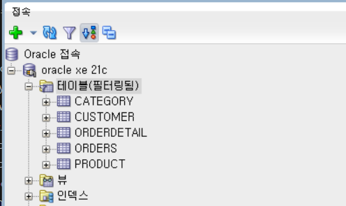

= Lab 3c : 테이블 생성 (Oracle)

== 연습 1 Oracle Development Studio 에서 테이블 생성

이 연습에서는 아래와 같은 스키마를 가진 릴레이션을 생성합니다.

_Category(CategoryNo: 정수, CategoryName 문자열) +
Product(ProductNo: 정수,: ProductName:문자열, UnitPrice: 정수, Description: 문자열, CategoryNo: 정수) +
Customer(CustomerNo: 정수, CustomerName: 문자열, email: 문자열, Password: 문자열) +
Orders(OrderNo: 정수, OrderDate: 날짜, CustomerNo: 정수) +
OrderDetail(ProductNo: 숫자, OrderNo:정수 Quantity: 숫자)_

=== SQL Developer를 통해 Oracle 데이터베이스에 접속하고 테이블 생성

1. SQL Developer를 실행하고 `수동으로 접속 생성` 버튼을 클릭합니다.
2. 아래 정보를 입력하고 `접속` 버튼을 클릭합니다.
A. Name `Oracle xe 21c`
B. 사용자 이름 `celine`
C. 비밀번호 `celine`
D. 호스트 이름 `localhost`
E. 포트 `1521`
F. SID `xe`

=== Category 테이블 생성

1. 워크시트에서 아래 쿼리를 실행하여 Category 테이블을 생성합니다.
+
[source, sql]
----
CREATE TABLE Category (
    CategoryNo int,
    CategoryName varchar(20) NOT NULL,

    CONSTRAINT pk_Category PRIMARY KEY(CategoryNo)
);
----
2. 아래 쿼리를 실행하여 생성된 테이블 정보를 확인합니다.
+
[source, sql]
----
desc category;
----
+
결과는 아래와 유사할 것입니다.
+
----
 Name                                      Null?    Type
 ----------------------------------------- -------- ----------------------------
 CATEGORYNO                                NOT NULL NUMBER(38)
 CATEGORYNAME                              NOT NULL VARCHAR2(20)
----

=== Product 테이블 생성

1. 다음 쿼리를 실행하여 Product 테이블을 생성합니다.
+
[source, sql]
----
CREATE TABLE Product (
    ProductNo NUMBER,
    ProductName varchar2(100) NOT NULL,
    UnitPrice NUMBER(19, 4),
    Description varchar2(4000),
    CategoryNo NUMBER,
    
    CONSTRAINT pk_product PRIMARY KEY(ProductNo),
    CONSTRAINT fk_product_category FOREIGN KEY(CategoryNo) REFERENCES Category(CategoryNo)
);
----
+
2. 다음 쿼리를 실행하여 생성된 Product 테이블을 확인합니다.
+
[source, sql]
----
desc product
----
+
결과는 아래와 유사할 것입니다.
+
----
 Name                                      Null?    Type
 ----------------------------------------- -------- ----------------------------
 PRODUCTNO                                 NOT NULL NUMBER
 PRODUCTNAME                               NOT NULL VARCHAR2(100)
 UNITPRICE                                          NUMBER(19,4)
 DESCRIPTION                                        VARCHAR2(4000)
 CATEGORYNO                                         NUMBER
----

=== Customer 테이블 생성

1. 다음 쿼리를 실행하여 Customer 테이블을 생성합니다.
+
[source, sql]
----
CREATE TABLE Customer (
	CustomerNo NUMBER,
	CustomerName varchar2(10),
	Email varchar(40),
	Password varchar(16)
);
----
+
2. 다음 쿼리를 실행하여 Customer 테이블에 PRIMARY KEY 인덱스를 생성합니다.
+
[source, sql]
----
ALTER TABLE Customer ADD CONSTRAINT pk_customer PRIMARY KEY(CustomerNo);
----

=== Orders 테이블 생성

1. 다음 쿼리를 생성하여 Orders 테이블을 생성합니다.
+
[source, sql]
----
CREATE TABLE Orders (
    OrderNo NUMBER,
    OrderDate Date,
    CustomerNo int,

    CONSTRAINT pk_Order PRIMARY KEY(OrderNo),
    CONSTRAINT fk_Order_Customer FOREIGN KEY(CustomerNo) REFERENCES Customer(CustomerNo)
);
----

=== OrderDetail 테이블 생성

1. 다음 쿼리를 실행하여 OrderDetail 테이블을 생성합니다.

[source, sql]
----
CREATE TABLE OrderDetail (
    ProductNo int,
    OrderNo int,
    Quantity int,
    
    CONSTRAINT pk_OrderDetail PRIMARY KEY(ProductNo, OrderNo),
    CONSTRAINT fk_OrderDetail_Order FOREIGN KEY(OrderNo) REFERENCES Orders(OrderNo),
    CONSTRAINT fk_OrderDetail_Product FOREIGN KEY(ProductNo) REFERENCES Product(ProductNo)
);
----

=== 생성된 개체 확인

1. 접속 창에서 테이블을 확장한 후, 테이블을 마우스 오른쪽 클릭하고 `새로 고침` 을 클릭합니다.
2. 생성된 테이블을 확인합니다.
+

+
3. 각 테이블을 확장하여 생성된 테이블의 정보를 확인합니다.

---

link:./08-lab3b.adoc[이전: Lab 3c: 테이블 생성(Oracle)] +
link:./08-lab3d.adoc[다음: Lab 3d: 테이블 생성(Postgres)]