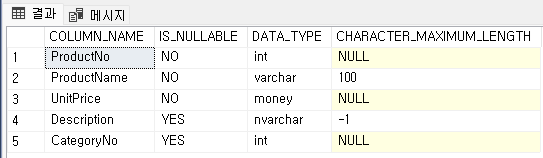
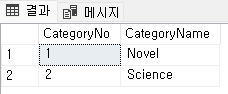
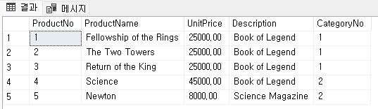
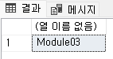
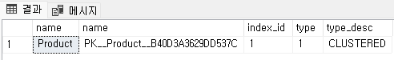
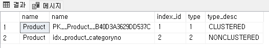
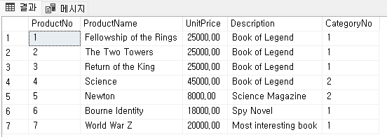
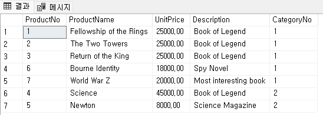

= Lab 4b: 인덱스 생성(Microsoft SQL Server)

==  연습 1 클러스터드 인덱스 확인

이 연습에서는 Module03에서 생성한 테이블에 인덱스를 생성하고 데이터를 삽입한 후 동작을 확인합니다. 아래 절차에 따릅니다.

=== Product 테이블에 데이터 삽입

이 연습에서는 `Product` 테이블에 데이터를 삽입합니다. 아래 절차에 따릅니다.

1. 아래 쿼리를 실행하여 `Product` 테이블의 컬럼을 확인합니다.
+
[source, sql]
----
SELECT COLUMN_NAME, IS_NULLABLE, DATA_TYPE, CHARACTER_MAXIMUM_LENGTH
FROM INFORMATION_SCHEMA.COLUMNS
WHERE TABLE_NAME = 'Product'
----
+
결과는 아래와 유사할 것입니다.
+

+
2. 아래 쿼리를 실행하여 `Product` 테이블에 데이터를 삽입합니다.
+
[source, sql]
----
INSERT INTO Product VALUES (1, 'Fellowship of the Rings', 25000, 'Book of Legend', 1)
----
+
쿼리는 실패합니다. 오류 메시지는 아래와 같습니다.
+
----
메시지 547, 수준 16, 상태 0, 줄 1
INSERT 문이 FOREIGN KEY 제약 조건 "fk_Product_CategoryID"과(와) 충돌했습니다. 데이터베이스 "Module03", 테이블 "dbo.Category", column 'CategoryNo'에서 충돌이 발생했습니다.
문이 종료되었습니다.
----
+
3. 아래 쿼리를 수행하여 `Category` 테이블에 데이터를 삽입합니다.
+
[source, sql]
----
INSERT INTO Category VALUES(1, 'Novel'), (2, 'Science')
----
+
4. 아래 쿼리를 수랭하여 `Category` 테이블의 데이터를 조회합니다.
+
[source, sql]
----
SELECT * FROM Category
----
+
결과는 아래와 같습니다.
+

+
5. 다음 쿼리를 실행하여 `Product` 테이블에 데이터를 삽입합니다.
+
[source, sql]
----
INSERT INTO Product VALUES (1, 'Fellowship of the Rings', 25000, 'Book of Legend', 1)
----
+
6. 다음 쿼리를 실행하여 `Product` 테이블에 데이터를 삽입합니다.
+
[source, sql]
----
INSERT INTO Product VALUES (1, 'The Two Towers', 25000, 'Book of Legend', 1)
----
+
PRIMARY KEY로 지정된 `ProductNo` 컬럼에 중복값의 삽입이 시도되었으로 쿼리는 실패합니다.
+
----
메시지 2627, 수준 14, 상태 1, 줄 1
PRIMARY KEY 제약 조건 'PK__Product__B40D3A3629DD537C'을(를) 위반했습니다. 개체 'dbo.Product'에 중복 키를 삽입할 수 없습니다. 중복 키 값은 (1)입니다.
문이 종료되었습니다.
----
+
7. 다음 쿼리를 실행하여 `Product` 테이블에 데이터를 삽입합니다.
+
[source, sql]
----
INSERT INTO Product VALUES (2, 'The Two Towers', 25000, 'Book of Legend', 1)
----
+
8. 다음 쿼리를 실행하여 `Product` 테이블에 데이터를 삽입합니다.
+
[source, sql]
----
INSERT INTO Product VALUES (4, 'Science', 45000, 'Book of Legend', 2)
INSERT INTO Product VALUES (5, 'Newton', 8000, 'Science Magazine', 2)
INSERT INTO Product VALUES (3, 'Return of the King', 25000, 'Book of Legend', 1)
----
+
9. 아래 질의를 수행하여 `Product` 테이블에 삽입된 데이터를 확인합니다.
+
[source, sql]
----
SELECT * FROM Product
----
+
결과는 아래와 같습니다. 데이터 삽입 순서와 관계없이 `Product` 테이블의 기본 키(Primary Key)인 `ProductNo` 필드를 기준으로 정렬됩니다.
+

=== 연습 2 넌 클러스터드 인덱스 생성 및 확인

이 연습에서는 Module03 데이터베이스의 `Product` 테이블의 `CategoryNo` 컬럼에 대해 인덱스를 생성하고 확인합니다. 아래 절차에 따릅니다.

1. 다음 쿼리를 수행하여 현재 데이터베이스 컨텍스트를 확인합니다.
+
[source, sql]
----
SELECT db_name()
----
+
결과는 아래와 같습니다.
+

+
2. 다음 쿼리를 실행하여 `Product` 테이블의 인덱스를 확인합니다.
+
[source, sql]
----
SELECT t.name, i.name, i.index_id, i.type, i.type_desc
FROM sys.tables t INNER JOIN sys.indexes i
    ON t.object_id = i.object_id
WHERE t.name = 'Product'
----
+
결과는 아래와 같습니다.
+

+
3. 다음 쿼리를 실행하여 `Product` 테이블의 `CategoryNo` 컬럼에 인덱스를 생성합니다.
+
[source, sql]
----
CREATE INDEX idx_product_categoryno ON Product(CategoryNo)
----
+
4. 다음 쿼리를 실행하여 `Product` 테이블의 인덱스를 확인합니다.
+
[source, sql]
----
SELECT t.name, i.name, i.index_id, i.type, i.type_desc
FROM sys.tables t INNER JOIN sys.indexes i
    ON t.object_id = i.object_id
WHERE t.name = 'Product'
----
+
결과는 아래와 같습니다.
+

+
5. 아래 두 질의를 순서대로 실행하여 `Product` 테이블에 데이터를 삽입합니다.
+
[source, sql]
----
INSERT INTO Product VALUES (7, 'World War Z', 20000, 'Most interesting book', 1)
INSERT INTO Product VALUES (6, 'Bourne Identity', 18000, 'Spy Novel', 1)
----
+
6. 다음 쿼리를 실행하여 `Product` 테이블의 데이터를 확인합니다.
+
[source, sql]
----
SELECT * FROM Product;
----
+
결과는 아래와 같습니다. `Product` 테이블의 기본 키 인덱스인 `ProductNo` 를 기준으로 정렬됩니다.
+

+
7. 아래 질의를 수행하여 `Product` 테이블의 데이터를 확인합니다.
+
[source, sql]
----
SELECT * FROM Product WITH (INDEX(idx_product_categoryno))
----
+
위 쿼리는 Product 테이블의 CategoryNo 컬럼을 기준으로 생성된 idx_product_category 인덱스를 사용하여 수행되도록 작성되었습니다. 따라서, 결과는 Product 테이블의 CategoryNo 컬럼을 기준으로 정렬된 결과를 보여줍니다. 
+

---

link:./02-lab4a.adoc[이전: Lab 4a: 인덱스 생성(MySQL)] +
link:./02-lab4c.adoc[다음: Lab 4c: 인덱스 생성(Oracle)]