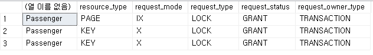

= Lab 12-2b: 잠금 (Microsoft SQL Server)

이 연습에서는 같은 데이터 객체에 두 트랜잭션이 접근할 때 발생할 수 있는 여러 문제를 해결할 수 있는 잠금과, 잠금 해제를 기다리는 관계에 사이클이 생기는 경우에 발생하는 deadlock이 발생하는 상황을 시뮬레이션하고 살펴봅니다.

> 참고: 이 연습에서는 이전 학습에 사용한 Module06 데이터베이스를 사용합니다.

1. Microsoft SQL Management Studio (SSMS) 또는 Azure Data Studio를 실행하고 sa 사용자 (또는 관리자 권한 사용자)로 로그인합니다. (터미널 1로 호칭합니다)
2. 아래 쿼리를 수행하여 프로세스가 가진 잠금을 확인합니다.
+
[source, sql]
----
SELECT * FROM sys.dm_tran_locks WHERE request_session_id = @@SPID
----
+
3. Microsoft SQL Management Studio (SSMS) 또는 Azure Data Studio를 하나 더 실행하고 sa 사용자 (또는 관리자 권한 사용자)로 로그인합니다. (터미널 2로 호칭합니다.)

== 연습 1: 잠금

이 연습에서는 Microsoft SQL Server의 기본적인 잠금에 대해 학습합니다. 아래 절차를 따릅니다.

1. 아래 쿼리를 실행하여 현재 세션의 ID를 확인합니다.
+
[source, sql]
----
SELECT @@SPID
----
+
----
67
(1개 행 적용됨)
----
2. 아래 쿼리를 실행하여 현재 세션의 트랜잭션 수를 확인합니다.
+
[source, sql]
----
SELECT @@TRANCOUNT
GO
----
+
----
0
(1개 행 적용됨)
----
+
3. 터미널 1에서, 아래 쿼리를 실행하여 트랜잭션을 시작합니다.
+
[source, sql]
----
BEGIN TRANSACTION
GO
----
+
4. 터미널 1에서, 아래 쿼리를 실행하여 Passenger 테이블에서 Grade가 10인 데이터에 대해 Exclusive Lock을 요청합니다.
+
[source, sql]
----
UPDATE Passenger SET age = age + 1 WHERE Grade = 10
----
+
5. 터미널 1에서, 아래 쿼리를 실행하여 세션에서 Module06 데이터베이스의 개체들에 수행한 잠금을 확인합니다.
+
[source, sql]
----
SELECT object_name(p.object_id), resource_type, request_mode, request_type, request_status, request_owner_type
FROM sys.dm_tran_locks as tx INNER JOIN sys.partitions as p ON tx.resource_associated_entity_id = p.hobt_id
WHERE request_session_id = @@SPID AND resource_database_id = db_id('module06')
----
+

6. 터미널 2에서, 아래 쿼리를 실행하여 Module06 데이터에 읽기를 시도합니다.
+
[source, sql]
----
SELECT * FROM Passenger WHERE Grade = 9
----
+
터미널 1의 트랜잭션에서 Passenger 테이블의 Key에 대해 잠금을 수행하고 있으므로 데이터 요청은 잠금이 풀릴때까지 대기합니다.
+
7. 터미널 1에서, 아래 쿼리를 수행하여 트랜잭션을 rollback 합니다.
+
[source, sql]
----
ROLLBACK TRANSACTION
GO
----
+
8. 터미널 1에서 데이터 잠금이 해제되면 터미널 1에서 읽기가 수행됨을 확인합니다.

---

link:./04-lab12-2a.adoc[이전: Lab 12-2a 잠금 (MySQL)] +
link:./04-lab12-2c.adoc[이전: Lab 12-2c 잠금 (Oracle)]