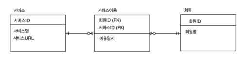

### 1. 아래 ERD에 대한 설명으로 가장 적절하지 않은 것은?


① 한 명의 고객은 여러 개의 제품을 주문할 수 있다.

② 하나의 주문은 반드시 한 명의 고객에 의해 주문된다.

③ 하나의 고객은 주문을 할  수도 있고 안 할 수도 있다.

④ 하나의 주문은 고객이 있을 수도 있고 없을 수도 있다.

### 2. SELECT 문에 대한 설명으로 가장 적절하지 않은 것은?

① WHERE 절은 필수가 아니므로 생략 가능하다.

② DISTINCT 옵션을 통해 중복된 데이터가 있을 경우 1건으로 처리해 출력할 수 있다.

③ FROM 절이 없는 다음 문장 “SELECT COL1, COL2”은 에러 없이 수행된다.

④ SELECT List에 서브쿼리가 사용될 수 있다.

### 3. 아래 내용의 범주에 해당하는 SQL 명령어로 가장 적절하지 않은 것은?

```
테이블의 구조를 생성, 변경, 삭제하는 등 데이터 구조를 정의하는 데 사용되는 명령어이다.
```

① CREATE

② GRANT

③ ALTER

④ DROP

### 4. 데이터베이스에서 조회되는 데이터에 대한 조건을 설정하여 원하는 데이터만을 검색하기 위해 사용하는 절로 가장 적절한 것은?

① WHERE 절

② GROUP BY 절 

③ ORDER BY 절

④ HAVING 절

### 5. SQL 문을 실행했을 때 오류가 발생하는 부분으로 가장 적절한 것은?

① SELECT DEPNO, ROUND(AVG(SAL),2)

② FROM EMP

③ WHERE AVG(SAL) >= 1800

④ GROUP BY DEPTNO;

### 6. 전공이름별로 묶어 전공이름과 학점 평균을 전공이름의 내림차순으로 정렬하여 출력하고자 할 때, 빈칸 ㉠, ㉡ 에 들어갈 명령어로 가장 적절한 것은?

```sql
SELECT 전공이름, AVG(학점)
FROM 전공, 학생
WHERE 전공.전공번호 = 학생.전공번호
  ㉠   전공이름
ORDER BY 전공이름   ㉡   ;
```

① ㉠ GROUP BY ㉡ DESC

② ㉠ HAVING ㉡ DESC

③ ㉠ GROUP BY ㉡ ASC

④ ㉠ HAVING ㉡ ASC

### 7. 아래를 참고할 때 광고매체 ID별 최초로 게시한 광고명과 광고시작일자를 출력하기 위하여 빈칸 ㉠에 들어갈 SQL로 가장 적절한 것은?


```sql
SELECT C.광고매체명, B.광고명, A.광고시작일자
FROM 광고게시 A
	JOIN 광고 B ON A.광고ID = B.광고ID
	JOIN 광고매체 C ON A.광고매체ID = C.광고매체ID
	JOIN (
	   ㉠  
	) D ON A.광고시작일자 = D.광고시작일자 AND A.광고매체ID = D.광고매체ID
ORDER BY C.광고매체명;
```

①  
```sql
SELECT D.광고매체ID, MIN(D.광고시작일자) AS 광고시작일자 
FROM 광고게시 D
WHERE D.광고매체ID = C.광고매체ID
GROUP BY D.광고매체ID
```
②  
```sql
SELECT 광고매체ID, MIN(광고시작일자) AS 광고시작일자 
FROM 광고게시
GROUP BY 광고매체ID
```

③  
```sql
SELECT MIN(광고매체ID) AS 광고매체ID, MIN(광고시작일자) AS 광고시작일자 
FROM 광고게시
GROUP BY 광고ID
```

④  
```sql
SELECT MIN(광고매체ID) AS 광고매체ID, MIN(광고시작일자) AS 광고시작일자 
FROM 광고게시 
```

### 8. 아래 SQL을 순서대로 실행했을 때 최종적으로 반영되는 SQL을 모두 고른 것은?

```sql
(가) INSERT INTO emp (empno, ename, deptno) VALUES 999, 'Smith', 10);
     SAVEPOINT a;
     
(나) DELETE emp WHERE empno = 202;
    SAVEPOINT b;
    
(다) UPDATE emp SET ename = 'Clark';
		ROLLBACK TO SAVEPOINT a;
		
(라) INSERT INTO emp (empno, ename, deptno) VALUES (300, 'Thomas', 30);
    SAVEPOINT c;
    
(마) DELETE emp WHERE deptno = 20;
    COMMIT;
```

① (가), (나), (다), (라), (마)

② (가), (나), (다), (라)

③ (나), (다), (라), (마)

④ (가), (라), (마)

### 9. 아래 SQL의 실행 결과로 가장 적절한 것은?

[TABLE_A]

| TABKEY | COLA | COLB | COLC |
| --- | --- | --- | --- |
| 1 | \<NULL> | 가 | \<NULL> |
| 2 | 1 | 가 | 5 |
| 3 | \<NULL> | 나 | 2 |
| 4 | 3 | 나 | 0 |
| 5 | \<NULL> | \<NULL> | 3 |
| 6 | 5 | 다 | 0 |
| 7 | \<NULL> | 다 | \<NULL> |

```sql
SELECT COLB
	, MAX(COLA) AS COLA1
	, MIN(COLA) AS COLA2
	, SUM(COLC) AS SUMC
FROM TABLE_A
GROUP BY COLB;
```

① 

| COLB | COLA1 | COLA2 | SUMC |
| --- | --- | --- | --- |
| \<NULL> | \<NULL> | \<NULL> | \<NULL> |
| 가 | 1 | 1 | 5 |
| 나 | 3 | 3 | 2 |
| 다 | 5 | 5 | 0 |

② 

| COLB | COLA1 | COLA2 | SUMC |
| --- | --- | --- | --- |
| 가 | 1 | \<NULL> | \<NULL> |
| 나 | 3 | \<NULL> | 2 |
| 다 | 5 | \<NULL> | \<NULL> |

③ 

| COLB | COLA1 | COLA2 | SUMC |
| --- | --- | --- | --- |
| \<NULL> | \<NULL> | \<NULL> | \<NULL> |
| 가 | 1 | 1 | 5 |
| 나 | 3 | 3 | 2 |
| 다 | 5 | 5 | 0 |

④ 

| COLB | COLA1 | COLA2 | SUMC |
| --- | --- | --- | --- |
| 가 | 1 | 1 | 5 |
| 나 | 3 | 3 | 2 |
| 다 | 5 | 5 | 0 |

### 10. 출연료가 8888 이상인 영화명, 배우명, 출연료를 구하는 SQL을 작성하시오.


### 11. 아래에 대한 설명으로 가장 적절한 것은?


① 제품, 생산제품, 생산라인 엔터티를 INNER JOIN하기 위해서 생산제품 엔터티는 WHERE 절에 최소 3번 나타나야 한다.

② 제품과 생산라인 엔터티를 JOIN 시 적절한 JOIN 조건이 없으므로 카티시안 곱(Cartesian Product)이 발생한다.

③ 제품과 생산라인 엔터티에는 생산제품과 대응되지 않는 레코드는 없다.

④  특정 생산라인번호에서 생산되는 제품의 제품명을 알기 위해서는 제품, 생산제품, 생산라인까지 3개 엔터티의 INNER JOIN이 필요하다.

### 12. 아래 SQL의 빈칸 ㉠, ㉡에 들어갈 내용으로 가장 적절한 것은?

```
[테이블]
고객 (고객번호, 이름, 등급), 구매정보 (구매번호, 구매금액, 고객번호)
* 구매정보 테이블의 고객번호는 고객 테이블의 고객번호를 참조하는 외래키(Foreign key)이다.

[조건]
구매 이력이 있는 고객 중 횟수가 3회 이상인 고객의 이름과 등급을 출력
```

```sql
[SQL]
SELECT A.이름, A.등급
FROM 고객 A
  ㉠  
GROUP BY A.이름, A.등급
  ㉡   ;
```

①  ㉠ INNER JOIN 구매정보 B ON A.고객번호 = B.고객번호
    ㉡ HAVING SUM(B.구매번호) >= 3

② ㉠ INNER JOIN 구매정보 B ON A.고객번호 = B.고객번호
    ㉡ HAVING COUNT(B.구매번호) >=3

③ ㉠ LEFT OUTER JOIN 구매정보 B ON A.고객번호=B.고객번호
    ㉡ HAVING SUM(B.구매번호) >= 3

④ ㉠ INNER JOIN 구매정보 B ON A.고객번호 = B.고객번호
    ㉡ WHERE B.구매번호 >= 3

### 13. 아래를 참고할 때 시간대별사용량 테이블을 기반으로 고객별 사용금액을 출력하는 SQL로 가장 적절한 것은?


①  
```sql
SELECT A.고객ID, A.고객명, SUM(B.사용량 * C.단가) AS 사용금액
FROM 고객 A
    INNER JOIN 시간대별사용량 B ON (A.고객ID = B.고객ID) 
    INNER JOIN 시간대구간 C ON (B.사용시간대 <= C.시작시간대 AND B.사용시간대 >= C.종료시간대)
GROUP BY A.고객ID, A.고객명
ORDER BY A.고객ID, A.고객명;
```
②  
```sql
SELECT A.고객ID, A.고객명, SUM(B.사용량 * C.단가) AS 사용금액
FROM 고객 A 
    INNER JOIN 시간대별사용량 B 
    INNER JOIN 시간대구간 C ON (A.고객ID = B.고객ID AND B.사용시간대 >= C.시작시간대 AND B.사용시간대 <= C.종료시간대)
GROUP BY A.고객ID, A.고객명
ORDER BY A.고객ID, A.고객명;
```
③  
```sql
SELECT A.고객ID, A.고객명, SUM(B.사용량 * C.단가) AS 사용금액
FROM 고객 A 
    INNER JOIN 시간대별사용량 B ON (A.고객ID = B.고객ID) 
    INNER JOIN 시간대구간 C ON (B.사용시간대 >= C.시작시간대 AND B.사용시간대 <= C.종료시간대)
GROUP BY A.고객ID, A.고객명
ORDER BY A.고객ID, A.고객명;
```
④  
```sql
SELECT A.고객ID, A.고객명, SUM(B.사용량 * C.단가) AS 사용금액
FROM 고객 A 
    INNER JOIN 시간대별사용량 B ON (A.고객ID = B.고객ID)
    INNER JOIN 시간대구간 C
GROUP BY A.고객ID, A.고객명
ORDER BY A.고객ID, A.고객명;
```
### 14. 아래를 참고할 때 SQL 실행 결과로 가장 적절한 것은?

[OS]
| OSID(PK) | OS명 |
| --- | --- |
| 100 | Android |
| 200 | iOS |
| 300 | Bada |


[단말기]
| 단말기ID(PK) | 단말기형 | OSID(FK) |
| --- | --- | --- |
| 1000 | A1000 | 100 |
| 2000 | B2000 | 100 |
| 3000 | C3000 | 200 |
| 4000 | D3000 | 300 |


[고객]
| 고객번호(PK) | 고객명 | 단말기ID(FK) |
| --- | --- | --- |
| 11000 | 홍길동 | 1000 |
| 12000 | 강감찬 | \<NULL> |
| 13000 | 이순신 | \<NULL> |
| 14000 | 안중근 | 3000 |
| 15000 | 고길동 | 4000 |
| 16000 | 이대로 | 4000 |

```sql
SELECT A.고객번호 AS 고객번호, A.고객명 AS 고객명, B.단말기ID AS 단말기ID, B.단말기명 AS 단말기명, C.OSID AS OSID, C.OS명 AS OS명
FROM 고객 A 
    INNER JOIN 단말기 B
	ON (A.고객번호 IN (11000, 12000) AND A.단말기ID = B.단말기ID) 
	INNER JOIN OS C
	ON (B.OSID = C.OSID)
ORDER BY A.고객번호;
```

① 

| 고객번호 | 고객명 | 단말기ID | 단말기명 | OSID | OS명 |
| --- | --- | --- | --- | --- | --- |
| 11000 | 홍길동 | 1000 | A1000 | 100 | Android |
| 12000 | 강감찬 | \<NULL> | \<NULL> | \<NULL> | \<NULL> |
| 13000 | 이순신 | \<NULL> | \<NULL> | \<NULL> | \<NULL> |
| 14000 | 안중근 | \<NULL> | \<NULL> | \<NULL> | \<NULL> |
| 15000 | 고길동 | \<NULL> | \<NULL> | \<NULL> | \<NULL> |
| 16000 | 이대로 | \<NULL> | \<NULL> | \<NULL> | \<NULL> |

② 

| 고객번호 | 고객명 | 단말기ID | 단말기명 | OSID | OS명 |
| --- | --- | --- | --- | --- | --- |
| 11000 | 홍길동 | 1000 | A1000 | 100 | Android |
| 12000 | 강감찬 | \<NULL> | \<NULL> | \<NULL> | \<NULL> |

③ 

| 고객번호 | 고객명 | 단말기ID | 단말기명 | OSID | OS명 |
| --- | --- | --- | --- | --- | --- |
| 11000 | 홍길동 | 1000 | A1000 | 100 | Android |

④ 

| 고객번호 | 고객명 | 단말기ID | 단말기명 | OSID | OS명 |
| --- | --- | --- | --- | --- | --- |
| 11000 | 홍길동 | 1000 | A1000 | 100 | Android |
| 12000 | 강감찬 | \<NULL> | \<NULL> | \<NULL> | \<NULL> |
| 13000 | 이순신 | \<NULL> | \<NULL> | \<NULL> | \<NULL> |
| 14000 | 안중근 | 3000 | C3000 | 200 | iOS |
| 15000 | 고길동 | 4000 | D3000 | 300 | Bada |
| 16000 | 이대로 | 4000 | D3000 | 300 | Bada |

### 15. DEPT와 EMP를 조인하되 사원이 없는 부서 정보도 같이 출력하고자 할 때, 아래 SQL의 빈칸 ㉠에 들어갈 내용으로 가장 적절한 것은?

```sql
SELECT E.ENAME, D.DEPTNO, D.DNAME
FROM DEPT D   ㉠   EMP E
	ON D.DEPTNO = E.DEPTNO;
```

① LEFT OUTER JOIN

② RIGHT OUTER JOIN

③ FULL OUTER JOIN

④ INNER JOIN

### 16. 아래에 대한 설명으로 가장 적절하지 않은 것은? (단, 컬럼의 타입은 NUMBER 이다.)

| COL1 | COL2 | COL3 |
| --- | --- | --- |
| 10 | 20 | \<NULL> |
| 15 | \<NULL> | \<NULL> |
| 50 | 70 | 20 |

① SELECT AVG(COL1) FROM TAB1의 결과는 25이다.

② SELECT MIN(COL2) FROM TAB1의 결과는 NULL이다.

③ SELECT MAX(COL3) FROM TAB1의 결과는 20이다.

④ SELECT SUM(COL1) FROM TAB1의 결과는 75이다.

### 17. 아래와 같은 상황에서 문제가 발생한 트랜잭션의 특성으로 가장 적절한 것은?

[TableA]

| COL1 | COL2 |
| --- | --- |
| A | 100 |
| B | 200 |

[트랜잭션]

| 시간 | TX1                                               | TX2                                               |
| --- |---------------------------------------------------|---------------------------------------------------|
| t1 | update TableA set col2 = 200<br>where col1 = 'A'; |                                                   |
| t2 |                                                   | update TableA set col2 = 300<br>where col1 = 'A'; |
| t3 |                                                   | commit;                                           |
| t4 | commit;                                           |                                                   |

[트랜잭션 수행결과]

| COL1 | COL2 |
| --- | --- |
| A | 300 |
| B | 200 |

① 원자성(Atomicity)

② 일관성(Consistency)

③ 고립성(Isolation)

④ 영속성(Durability)

### 18. 아래를 참고할 때 DELETE FROM T; 를 수행한 후에 테이블 R에 남아있는 데이터로 가장 적절한 것은?

```sql
CREATE TABLE T (C INTEGER PRIMARY KEY, D INTEGER);

CREATE TABLE S (B INTEGER PRIMARY KEY, C INTEGER REFERENCES T(C) ON DELETE CASCADE);

CREATE TABLE R (A INTEGER PRIMARY KEY, B INTEGER REFERENCES S(B) ON DELETE SET NULL);
```

[T]

| C | D |
| --- | --- |
| 1 | 1 |
| 2 | 1 |

[S]

| B | C |
| --- | --- |
| 1 | 1 |
| 2 | 1 |

[R]

| A | B |
| --- | --- |
| 1 | 1 |
| 2 | 2 |

① (1, NULL)과 (2, 2)

② (1, NULL)과 (2, NULL)

③ (2, 2)

④ (1, 1)

### 19. 테이블 생성 시 주의해야 할 사항으로 가장 적절한 것은?

① 테이블명은 객체를 의미할 수 있는 적절한 이름을 사용하고 가능한 복수형을 권고한다.

② 한 테이블 내에서는 칼럼명을 중복되게 지정할 수 있다.

③ 칼럼 뒤에 데이터 유형은 꼭 지정되어야 한다.

④ 벤더에서 사전에 정의한 예약어(Reserved Word)도 쓸 수 있다.

### 20. 아래와 같이 테이블을 생성한 후 데이터를 삽입했을 때, (가)와 (나)의 실행 결과에 대한 설명으로 가장 적절한 것은?

```sql
CREATE TABLE 학생 (학번 CHAR (8) PRIMARY KEY, 장학금 INTEGER);

(가) SELECT COUNT(*) FROM 학생 
(나) SELECT COUNT(학번) FROM 학생
```

① (가), (나) 문장의 실행 결과는 다를 수 있으며, 그 이유는 장학금 속성에 NULL이 존재할 수 있기 때문이다.

② (가), (나) 문장의 실행 결과는 항상 다르다.

③ (가), (나) 문장의 실행 결과는 항상 같다.

④ (가), (나) 문장의 실행 결과는 다를 수 있으며, 그 이유는 학번 속성에 NULL이 존재할 수 있기 때문이다.


### 21. 외래키에 대한 설명으로 가장 적절하지 않은 것은?

①  테이블 생성 시 설정할 수 있다.

② 외래키 값은 NULL을 가질 수 없다.

③ 한 테이블에 하나 이상 생성할 수 있다.

④ 외래키 값은 참조 무결성 제약을 받을 수 있다.

### 22. 아래 SQL에서 RepName 속성이 가지는 키 특성으로 가장 적절한 것은?

```sql
CREATE TABLE SALESREP (
	SalesRepNo int NOT NULL,
	RepName char(35) NOT NULL,
	HireDate date NOT NULL,
	CONSTRAINT SalesRepPK PRIMARY KEY (SalesRepNo),
	CONSTRAINT SalesRepAK1 UNIQUE (RepName)
);
```

①  기본키(Primary Key)

② 외래키(Foreign Key)

③ 후보키(Candidate Key)

④ 대리키(Surrogate Key)

### 23. 아래 테이블에서 COMM 칼럼을 삭제하고자 할 때, SQL의 빈칸 안에 들어갈 내용으로 가장 적절한 것을 적으시오. (MySQL 기준으로 작성합니다.)

[EMP]

| MGR | ENAME | SAL | COMM |
| --- | --- | --- | --- |
| 7566 | FORD | 3000 | \<NULL> |
| 7566 | SCOTT | 3000 | \<NULL> |
| 7698 | JAMES | 950 | \<NULL> |
| 7698 | ALLEN | 1600 | \<NULL> |
| 7698 | WARD | 1250 | \<NULL> |
| 7698 | TURNER | 1500 | \<NULL> |
| 7698 | MARTIN | 1250 | \<NULL> |
| 7782 | MILLER | 1300 | \<NULL> |
| 7788 | ADAMS | 1100 | \<NULL> |
| 7839 | BLAKE | 2850 | \<NULL> |
| 7839 | JONES | 2980 | \<NULL> |
| 7839 | CLARK | 2450 | \<NULL> |
| 7902 | SMITH | 800 | \<NULL> |
| \<NULL> | KING | 5000 | \<NULL> |

```sql
[SQL]
____ TABLE EMP ____ COMM;
```

### 24. 아래 SQL의 실행 결과를 적으시오.

[T1]

| COL1 | COL2 |
| --- | --- |
| 1 | AAAA |
| 1 | AAAA |
| 1 | AAAA |
| 1 | BBBB |

[SQL]

```sql
SELECT COUNT(COL1) AS CNT1, COUNT(COL2) AS CNT2 
FROM (
	SELECT DISTINCT COL1, COL2 
	FROM T1
) as C;
```

### 25. 관계형 데이터베이스에서 **부모 테이블의 PK 데이터를 삭제하거나 업데이트하려고 할 때**, 해당 PK를 참조하는 자식 테이블의 FK 데이터가 존재하면 **삭제나 업데이트를 허용하지 않는** 참조 동작(Referential Action)은?

① CASCADE

② RESTRICT

③ AUTOMATIC

④ DEPENDENT

### 26. 아래를 참고할 때 오류가 발생하지 않는 SQL을 (가) ~ (마) 중 모두 고르시오

```sql
--아래
CREATE TABLE TBL
(
	ID NUMBER PRIMARY KEY,
	AMT NUMBER NOT NULL, 
	DEGREE VARCHAR2(1)
);

--보기
(가) INSERT INTO TBL VALUES(1, 100);
(나) INSERT INTO TBL(ID, AMT, DEGREE) VALUES(2, 200, 'AB');
(다) INSERT INTO TBL(ID, DEGREE) VALUES(4, 'X');
(라) INSERT INTO TBL(ID, AMT) VALUES(3, 300);
(마) INSERT INTO TBL VALUES(5, 500, NULL);
```

### 27. 아래를 참고할 때 오류가 발생하는 SQL은?

```sql
--[BOARD]--------------------------
| BOARD_ID: VARCHAR2(10) NOT NULL |
|---------------------------------|
| BOARD_NM: VARCHAR2(50) NOT NULL |
| USE_YN: VARCHAR2(1) NOT NULL    |
| REG_DATE: DATE NOT NULL         |
| BOARD_DESC: VARCHAR2(100) NULL  |
-----------------------------------
```

① INSERT INTO BOARD VALUES (1, 'Q&A', 'Y', SYSDATE, 'Q&A 게시판’);

② INSERT INTO BOARD (BOARD_ID, BOARD_NM, USE_YN, BOARD_DESC) 
VALUES ('100', 'FAQ, 'Y', 'FAQ AZE);

③ UPDATE BOARD SET USE_YN = 'N' WHERE BOARD_ID = '1';

④ UPDATE BOARD SET BOARD_ID = 200 WHERE BOARD_ID = '100';

### 28. 아래를 참고할 때 오류가 발생하는 INSERT문으로 가장 적절한 것은?

```sql
CREATE TABLE 주문 (
	주문번호 NUMBER PRIMARY KEY,
	주문일자 DATE NOT NULL,
	회원번호 NUMBER,
	주문상태코드 VARCHAR2(3) DEFAULT '000'
);
```

① INSERT INTO 주문(주문번호, 주문일자, 회원번호, 주문상태코드)
VALUES(1, SYSDATE, 1900123, '002');

② INSERT INTO 주문(주문번호, 주문일자, 회원번호, 주문상태코드)
VALUES(2, '20190301', 1900124, '001');

③ INSERT INTO 주문(주문번호, 주문일자, 회원번호, 주문상태코드)
VALUES(3, SYSDATE-1, 1900125, '001');

④ INSERT INTO 주문(주문번호, 주문일자, 회원번호, 주문상태코드)
VALUES(4, 20190302, 1900126, '001);

### 29. 아래와 같은 테이블에서 Department의 did가 1인 행이 삭제될 때, Employee의 did가 1인 행도 같이 삭제하도록 하는 방법으로 가장 적절한 것은? (단, Employee의 did는 Department에서 가져온 외래키 이다.)

```sql
Employee(eid, ename, did)
Department(did, dname, budget)
```

①  Employee 릴레이션을 생성할 때 FOREIGN KEY(did) REFERENCES Department(did) ON DELETE RESTRICT 명령어를 추가한다.

② Department 릴레이션을 생성할 때 FOREIGN KEY(did) REFERENCES Employee(did) ON DELETE CASCADE 명령어를 추가한다.

③ Employee 릴레이션을 생성할 때 FOREIGN KEY(did) REFERENCES Department(did) ON DELETE CASCADE 명령어를 추가한다.

④ Department 릴레이션을 생성할 때 FOREIGN KEY(did) REFERENCES Employee(did) ON DELETE RESTRICT 명령어를 추가한다.

### 30. 데이터베이스 트랜잭션에 대한 설명으로 가장 적절하지 않은 것은?

①  원자성(Atomicity) : 트랜잭션에서 정의된 연산들은 모두 성공적으로 실행되든지 아니면 전혀 실행되지 않은 상태로 남아 있어야 한다.

② 일관성(Consistency) : 트랜잭션이 실행 되기 전의 데이터베이스 내용이 잘못 되어 있지 않다면 트랜잭션이 실행된 이후에도 데이터베이스의 내용에 잘못이 있으면 안 된다.

③ 고립성(Isolation) : 트랜잭션이 실행되는 도중에 다른 트랜잭션의 영향을 받아 잘못된 결과를 만들어서는 안 된다.

④ 지속성(Durability) : 트랜잭션을 취소하더라도 트랜잭션이 갱신한 내용이 데이터베이스에 저장되어야 한다.

### 31. 아래 테이블에서 승리건수가 높은 순으로 3위까지 출력하되 3위의 승리 건수가 동일한 팀이 있다면 함께 출력하기 위한 SQL로 가장 적절한 것은?

[팀별성적]

| 팀명 | 승리건수 | 패배건수 |
| --- | --- | --- |
| A팀 | 120 | 80 |
| B팀 | 20 | 180 |
| C팀 | 10 | 190 |
| D팀 | 100 | 100 |
| E팀 | 110 | 90 |
| F팀 | 100 | 100 |
| G팀 | 70 | 130 |

```sql
① 
SELECT TOP(3) 팀명, 승리건수 
FROM 팀별성적 
ORDER BY 승리건수 DESC;

② SELECT TOP(3) 팀명, 승리건수 
FROM 팀별성적;

③ 
SELECT 팀명, 승리건수
FROM 팀별성적
WHERE ROWNUM <= 3
ORDER BY 승리건수 DESC;

④ 
SELECT TOP(3) WITH TIES 팀명, 승리건수
FROM 팀별성적
ORDER BY 승리건수 DESC;
```

### 32. 부서 테이블의 담당자 변경을 위해 부서임시 테이블에 입력된 데이터를 활용하여 주기적으로 부서 테이블을 실행 결과와 같이 반영하기 위한 SQL로 가장 적절한 것은? (단, 부서임시 테이블에서 변경일자를 기준으로 가장 최근에 변경된 데이터를 기준으로 부서 테이블에 반영되어야 한다.)

<아래>

[부서]

| 부서코드(PK) | 부서명 | 상위부서코드 | 담당자 |
| --- | --- | --- | --- |
| A001 | 대표이사 | 〈NULL〉 | 김대표 |
| A002 | 영업본부 | A001 | 홍길동 |
| A003 | 경영지원본부 | A001 | 이순신 |
| A004 | 마케팅본부 | A001 | 강감찬 |
| A005 | 해외영업팀 | A002 | 이청용 |
| A006 | 국내영업팀 | A002 | 박지성 |
| A007 | 총무팀 | A003 | 차두리 |
| A008 | 인사팀 | A003 | 이민정 |
| A009 | 해외마케팅팀 | A004 | 이병헌 |
| A010 | 국내마케팅팀 | A004 | 차승원 |

[부서임시]

| 변경일자(PK) | 부서코드(PK) | 담당자 |
| --- | --- | --- |
| 2014.01.23 | A007 | 이달자 |
| 2015.01.25 | A007 | 홍경민 |
| 2015.01.25 | A008 | 유재석 |

[실행 결과]

| 부서코드(PK) | 부서명 | 상위부서코드 | 담당자 |
| --- | --- | --- | --- |
| A001 | 대표이사 | (NULL) | 김대표 |
| A002 | 영업본부 | A001 | 홍길동 |
| A003 | 경영지원본부 | A001 | 이순신 |
| A004 | 마케팅본부 | A001 | 강감찬 |
| A005 | 해외영업팀 | A002 | 이청용 |
| A006 | 국내영업팀 | A002 | 박지성 |
| A007 | 총무팀 | A003 | 홍경민 |
| A008 | 인사팀 | A003 | 유재석 |
| A009 | 해외마케팅팀 | A004 | 이병헌 |
| A010 | 국내마케팅팀 | A004 | 차승원 |

```sql
① 
UPDATE 부서 A SET 담당자 = (
    SELECT C.부서코드 
	FROM (
	    SELECT 부서코드, MAX(변경일자) AS 변경일자
	    FROM 부서임시
	    GROUP BY 부서코드) B, 부서임시 C
	WHERE B.부서코드 = C.부서코드
	  AND B.변경일자 = C.변경일자
	  AND B.부서코드 = C.부서코드);
	  
② 
UPDATE 부서 A SET 담당자 = (
    SELECT C.부서코드
    FROM (
        SELECT 부서코드, MAX(변경일자) AS 변경일자
        FROM 부서임시
        GROUP BY 부서코드) B, 
        부서임시 C WHERE B.부서코드 = C.부서코드
            AND B.변경일자 = C.변경일자
            AND A.부서코드 = C.부서코드
    )
WHERE EXISTS (SELECT 1 FROM 부서 X WHERE A.부서코드 = X.부서코드);

③ 
UPDATE 부서 A SET 담당자 = (
    SELECT B.담당자
    FROM 부서임시 B
    WHERE B.부서코드 = A.부서코드
        AND B.변경일자 = (
        SELECT MAX(C.변경일자) 
        FROM 부서임시 C
        WHERE C.부서코드 = B.부서코드)
    )
WHERE 부서코드 IN (SELECT 부서코드 FROM 부서임시);

④ 
UPDATE 부서 A SET 담당자 = (
    SELECT B.담당자
    FROM 부서임시 B
    WHERE B.부서코드 = A.부서코드
        AND B.변경일자 = '2015.01.25');
		
```

### 33. 아래 데이터 모델에 표현된 FK(Foreign Key)에 대한 설명으로 가장 적절한 것은?


⓵ 학사기준번호는 부모 테이블에 이미 인덱스가 존재하기 때문에 상속받아 생긴 수강신청에는 학사기준번호 칼럼에 대한 별도의 인덱스가 필요하지 않다.

② 학사기준번호는 부모 테이블에 이미 인덱스가 존재하지만 수강신청과 조인에 의한 성능저하 예방을 위해 상속받아 생긴 수강신청에도 학사기준번호 칼럼에 대한 별도의 인덱스가 필요하다.

③ 데이터 모델에서는 관계를 연결하고 데이터베이스에 FK제약조건 생성을 생략하는 경우 학사기준번호에 대한 인덱스를 생성할 필요가 없다.

④ 수강신청의 학사기준번호를 주식별자로 변경(강의번호 + 학번 + 학사기준번호)하는 것이 조인 시 성능저하를 방지할 수 있다.

### 34. SET OPERATOR 중에서 수학의 교집합과 같은 기능을 하는 연산자로 가장 적절한 것은?

①  UNION

②  INTERSECT

③  MINUS

④  EXCEPT

### 35. 아래의 SQL과 실행 결과가 동일한 SQL은?



[SQL]

```sql
SELECT A.서비스ID, A.서비스명, A.서비스URL
FROM 서비스 A
WHERE A.서비스ID IN (SELECT 서비스ID FROM 서비스이용);
```

```sql
① 
SELECT B.서비스ID, A.서비스명, B.서비스URL
FROM 서비스A, 서비스이용B
WHERE A.서비스ID = B.서비스ID;

② 
SELECT X.서비스ID, X.서비스명, X.서비스URL
FROM 서비스 X
WHERE NOT EXISTS (
    SELECT 1
    FROM (
            SELECT 서비스ID
            FROM 서비스
            WHERE 서비스ID NOT IN (SELECT 서비스ID FROM 서비스이용)
    ) Y
    WHERE X.서비스ID = Y. 서비스ID
);
								
③ 
SELECT B.서비스ID, A.서비스명, A.서비스URL
FROM 서비스 A 
LEFT JOIN 서비스이용 B ON A.서비스ID = B.서비스ID
WHERE B.서비스ID IS NULL
GROUP BY B.서비스ID, A.서비스명, A.서비스URL;
	
④ 
SELECT A.서비스ID, A.서비스명, A.서비스URL
FROM 서비스 A
WHERE 서비스ID IN (SELECT serviceID FROM serviceUse) AND 
    serviceID NOT IN (SELECT serviceID FROM service);
```

### 36. 아래 SQL의 실행 결과를 적으시오.

[TBL1]

| COL1 | COL2 |
| --- | --- |
| AA | A1 |
| AB | A2 |

[TBL2]

| COL1 | COL2 |
| --- | --- |
| AA | A1 |
| AB | A2 |
| AC | A3 |
| AD | A4 |

[SQL]

```sql
SELECT COL1, COL2, COUNT(*) AS CNT
FROM (
    SELECT COL1, COL2 FROM TBL1
    UNION ALL
    SELECT COL1, COL2 FROM TBL2
    UNION
    SELECT COL1, COL2 FROM TBL1
) AS TBL3
GROUP BY COL1, COL2;

```

### 37. B_User가 아래의 작업을 수행할 수 있도록 권한을 부여하는 DCL로 가장 적절한 것은?

```sql
UPDATE A_User.TB_A
SET col1='AAA'
WHERE col2=3;
```

①  GRANT SELECT, UPDATE TO B_User;

②  REVOKE SELECT ON A_User.TB_A FROM B_User;

③  DENY UPDATE ON A_User.TB_A TO B_User;

④  GRANT SELECT, UPDATE ON A_User.TB_A TO B_User;

### 38. 아래 SQL의 실행 결과로 가장 적절한 것은?

[EMP]

| A | B | C | D |
| --- | --- | --- | --- |
| 1 | a | 1 | x |
| 2 | a | 1 | x |
| 3 | b | 2 | y |

[DEPT]

| D | E | F |
| --- | --- | --- |
| x | i | 5 |
| y | m | 6 |

[SQL]

```sql
SELECT COUNT(DISTINCT CONCAT(A, B))
FROM EMP
WHERE D = (SELECT D FROM DEPT WHERE E = 'i');
```

①  0

②  1

③  2

④  3

### 39. 아래에서 서브쿼리에 대한 설명으로 적절한 것을 모두 고른 것은?

```sql
(가) 서브쿼리는 단일 행(Single Row) 또는 복수 행(Multi Row) 비교 연산자와 함께 사용할 수 있다.
(나) 서브쿼리는 SELECT절, FROM절, HAVING절, ORDER BY절 등에서 사용이 가능하다.
(다) 서브쿼리의 결과가 복수 행(Multi Row) 결과를 반환하는 경우에는 ‘=’, ‘<=’, ‘=>’ 등의 연산자와 함께 사용할 수 있다.
(라) 연관(Correlated) 서브쿼리는 서브쿼리가 메인쿼리 칼럼을 포함하고 있는 형태의 서브쿼리이다.
(마) 다중 칼럼 서브쿼리는 서브쿼리의 결과로 여러 개의 칼럼이 반환되어 메인쿼리의 조건과 동시에 비교되는 것을 의미하며 오라클 및 SQL Server 등의 DBMS에서 사용할 수 있다.
```

①  (나), (라), (마)

②  (가), (나), (라)

③  (나), (다), (라)

④  (가), (나), (마)

### 40. 아래 SQL과 동일한 결과를 출력하는 SQL로 가장 적절하지 않은 것은?


[SQL]

```sql
SELECT A.회원번호, A.회원명
FROM 회원 A, 동의항목 B
WHERE A.회원번호 = B.회원번호
GROUP BY A.회원번호, A.회원명
HAVING COUNT(CASE WHEN B.동의여부 = 'N' THEN 0 ELSE NULL END) >= 1
ORDER BY A.회원번호;
```

```sql
① 
SELECT A.회원번호, A.회원명
FROM 회원 A
WHERE EXISTS (
    SELECT 1
    FROM 동의항목 B
    WHERE A.회원번호 = B.회원번호
      AND B.동의여부 = ‘N’)
ORDER BY A.회원번호;

② 
SELECT A.회원번호, A.회원명
FROM 회원 A
WHERE A.회원번호 IN (
    SELECT B.회원번호
    FROM 동의항목 B
    WHERE B.동의여부 = ‘N’)
ORDER BY A.회원번호;

③ 
SELECT A.회원번호, A.회원명
FROM 회원 A
WHERE 0 < (
    SELECT COUNT(*)
    FROM 동의항목 B
    WHERE B.동의여부 = ‘N’
);

④ 
SELECT A.회원번호, A.회원명
FROM 회원 A, 동의항목 B
WHERE A.회원번호 = B.회원번호 AND B.동의여부 = ‘N’
GROUP BY A.회원번호, A.회원명
ORDER BY A.회원번호;
```

### 41. 뷰에 대한 설명으로 가장 적절하지 않은 것은?

① 뷰는 단지 정의만을 가지고 있으며, 실행 시점에 질의를 재작성하여 수행한다.

② 뷰는 복잡한 SQL 문장을 단순화하는 장점이 있는 반면, 테이블 구조가 변경되면 응용 프로그램을 변경해 주어야 한다.

③ 뷰는 보안을 강화하기 위한 목적으로도 활용할 수 있다.

④ 실제 데이터를 저장하고 있는 뷰를 생성하는 기능을 지원하는 DBMS도 있다.

### 42. 아래에서 뷰 생성 스크립트를 실행한 후, SQL을 실행한 결과로 가장 적절한 것은?

[TBL]

| C1 | C2 |
| --- | --- |
| A | 100 |
| B | 200 |
| B | 100 |
| B | NULL |
| NULL | 200 |

[뷰 생성 스크립트]

```sql
CREATE VIEW V_TBL
AS
SELECT *
FROM TBL
WHERE C1 = 'B' OR C1 IS NULL
```

[SQL]

```sql
SELECT SUM(C2) C2
FROM V_TBL
WHERE C2 >= 200 AND C1 = 'B'
```

① 0

② 200

③ 300

④ 400

### 43. 주식별자의 특징과 그에 대한 설명으로 가장 적절하지 않은 것은?

① 유일성: 주식별자에 의해 엔티티 내의 모든 인스턴스들은 유일하게 구분된다.

② 존재성: 주식별자는 데이터 값이 없을 수 있다. (NULL 존재 가능)

③ 불변성: 주식별자가 한 번 특정 엔터티에 지정되면 그 식별자의 값은 변하지 않아야 한다.

④ 최소성: 주식별자를 구성하는 속성의 수는 유일성을 만족하는 최소의 수가 되어야 한다.

### 44. 아래 SQL에 대한 설명으로 가장 적절한 것은?

```sql
SELECT EMPNO, SALL
FROM EMP
WHERE SAL >= (
    SELECT MAX(SAL)
    FROM EMP
    GROUP BY DEPTNO);
```

① ‘단일 행 하위 질의에 2개 이상의 행이 리턴되었습니다.’ 오류가 발생한다.

② 부서별 최고연봉보다 크거나 같은 사원을 출력한다.

③ 부서별 최고연봉 전부와 크거나 같은 연봉을 가진 사원을 출력하는 쿼리는 다음과 같이 변경할 수 있다.

```sql
SELECT EMPNO, DEPTNO, SAL
FROM EMP
WHERE SAL >= ANY(
    SELECT MAX(SAL) 
    FROM EMP 
    GROUP BY DEPTNO);
```

④ 부서별 최고연봉 중 하나보다 크거나 같은 연봉을 가진 사원을 출력하는 쿼리는 다음과 같이 변경할 수 있다.

```sql
SELECT EMPNO, DEPTNO, SAL
FROM emp
WHERE SAL >= ALL(SELECT MAX(SAL) FROM EMP GROUP BY DEPTNO);
```

### 45. 아래에서 설명하는 데이터 독립성은?

```sql
 - 데이터베이스의 파일 구조의 변화가 논리스키마(Schema)에 영향을 주지 않음
 - 데이터베이스의 색인 구조의 변화가 응용프로그램에 영향을 주지 않음
```

① 논리적 독립성

② 물리적 독립성

③ 개념적 독립성

④ 내부적 독립성

### 46. 아래는 EMPLOYEE 스키마뿐만 아니라 연관된 객체들도 모두 삭제하는 SQL 명령어이다. 빈칸 ( ㉠ )에 들어갈 내용으로 가장 적절한 것은?

```sql
DROP SCHEMA EMPLOYEE ( ㉠ );
```

① NULL

② NOT NULL

③ CASCADE

④ RESTRICT

### 47. 집합 연산자인 INTERSECT에 대한 설명으로 가장 적절한 것은?

① 여러 개의 SQL문의 결과에 대한 합집합으로, 중복된 행은 하나의 행으로 출력한다.

② 여러 개의 SQL문의 결과에 대한 합집합으로, 중복된 행도 그대로 결과로 출력한다.

③ 여러 개의 SQL문의 결과에 대한 교집합으로, 중복된 행은 하나의 행으로 출력한다.

④ SQL문 결과간의 차집합으로, 중복된 행은 하나의 행으로 출력한다.

### 48. 속성에 대한 설명으로 가장 적절하지 않은 것은?

① 엔터티에 대한 자세하고 구체적인 정보를 나타낸다.

② 하나의 엔터티는 두 개 이상의 속성을 갖는다.

③ 하나의 인스턴스에서 각각의 속성은 하나 이상의 속성값을 가질 수 있다.

④ 속성도 집합이다.

### 49. 아래 시나리오에서 엔터티로 가장 적절한 것은?

```sql
S병원은 여러 명의 환자가 존재하고 각 환자의 이름, 주소 등을 관리해야 한다.
(단, 업무범위와 데이터의 특성은 위 시나리오에 기술되어 있는 사항만을 근거하여 판단해야 함)
```

① 병원

② 환자

③ 이름

④ 주소

### 50. 관계형 데이터베이스의 인덱스에 대한 설명으로 가장 적절하지 않은 것은?

① 인덱스의 목적은 조회 성능을 최적화하는 것이다.

② Insert, Update, Delete 등의 DML 처리 성능을 저하시킬 수도 있다.

③ B-트리 인덱스는 일치 및 범위 검색에 적절한 구조이다.

④ 인덱스 액세스는 테이블 전체 스캔보다 항상 유리하다.